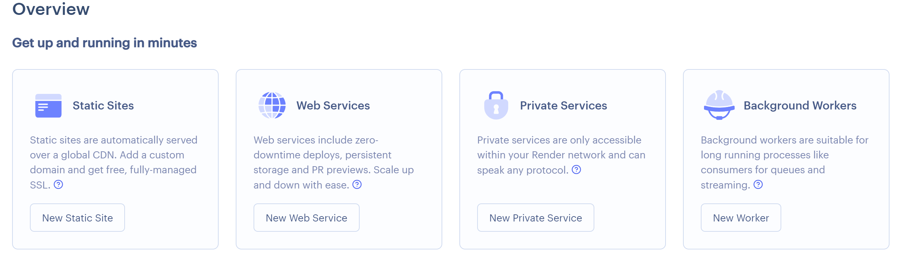
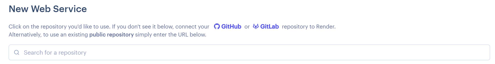
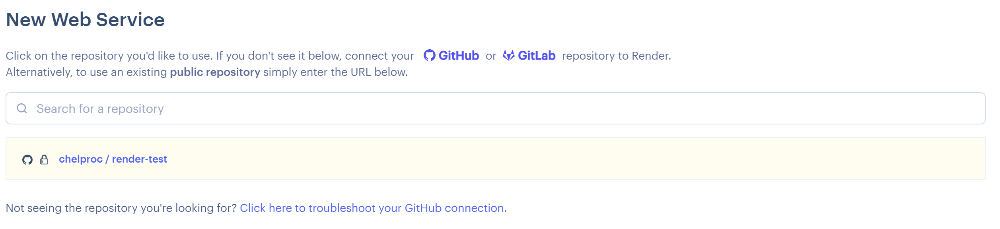

import CodeBlock from '@theme/CodeBlock';
import Term from "@site/src/components/Term";
import OpenInCodeSandbox from "@site/src/components/OpenInCodeSandbox";

## PaaS

**PaaS** は、プログラムをアップロードすることで、そのプログラムを動作させることができるサービスです。[Render](https://render.com/) は最近登場した簡単に操作できる PaaS です。

Render などの PaaS を利用するにあたって、プログラムの改変が必要になる場合があります。ポート番号は、その一例です。Renderでは、ポート番号が `PORT` という名前の環境変数によって指定される。Node.jsでは、環境変数は `process.env` 変数を用いて取得できるので、このポート番号を指定しましょう。

```javascript
app.listen(process.env.PORT || 3000);
```

## Render へのデプロイ

事前にアプリケーション全体を GitHub に保存しておいてください。

[Render](https://render.com/) に登録すると、最初に次のような画面が現れるので、`Web Services` を選択しましょう。



続いて、GitHub アカウントを選択します。



接続が完了すると、リポジトリが選択できるようになります。



設定項目を入力します。


ステータスが `Live` になったら成功です！

