import addRemoteRepositoryVideo from "./add-remote-repository.mp4";
import pushChangesVideo from "./push-changes.mp4";
import cloneRepositoryVideo from "./clone-repository.mp4";
import createNewBranchVideo from "./create-new-branch.mp4";
import createNewBranchWithCliVideo from "./create-new-branch-with-cli.mp4";
import pushNewBranchVideo from "./push-new-branch.mp4";
import createPullRequestVideo from "./create-pull-request.mp4";
import mergePullRequestVideo from "./merge-pull-request.mp4";
import pullBranchVideo from "./pull-branch.mp4";
import step1Video from "./step1.mp4";
import step2Video from "./step2.mp4";
import step3Video from "./step3.mp4";
import step4Video from "./step4.mp4";
import step5Video from "./step5.mp4";
import step6Video from "./step6.mp4";

## 共同開発で生じる問題

2人で企画書を作成することを考えてみてください。1人が企画書を書いた後、それを相手にメールで送り、相手はそれをさらに修正してまたメールで送り返すということを繰り返します。このようにすると、1人が編集している間はもう一人は企画書を編集できなくなってしまいますし、メールで送り合うのは手間がかかりますし、やり取りが複雑になってしまいます。

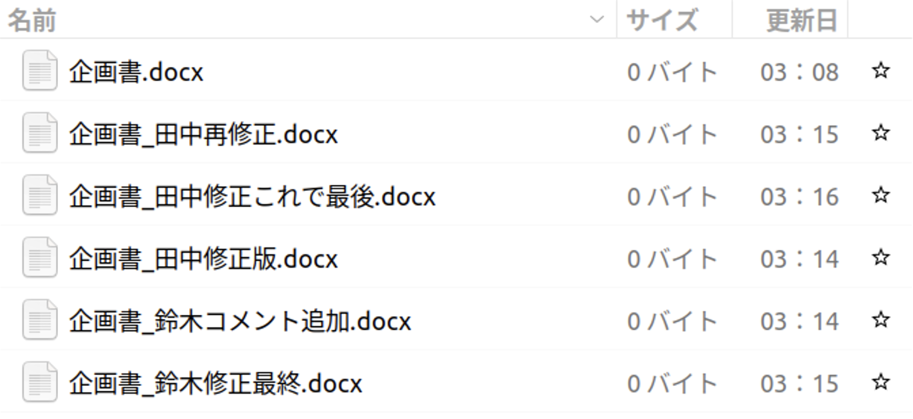

## GitとGitHubを用いた共同開発の仕組み

GitとGitHubを用いることでこの問題を解決することができます。まず、GitHub上にリポジトリを作成し、他のメンバーがそのリポジトリにアクセスできるようにします。Gitには**ブランチ**という仕組みが備わっています。メンバーは変更を加えたい時には、メインのブランチからその変更を加えるための専用の作業場所であるブランチを作成します。そして、そこで変更を加えて、コミットを作成します。

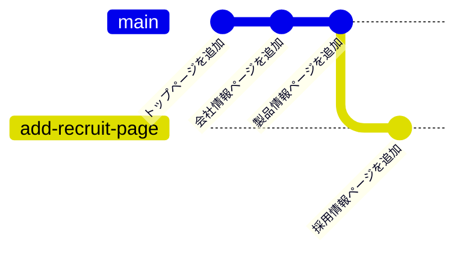

そして、作業が終わったら、メインのブランチに自分のブランチの変更を取り込みます。ここで、GitHubには**プルリクエスト**という機能があります。プルリクエストを作ることで、自分がどのような変更を加えようとしているのかを他の人に確認してもらうことができます。そして、その変更が良さそうだったら、メインのブランチに取り込みます。

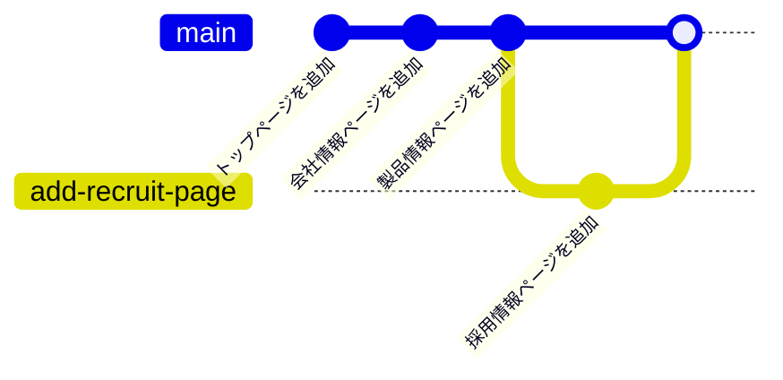

このように、プロジェクトの本体に影響を与えずに同時並行で開発を進めることができます。

## GitとGitHubを用いて共同開発をする

では、実際にGitとGitHubを用いて共同開発をしてみましょう。

GitとGitHubを用いた共同開発は、大きく次のような流れで行います。

1. GitHub上のリポジトリにソースコードを保存する。
1. 他のメンバーはそのリポジトリをクローンする。
1. 変更を加えるために、ブランチを作成する。
1. 変更を加えて、コミットを作成する。
1. そのブランチをリモートリポジトリにプッシュする。
1. プルリクエストを作成する。
1. プルリクエストを確認してもらい、メインのブランチにマージする。

2回目以降は、メインのブランチに他のメンバーが変更を加えている可能性があるので、まずはメインのブランチに戻って、プルをすることでリモートリポジトリの変更を取り込みます。その後は、3.以降の手順を繰り返して新たなプルリクエストを作成します。

では、それぞれについて見ていきましょう。

### GitHubにソースコードを保存する

自分のコンピューター上に作成したリポジトリと同期させるため、GitHub上にもリポジトリを作成します。GitHub上部のメニューから`New repository`を選択してください。

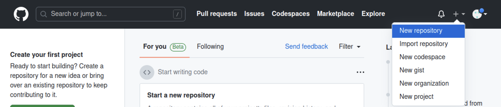

必要な設定はリポジトリの名前と公開範囲です。公開するつもりがない場合は公開範囲は`Private`に設定するようにしましょう。

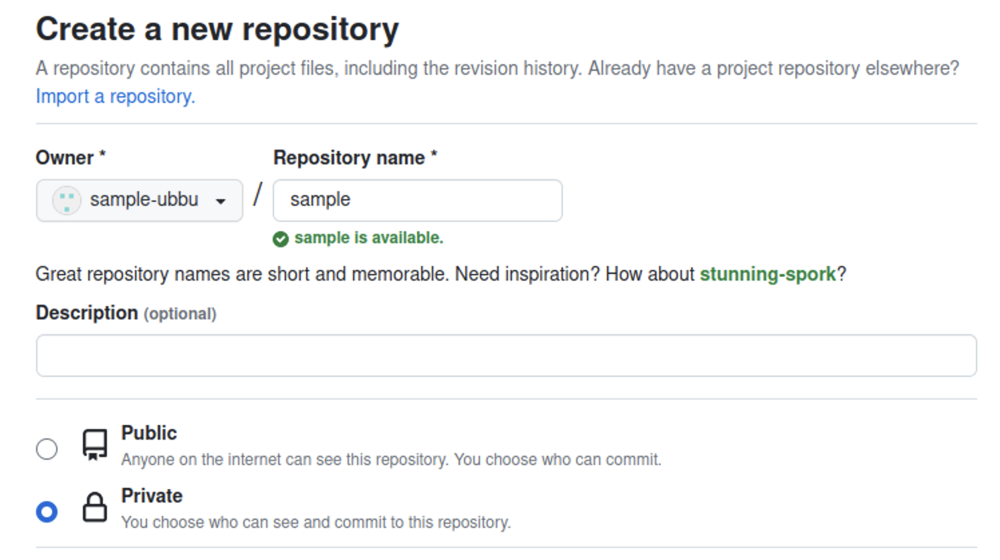

続いて、GitHub上に作成したリポジトリと自分のPC上にあるリポジトリを紐づけます。GitHub上に表示されている**SSH**のURLをコピーします。(**SSH**にするのを忘れないでください。)これがGitHub上に作成したリポジトリを表すURLになります。GitHub上に作成したリポジトリを**リモートリポジトリ**と呼びます。次のコマンドを実行して、このリモートリポジトリを`origin` (慣習的にリモートリポジトリが一つだけの場合はこの名前が用いられます) という名前で登録します。

```shell
git remote add origin git@github.com:アカウント名/リポジトリ名.git
```

<video src={addRemoteRepositoryVideo} muted controls />

登録が完了したら、`origin`として登録したリモートリポジトリにコミットを送信します。この操作を**プッシュ**と呼びます。プッシュをするには、`Pull, Push`>`Push to...`>`origin`を押します。

<video src={pushChangesVideo} muted controls />

GitHubを開いているブラウザを更新して、プログラムが反映されていることを確認したら完了です。

:::info[`git push`コマンド]

`git push`コマンドを使うことで、コマンドラインから、プッシュをすることもできます。

```shell
git push origin main
```

このコマンドの`main`というのは、メインのブランチの名前です。

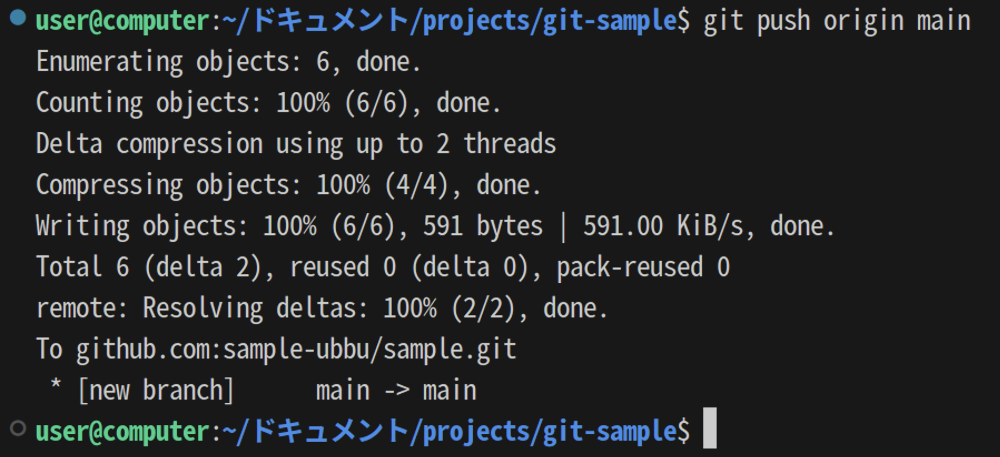

:::

### リポジトリをクローンする

自分が作成したリポジトリであれば、そのまま変更を加えることができますが、他の人が作成したリポジトリに変更を加える場合は、まずは自分のPC上にそのリポジトリをクローンする必要があります。**クローン**するとは、リモートリポジトリを自分のPC上に複製することです。

他の人が作成したリポジトリに変更を加える場合は、権限を与えてもらってからそのリポジトリをクローンしましょう。

クローンするリモートリポジトリの**SSH**のURLをコピーして、次のコマンドを実行してください。その後、クローンしたリポジトリをVS Codeで開いてください。

```shell
git clone git@github.com:アカウント名/リポジトリ名.git
```

<video src={cloneRepositoryVideo} muted controls />

### ブランチを作成する

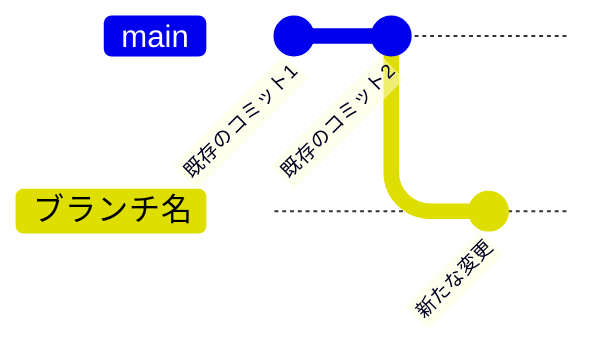

まずは、メインのブランチから今回の作業専用のブランチを作成しましょう。左下の`main`というボタンをクリックして、`Create new branch from...`を選択します。次に、分岐元のブランチである`main`を選択します。最後に、新しいブランチの名前を入力します。新しいブランチの名前には、今回加えたい変更の内容を表す名前をつけましょう。左下の表示が`main`から新しいブランチの名前に変わったことを確認してください。

<video src={createNewBranchVideo} muted controls />

:::info[`git switch`コマンド]

ブランチの作成をコマンドラインから行うこともできます。

まずは、現在いるブランチを確認してみましょう。ターミナルで`git branch`コマンドを実行してください。

```shell
$ git branch
* main
```

ここで、`*`から始まっているのが、現在いるブランチです。`main`となっているはずです。

`git switch`コマンドを使うことで、ブランチを切り替えることができます。切り替え先のブランチが存在しない場合`-c`というオプションをつけることで、新しいブランチを作成して切り替えることができます。

```shell
git switch -c 新しいブランチ名
```

現在いるブランチを確認すると、`*`が移動しているはずです。

```shell
$ git branch
* 新しいブランチ名
  main
```

<video src={createNewBranchWithCliVideo} muted controls />

:::

### 変更を加えてコミットを作成する

変更を加えて、コミットを作成しましょう。必要に応じて、コミットの履歴やコミットの差分を確認してください。

### リモートリポジトリにプッシュする

変更を加えたのは、自分のPC上のリポジトリです。そのため、リモートリポジトリにその変更を反映させる必要があります。新しく作ったブランチをリモートリポジトリにプッシュします。

<video src={pushNewBranchVideo} muted controls />

:::info

コマンドラインからプッシュするには、次のコマンドを実行します。

```shell
git push origin ブランチ名
```

:::

### プルリクエストを作成する

次に変更をメインのブランチに反映します。GitHubのプルリクエストという機能を使うことで、簡単に変更の内容を他の人に確認してもらい、メインのブランチに反映することができます。

GitHubを開き`Pull requests`を開いてください。

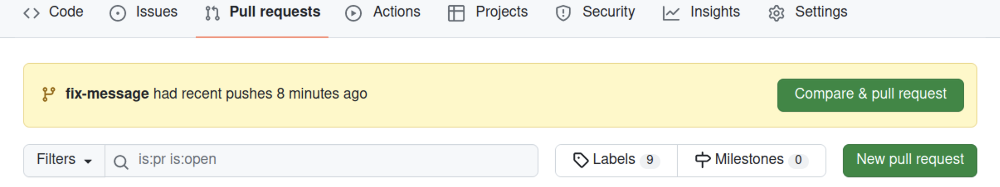

`New pull request`を押してください。

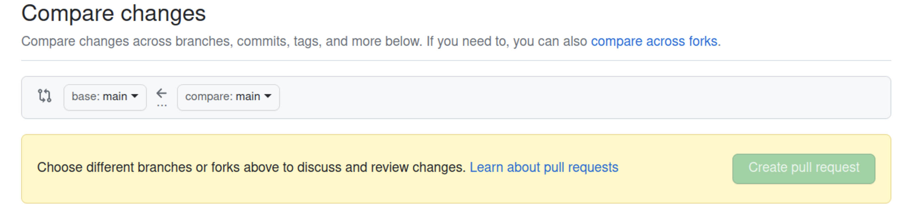

`compare`と書いてある方のブランチを変更して、さきほど作成したブランチを選択してください。

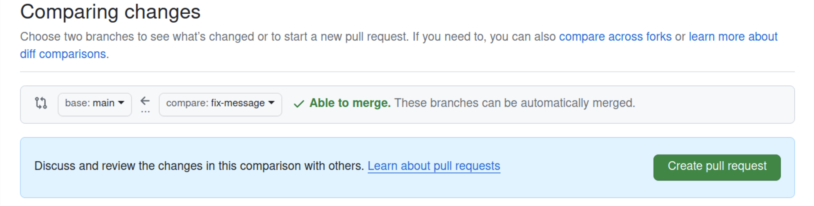

`Create pull request`を押してください。

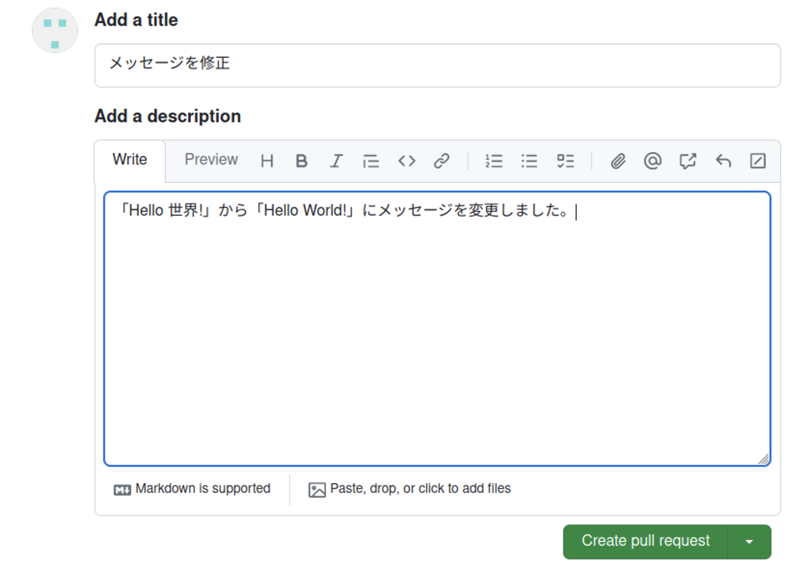

確認画面が出るので、コメントを書いて`Create pull request`を押してください。これで、プルリクエストを作成することができました。

<video src={createPullRequestVideo} muted controls />

### マージする

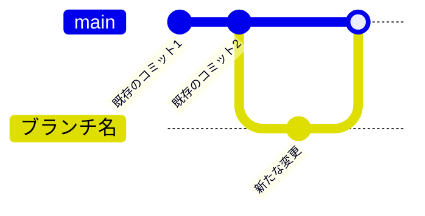

メインのブランチと変更を加えたブランチとの差分は、`Files changed`タブから確認できます。変更が良さそうだったら、`Merge pull request`を押してください。これで、メインのブランチに変更を加えたブランチを**マージ**することができます。マージとは、あるブランチと別のブランチとを統合することです。

マージしたら、不要になったブランチは`Delete branch`を押して削除しておきましょう。

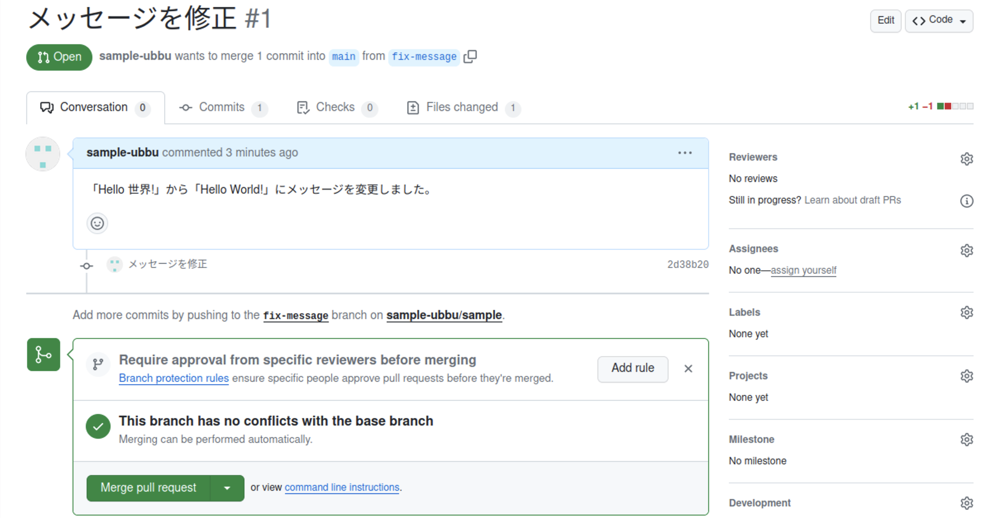

<video src={mergePullRequestVideo} muted controls />

### 新たなプルリクエストを作成する

これ以降プルリクエストを作る場合は、リモートリポジトリのメインのブランチに他の人が変更を加えている可能性があるため、`main`ブランチに戻って、リモートリポジトリから新たな変更を**プル**しましょう。プルするとは、自分のPC上にリモートリポジトリの変更を取り込むことです。その後は、今までと同様に新しいブランチを作成して進めていきます。

リモートリポジトリの変更をプルするには、`Pull, Push`>`Pull from...`>`origin/main`を押します。

<video src={pullBranchVideo} muted controls />

:::info

コマンドラインからプルするには、次のコマンドを実行します。

```shell
git pull origin main
```

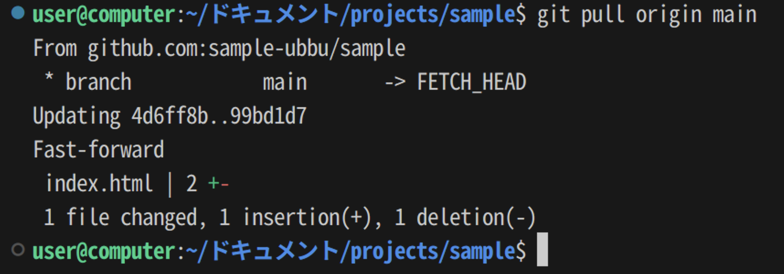

:::

## 演習

Gitを用いたバージョン管理の練習問題で、学部一覧ページを作成しました。このリポジトリをGitHubに保存して、各学部のウェブサイトのURLを追加するプルリクエストを作成してください。


### 手順1

GitHubのリポジトリにソースコードを保存しましょう。

<Answer>

<video src={step1Video} muted controls />

</Answer>

### 手順2

ブランチを作成しましょう。

<Answer>

<video src={step2Video} muted controls />

</Answer>

### 手順3

学部一覧ページに各学部のウェブサイトのURLを追加して、ステージをしてコミットを作成しましょう。

<Answer>

<video src={step3Video} muted controls />

```html
<!doctype html>
<html lang="ja">
  <head>
    <meta charset="utf-8" />
    <title>学部一覧</title>
  </head>
  <body>
    <h1>学部一覧</h1>
    <ul>
      <li><a href="https://www.j.u-tokyo.ac.jp/">法学部</a></li>
      <li><a href="https://www.m.u-tokyo.ac.jp/">医学部</a></li>
      <li><a href="https://www.t.u-tokyo.ac.jp/foe">工学部</a></li>
      <li><a href="https://www.l.u-tokyo.ac.jp/">文学部</a></li>
      <li><a href="https://www.s.u-tokyo.ac.jp/ja">理学部</a></li>
      <li><a href="https://www.a.u-tokyo.ac.jp/">農学部</a></li>
      <li><a href="https://www.e.u-tokyo.ac.jp/">経済学部</a></li>
      <li><a href="https://www.c.u-tokyo.ac.jp/">教養学部</a></li>
      <li><a href="https://www.p.u-tokyo.ac.jp/">教育学部</a></li>
      <li><a href="https://www.f.u-tokyo.ac.jp/">薬学部</a></li>
    </ul>
  </body>
</html>
```

</Answer>

### 手順4

ブランチをリモートリポジトリにプッシュしましょう。

<Answer>

<video src={step4Video} muted controls />

</Answer>

### 手順5

プルリクエストを作成しましょう。

<Answer>

<video src={step5Video} muted controls />

</Answer>

### 手順6

差分を確認して、プルリクエストをマージしましょう。

<Answer>

<video src={step6Video} muted controls />

</Answer>
