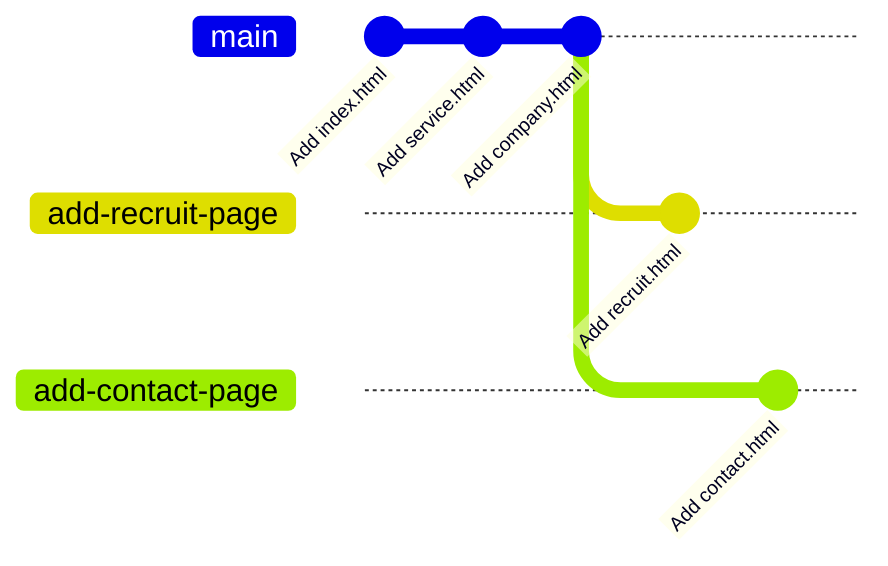
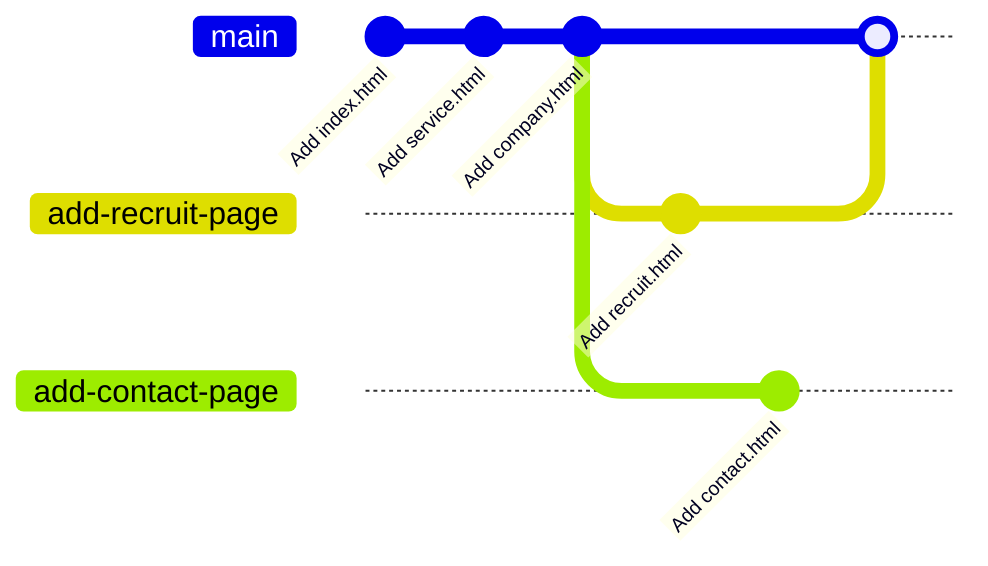
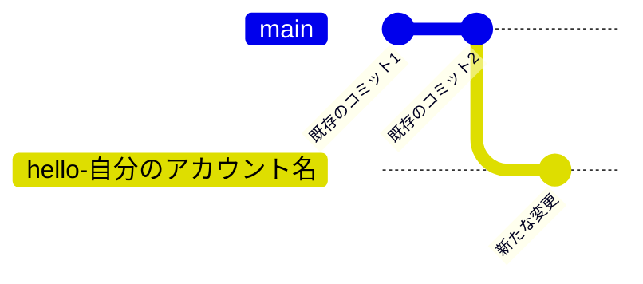
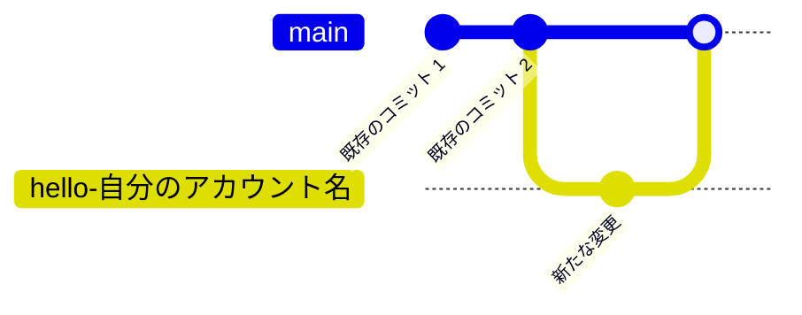

import cloneRepositoryVideo from "./clone-repository.mp4";
import createNewBranchVideo from "./create-new-branch.mp4";
import createNewBranchWithCliVideo from "./create-new-branch-with-cli.mp4";
import pushNewBranchVideo from "./push-new-branch.mp4";
import pushNewBranchWithCliVideo from "./push-new-branch-with-cli.mp4";
import prPracticeVideo from "./pr-practice.mp4";
import pullBranchVideo from "./pull-branch.mp4";
import pullBranchWithCliVideo from "./pull-branch-with-cli.mp4";

## GitHub を用いた共同開発をする

GitHub を用いると簡単に共同開発ができます。[練習用のリポジトリ](https://github.com/ut-code/readme_practice)を用意してあるのでここに変更を加えてみましょう。変更を加えるのにはリポジトリの編集権限が必要なので、事前に権限をもらっておきましょう。

まずは、共同開発をするリポジトリをローカルにクローンします。クローンするとは、リモートリポジトリを自分の PC 上に複製することです。[練習用のリポジトリ](https://github.com/ut-code/readme_practice)の **SSH** の URL をコピーして、次のコマンドを実行してください。その後、クローンしたリポジトリを VS Code で開いてください。

```shell
git clone git@github.com:ut-code/readme_practice.git
```

<video src={cloneRepositoryVideo} muted autoPlay loop controls />

複数のメンバーが並行して変更を加えていくために、Git にはブランチという仕組みが備わっています。まず変更を加えたい時には、メインのブランチから自分の作業専用のブランチを作成します。



そして、作業が終わったらメインのブランチに自分のブランチの変更を取り込みます。これによって、プロジェクトの本体に影響を与えずに同時並行で開発を進めることが出来ます。



まずは、メインのブランチから自分の作業専用のブランチを作成しましょう。
左下の `main` というボタンをクリックして、`Create new branch from...` を選択します。次に、分岐元のブランチを選択します。今回は `main` を選択します。最後に、新しいブランチの名前を入力します。新しいブランチ名には、変更の内容を端的に表す名前をつけてください。今回は `hello-自分のアカウント名` という名前にしてみましょう。左下の表示が新しいブランチ名に変わったことを確認してください。

<video src={createNewBranchVideo} muted autoPlay loop controls />

:::info `git switch` コマンド

ブランチの作成をコマンドラインから行うこともできます。

まずは、現在いるブランチを確認してみましょう。ターミナルで `git branch` コマンドを実行してください。

```shell
$ git branch
* main
```

ここで、`*` から始まっているのが、現在いるブランチです。`main` となっているはずです。

新しいブランチを作成して移動するには、`git switch` コマンドを使います。

```shell
git switch -c 新しいブランチ名
```

現在いるブランチを確認すると、`*` が移動しているはずです。

```shell
$ git branch
  main
* 新しいブランチ名
```

<video src={createNewBranchWithCliVideo} muted autoPlay loop controls />

:::

この状態で、ファイルに必要な変更を行います。練習用のリポジトリに自分だけの新しいファイルを作ってみましょう。今回は、`自分のアカウント名.txt` というファイルを作ってみましょう。ファイルの中身は何でも構いません。変更ができたらその都度、変更をステージし、コミットします。必要に応じて、コミットの履歴やコミットの差分を確認してください。

変更が終わったら、変更をリモートにも反映します。新しく作ったブランチをリモートリポジトリにプッシュします。

<video src={pushNewBranchVideo} muted autoPlay loop controls />



:::info

コマンドラインからプッシュするには、次のコマンドを実行します。

```shell
git push origin ブランチ名
```

<video src={pushNewBranchWithCliVideo} muted autoPlay loop controls />

:::

次に変更をメインのブランチに反映します。GitHub のプルリクエストという機能を使うことで簡単に変更をメインのブランチに取り込むことができます。



GitHub を開き `Pull requests` を開いてください。


`New pull request` を押してください。

次のような画面が現れるので、


`compare` と書いてある方のブランチを変更して、変更を加えたブランチを選択してください。


`Create pull request` を押してください。


確認画面が出るので、コメントを書いて `Create pull request` を押してください。これで、プルリクエストを作成することができました。


メインのブランチと自分の加えた変更の差分は、`Files changed` タブから確認できます。変更が良さそうだったら、`Merge pull request` を押してください。これで、変更を反映できます。


マージしたら、不要になったブランチは削除しておきましょう。

<video src={prPracticeVideo} muted controls />

この後、また変更を加える場合は、他の人が変更を加えている可能性があるので、まずは `main` ブランチに戻って、プルをすることでリモートの変更を取り込みます。その後は、今までと同様に新しいブランチを作成して進めて言ってください。

リモートの変更をプルするには、`Source Control` パネルから `Pull` を押してリモートの変更を取り込みます。

<video src={pullBranchVideo} muted controls />

:::info

コマンドラインからプルするには、次のコマンドを実行します。

```shell
git pull
```

<video src={pullBranchWithCliVideo} muted controls />

:::
