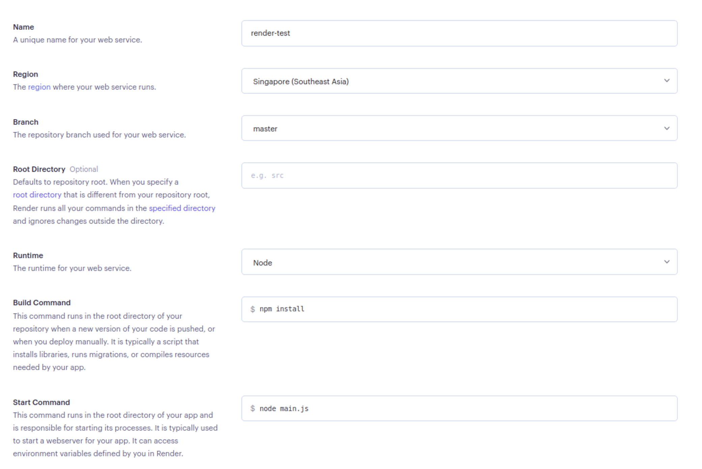
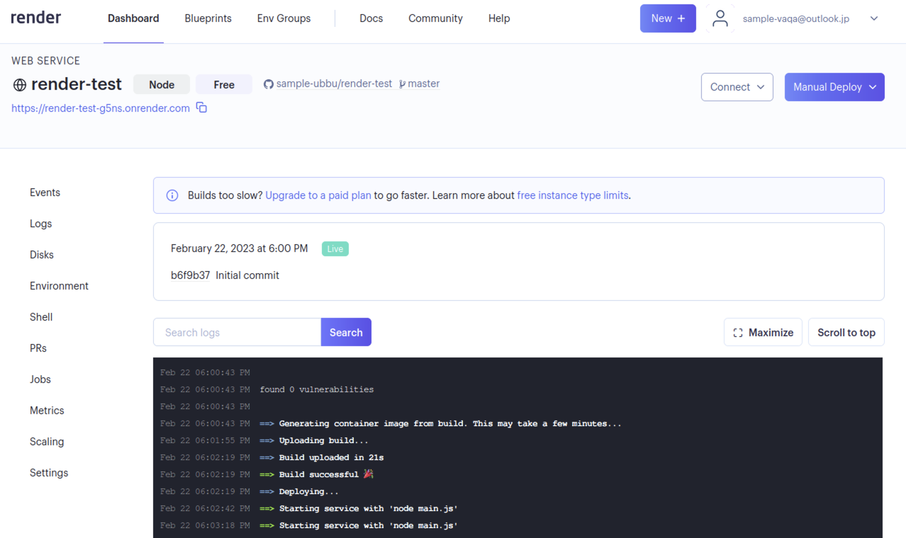

import CodeBlock from '@theme/CodeBlock';
import Term from "@site/src/components/Term";
import ViewSource from "@site/src/components/ViewSource";
import dynamicSiteDeployVideo from "./dynamic-site-deploy.mp4";

## Render へのデプロイ

Render で動的サイトをデプロイするには、ホーム画面から `Web Services` を選択しましょう。

静的サイトのときと同様にリポジトリを選択します。

設定項目を入力します。ここでは Node.js の設定を行っています。

ステータスが `Live` になったら成功です！

表示されている `.onrender.com` のサイトでアプリケーションが公開されています！

<video src={dynamicSiteDeployVideo} controls muted />
