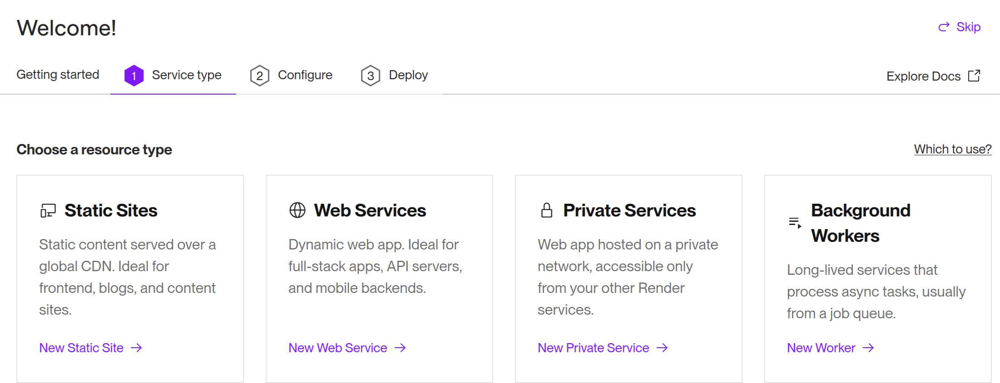

import registerRenderVideo from "./register-render.mp4";
import connectGitHubVideo from "./connect-github.mp4";
import staticSiteDeployVideo from "./static-site-deploy.mp4";
import prPreviewVideo from "./pr-preview.mp4";
import dynamicSiteDeployVideo from "./dynamic-site-deploy.mp4";

## PaaS

**PaaS** (Platform as a Service) は、プログラムをアップロードすることで、そのプログラムを動作させることができるサービスです。[Render](https://render.com/)は最近登場した簡単に操作できるPaaSです。

## Renderへの登録

[Render](https://render.com/)に登録しましょう。

<video src={registerRenderVideo} controls muted />

初回は、RenderのGitHubへのアクセスを許可しないといけません。

<video src={connectGitHubVideo} controls muted />

## 静的サイトと動的サイト

[Render](https://render.com/)に登録すると、最初に次のような画面が現れます。



この画面の`Static Sites`と`Web Services`の違いを解説します。

`Static Sites`は静的ページのことで、大まかに言えば「内容が変化しないWebページ」です。サーバーにアップロードされてから内容が変化せず、いつ閲覧しても同じページが表示されます。

一方、Renderにおける`Web Services`は静的ページの対義語にあたる動的ページに分類されます。これは大まかに言えば「内容が変化するWebページ」で、先ほどやったようなデータベースやサーバーとの通信をすることで閲覧する端末や閲覧する時間によって内容が異なるページが表示されます。

動的ページはSNSやログイン機能のあるページなど、Webサービスでは必要不可欠ですが、その都度サーバーとの通信をしなければならないため静的ページに比べてサーバー負荷が大きいというデメリットがあります。Renderでも`Static Sites`は無料ですが、`Web Services`はサーバーの性能によって無料〜月450ドルのプランを選択することになります。

## 静的サイトのデプロイ

RenderをGitHubのリポジトリと接続することで、ファイルを編集するごとに手動でサーバーにアップロードし直す必要なくGitHubでの更新に合わせて自動でWebサイトを更新することができます。 事前にアプリケーション全体を GitHubに保存しておいてください。

静的サイトをデプロイするには、ホーム画面から`Static Sites`を選択しましょう。

リポジトリを選択します。


設定項目を入力します。


`Create Static Site`を押して、ステータスが`Live`になったら成功です！表示されているリンク (動画の例では`https://render-test-1zpa.onrender.com`) にアプリケーションが公開されています！

<video src={staticSiteDeployVideo} controls muted />

## プルリクエストプレビュー

プルリクエストした内容を実際に確認できるように、プレビューページを自動で生成することもできます。

設定で、`Enable PR Previews`を設定しましょう。


プルリクエストをすると画面に変更の内容を反映したサイトへのリンクが表示されるようになるので、そこからプレビューページにアクセスできます！


<video src={prPreviewVideo} controls muted />

## 動的サイトのデプロイ

Renderで動的サイトをデプロイするには、ホーム画面から`Web Services`を選択しましょう。

静的サイトのときと同様にリポジトリを選択します。

設定項目を入力します。ここではNode.jsの設定を行っています。


ステータスが`Live`になったら成功です！


<video src={dynamicSiteDeployVideo} controls muted />

:::tip[ポート番号]

Renderでは必要ありませんが、PaaSを利用するにあたって、プログラムの改変が必要になる場合があります。ポート番号は、その一例です。ポート番号は`PORT`という名前の環境変数によって指定されています。Node.jsでは、環境変数は`process.env`変数を用いて取得できるので、このポート番号を指定しましょう。

```javascript
app.listen(process.env.PORT || 3000);
```

:::
