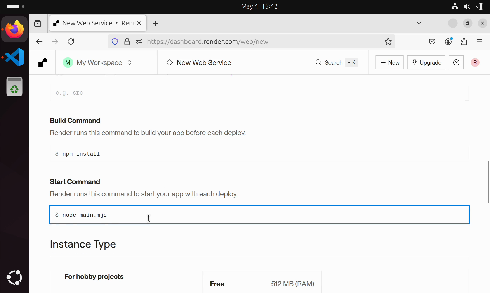

import registerRenderVideo from "./register-render.mp4";

これまでは、Webアプリケーションを開発するにあたり、開発用の端末をサーバーとして利用してきました。しかし、開発したアプリケーションを実際のユーザーが使用できるようにするためには、インターネットに公開されたサーバーが必要です。サーバーの公開に際しては、通常複雑な設定や管理が必要になりますが、**PaaS** (Platform as a Service) と呼ばれるようなサービスを用いることで、その手間を大幅に簡略化することができます。

[Render](https://render.com/)は、近年サービスを開始したPaaSで、GitHubなどと連携し、Webアプリケーションを簡単に公開できるサービスです。[データベースの節](../database)の演習問題で作成したアプリケーションをデプロイし、Renderを用いてNode.jsやPostgreSQLを用いたアプリケーションを<Term>デプロイ</Term>する方法を学びましょう。

## Renderへの登録

[Render](https://render.com/)のウェブサイトにアクセスし、`Get Started`から新しいアカウントを作成します。

<video src={registerRenderVideo} controls muted />

## Render へのデプロイ

RenderでWebアプリケーションをデプロイするには、RenderとGitHubリポジトリを接続し、アプリケーションをRender上で動作させるために必要な各種設定を行います。

<ExternalVideoPlayer src="https://www.youtube.com/embed/8LqsFELjSag" />

まずは、Renderにログインした直後の画面から、`Web Service`を作成します。Node.jsのアプリケーションのデプロイには、通常このオプションを選択します。

GitHubのリポジトリをRenderに接続します。この手順は、RenderがGitHubのリポジトリにアクセスできるようにするための、初回のみ必要な手順です。

デプロイするリポジトリを選択します。ここでは、データベースの演習問題で作成したアプリケーションをデプロイします。

次の画面では、アプリケーションを動作させるために必要な各種設定を行います。`Region`には、アプリケーションを動作させるサーバーの地域を選択します。アプリケーションを使用する地域に近い地域を選択することで、アプリケーションの応答速度を向上させることができます。

`Build Command`では、リポジトリをクローンした後に実行するコマンドを指定します。Node.jsのアプリケーションの場合、`npm install`が指定されることが一般的です。`Start Command`では、`Build Command`が成功した後、アプリケーションを起動するためのコマンドを指定します。このアプリケーションでは、`main.mjs`にサーバーを起動するためのプログラムが記述されているので、`node main.mjs`を指定します。

`Environment Variables`では、アプリケーションを動作させるために必要な<Term>環境変数</Term>を指定します。このアプリケーションでは、開発中に使用する<Term>環境変数</Term>を`.env`ファイルに記述していましたが、このファイルは`.gitignore`に記述されているため、GitHubのリポジトリには含まれていません。動画では、開発中に使用した`.env`ファイルの内容をコピーしていますが、実際には開発環境と本番環境を分離するため、<Term>環境変数</Term>の内容は両環境で異なる場合がほとんどです。

`Your service is live`と表示されれば、デプロイは成功です。

