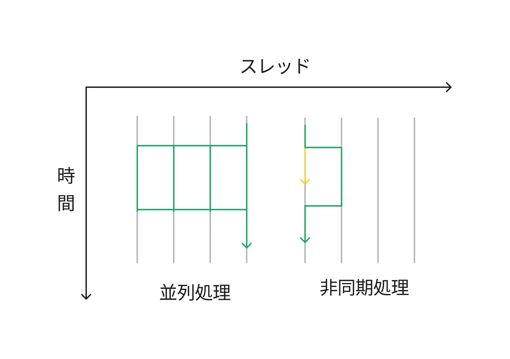

<!--
FIXME LATER: import削除
-->

import Term from "@site/src/components/Term";
import Answer from "@site/src/components/Answer";
import ViewSource from "@site/src/components/ViewSource";

## await、async

JavaScriptには、データベースへの接続・別のウェブサイトからの画像のダウンロード・ファイルの読み書き など、JavaScriptの処理以外で時間のかかる操作が多数存在します。
それぞれの処理のたびに処理を止めていては、ウェブサイトの読み込みにとてつもない時間がかかってしまいます。適切に最適化されたウェブサイトは「非同期処理」というものを利用して、読み込み時間を効果的に短縮しています。

JavaScript では、`Promise` オブジェクトと、`await`、`async` というキーワードを使うことで、操作を<Term type="asynchronousProcess">非同期処理</Term>することが可能です。
ファイルの読み取りを例にとって、<Term type="asynchronousProcess">非同期処理</Term>を書いてみましょう。

まずは次の 2 つのファイルを作り、`main.mjs` を `Node.js` で実行してみてください。

```text title="sample.txt"
Sample Text
```

```js title="main.mjs"
import * as fs from "node:fs/promises";
const text = fs.readFile("sample.txt", { encoding: "utf8" });
console.log(text);
```

上のコードを実行しようとしても、`Promise { <pending> }` と表示され、読み取ったファイルを使うことができません。

これは、`fs.readFile` 関数が `Promise` オブジェクトというものを返す関数だからです。`Promise` オブジェクトとは何でしょうか？

`Promise` オブジェクトは、ファイルの読み取りのような時間のかかる処理を、非同期的に処理するためのオブジェクトです。
`Promise` オブジェクトには、「状態」と「結果」の 2 種類のプロパティがあります。

`Promise` オブジェクトの「状態」には「待機中」「成功」「失敗」の 3 種類の状態があり、「結果」には成功または失敗した時にその結果が代入されます。
上の例で `Promise { <pending> }` と表示されたのは、`text` がファイルから読み取った文字列ではなく、待機中の `Promise` オブジェクトだったからです。

では、`Promise` オブジェクトの「結果」を取得するにはどのようにしたらいいのでしょうか？

```js title="main.mjs"
import * as fs from "node:fs/promises";
const promise = fs.readFile("sample.txt", { encoding: "utf8" });
const awaitText = await promise;
console.log(awaitText);
```

のように `Promise` オブジェクトに `await` 演算子を適用すると、処理を一時停止して、`Promise` オブジェクトの状態が「成功」(`fulfilled`) になるまで文字通り「待つ」ことができるため、`sample.txt` の中身を出力することができます。

しかしこれでは、2 行目で全体の処理が止まってしまっているので、目的だった非同期処理ができません。そこで、関数に `async` キーワードをつけて宣言します。

```js title="main.mjs"
import * as fs from "node:fs/promises";

async function logFile() {
  const text = await fs.readFile("sample.txt", { encoding: "utf8" });
  console.log(text);
}

logFile();
console.log("Doing another work...");
```

このように、関数の宣言の前に `async` キーワードを付けると、「この関数は非同期的に処理する」と宣言することができます。

これにより、`logFile` 関数で処理を一時停止したときにメインの処理に戻って `Doing another work...` と表示することができます。

:::info
`Promise` オブジェクトの状態が「失敗」になると、`await` 演算子はエラーを投げます。
`try ~ catch` 文を用いるとエラーを処理することができます。

```js title="main.mjs"
import * as fs from "node:fs/promises";
try {
  const text = await fs.readFile("bar.txt", { encoding: "utf8" });
  console.log(text);
} catch (error) {
  console.log("File: bar.txt might not exist.");
  console.log(`Error message: ${error}`);
}
```

:::

:::caution
フロントエンド側の JavaScript では、`await` は `async` キーワードをつけた関数内部でしか適用できません。
フロントエンドで `await` `async` を使うには、上記のように非同期の関数に名前を付けて定義する以外にも、無名関数をその場で実行する即時関数というものを利用する方法もあります。

```js
(async () => {
  console.log("Start");
  const myWord = await fs.readFile("sample.txt", { encoding: "utf8" });
  console.log("End");
  console.log(myWord);
})();

console.log("Async process");
```

:::

<!-- :::info 並列処理と非同期処理の違い
並列処理と非同期処理はよく混同されがちですが、全くの別物です。
並列処理がコンピューター内部で複数のCPUスレッドを同時に動かして、計算量が大きく負荷のかかる処理を高速に行うことであるのに対し、非同期処理はファイルの読み書き、インターネットへのアクセスなどのスレッド外の処理の待ち時間の間に別の処理をすることです。



この図の緑色の矢印はメインの処理、黄色は別の処理です。
::: -->

## 練習問題

3 秒かけて id からユーザーのデータを取得する、`Promise` オブジェクトを返す関数

```js
function fetchUserData(id) {
  return new Promise((resolve, reject) => {
    const users = [
      { name: "田中", age: 18 },
      { name: "鈴木", age: 20 },
      { name: "佐藤", age: 19 },
      { name: "高橋", age: 21 },
      { name: "工藤", age: 17 },
    ];
    setTimeout(() => {
      if (users[id]) resolve(users[id]);
      else reject("User not found!");
    }, 3000);
  });
}
```

を使用して、田中さんの名前と年齢を画面に表示してみましょう。

<Answer title="データベース？">

```js
// 上のデータベース実装は省略
async function showData(id) {
  const user = await fetchUserData(id);
  console.log(
    `id: ${id} の人の名前は ${user.name} 、年齢は ${user.age} 歳です。`,
  );
}
showData(0);
console.log("接続中...");
```

<ViewSource url={import.meta.url} src="./_samples/fetch-db-data" />

---

### 追加問題

データベース実装のコードを書き換えて、名前からユーザーを検索できるようにしてみましょう。

</Answer>

## 複数の<Term type="asynchronousProcess">非同期処理</Term>

これで非同期処理を完全にマスターしましたね！以下のように書けば 5 人分の `fetchUserData` を非同期的に処理できるはずです！

```js
// 以下、fetchUserData 関数の実装は省略します。必要に応じて上のコードをコピーしてください。

async function repeatAwait() {
  for (let i = 0; i < 5; i += 1) {
    const user = await fetchUserData(i);
    console.log(user);
  }
}

repeatAwait();
```

このコードを実行すると分かりますが、このように書くだけでは 5 個の処理を非同期的に処理できません。
なぜでしょうか？

これは、`await` キーワードの、時間のかかる処理をその場で待つ性質によります。
`await` キーワードの時点で処理が一時停止するので、同じ関数の中に`await` を連ねるだけでは結局 5 個の処理を待つことになってしまいます。

代わりに、このように書くと並列に処理ができます。

```js
async function logUser(id) {
  const user = await fetchUserData(id);
  console.log(user);
}

for (let i = 0; i < 5; i++) {
  logUser(id);
}
```

`logUser` 関数は 非同期的に処理する と宣言されているため、このように書くことで 5 個の操作を非同期的に処理することが可能になります。

## `Promise.all`

非同期処理の結果を画面に表示したいだけなら上のように書けばいいですが、全ての<Term type="asynchronousProcess">非同期処理</Term>の結果を利用して別の処理を行いたいときもありますよね？

そんな時は、 `Promise.all` 関数を使うと、複数の `Promise` オブジェクトをひとつの `Promise` オブジェクトにまとめることができます。上にある例で例えると、

```js
async function promiseAll() {
  const array = [0, 1, 2, 3, 4];

  // 配列を Promise オブジェクトに map する
  const promiseArray = array.map((x) => fetchUserData(x));

  // await Promise.all(配列) とすると、Promise オブジェクトの配列を 1 つの Promise オブジェクトにまとめられる
  const users = await Promise.all(promiseArray);

  // ここに全ての結果を使う処理を書くことができる
  // 例: 平均年齢を得る
  let sumAge = 0;
  for (let user in users) {
    sumAge += user.age;
  }
  console.log(`ユーザーの平均年齢は ${sumAge / users.length} 歳です。`);
}
PromiseAll();
```

とします。`Promise.all` 関数に配列を渡すとすると複数の時間のかかる処理をひとつにまとめることができるので、それを `await` すると処理の結果の配列を得ることができます。

:::tip

#### staticメソッド

`Promise.all` は、オブジェクトのインスタンスではなくクラスから呼び出しているので、違和感をおぼえるかもしれません。
これは `static` メソッドと言って、各インスタンスではなくクラスに直接紐づいているメソッドです。
ここでは重要ではないので、詳しくは [MDN](https://developer.mozilla.org/ja/docs/Glossary/Static_method) を参照してください。
:::

---

## `Promise` コンストラクタ

`Promise` オブジェクトは、`Promise` クラスのコンストラクタにコールバック関数を渡して作られるインスタンスです。
第一引数を `resolve`、第二引数を `reject` と命名した無名関数が渡されます。
`Promise` が成功した時には `resolve`、失敗した時には `reject` にそれぞれ結果を渡して関数実行されます。

上の `fetchUserData` では、

「3秒後に `users` の `id` 番目のユーザーを取得し、存在すれば `users[id]` に `resolve`し、存在しなければ `User not found!` として `reject` する」

という操作を `Promise` コンストラクタに渡しています。

`Promise` クラスには、処理が終わった後の、次の操作を指定するための `then` メソッド、`catch` メソッド、`finally` メソッドが定義されています。

## `then` メソッド

`then` メソッドは、引数にコールバック関数を 1 つとり、`Promise` オブジェクトの 「状態」 が 「成功」 になった後 (つまり `resolve` 関数が実行された後)にコールバック関数を実行します。
コールバック関数の引数には「結果」が渡されます。

<!-- FIXME: メソッドチェーン初出 -->

`then` メソッドは、「結果」 がコールバック関数の返り値である新しい `Promise` オブジェクトを生成して返します。そのため、メソッドチェーンのような書き方をすることができます。
`rejected` の状態にある `Promise` オブジェクトに引数が 1 つの `then` メソッドを適用すると、コールバック関数は実行されず同じ状態の `Promise` オブジェクトを返すので、一定数チェーンしてから `catch` でエラーハンドリングする、といったこともできます。

`then` メソッドは第二引数にエラーハンドリング用の関数をとることもできますが、可読性が下がるので後述する `catch` メソッドを使いましょう。

例:

```js
function alwaysSuccess() {
  return new Promise((resolve, reject) => {
    resolve("success!");
  });
}

alwaysSuccess()
  .then((result) => console.log(result)) // success! と表示される
  .then((result) => console.log(result));
// undefined と表示される (1個目の .then で返り値を指定していないため)
```

## `catch` メソッド

`catch` メソッドは、引数にコールバック関数を 1 つとり、`Promise` オブジェクトの 「状態」 が 「失敗」 になった後 (つまり `reject` 関数が実行された後) にコールバック関数を実行します。`then` メソッドと同様に、コールバック関数の引数には 「結果」 が渡されます。
`rejected` を文字通り「catch」するので、エラーハンドリングに使います。

`catch` メソッドは、「状態」 が 「成功」、「結果」 がコールバック関数の返り値である、新しい `Promise` オブジェクトを返します。そのため、`then` チェーンの途中に挟んでエラーハンドリングに使うことができます。

「成功」 の状態にある `Promise` オブジェクトに `catch` メソッドを適用すると、コールバック関数は実行されず同じ状態の `Promise` オブジェクトを返します。そのため、「失敗」する可能性のある `Promise` オブジェクトに対し `catch` メソッドを適用した後に、連続して `then` メソッドを記述することが可能です。

`rejected` になる可能性のある `Promise` オブジェクトは、`catch` メソッドによってハンドリングされる必要があります。

例:

```js
/* stringが "success" ならば "Operation Success!" に resolve し、
  そうでなければ
    `Operation failed with string: ${string}`
      に reject する Promise を返す関数。 */
function assertSuccess(string) {
  return new Promise((resolve, reject) => {
    if (string === "success") resolve("Operation Success!");
    else reject(`Operation failed with string: ${string}`);
  });
}

assertSuccess("success")
  .then((result) => console.log(result)) // Operation Success! と表示される
  .catch((error) => console.log(error)); // 何も表示されない

assertSuccess("bar")
  .then((result) => console.log(result)) // 何も表示されない
  .catch((error) => console.log(error));
// Operation failed with string: bar と表示される
```

## `finally` メソッド

`finally` メソッドは、引数に、引数をとらない関数 (コールバック関数) を 1 つとり、`Promise` オブジェクトの `PromiseState` が `pending` でなくなった後 (`fulfilled` または `reject` になった後)にコールバック関数を実行します。データベースとの接続の切断・ファイルの読み込み停止など、成功・失敗にかかわらず実行する処理に使用します。

`finally` メソッドもまた、新しい `Promise` オブジェクトを返します。

:::info
上記の 3 つのメソッドは、全て `await`・`async` と、`return` `throw` `try ~ catch ~ finally` などの一般的な文法要素を用いて書き換えることが可能です。
:::

## 練習問題

1. `Promise`オブジェクトを使って、1 秒後に 引数が 2 で割り切れたら`resolve`、割り切れなかったら`reject` する関数 `assertEven` を定義してみましょう。
2. (難) 上の `assertEven` 関数を使い、コンソールに** 1 秒おきに**以下のような表示をしてみましょう。

```console
-----------------------------
 6 can be divided by two!
-----------------------------
```

```console
-----------------------------
 5 cannot be divided by two!
-----------------------------
```

<Answer title="Assert Even">

```js
function wait(time_ms) {
  return new Promise((resolve) => {
    setTimeout(resolve, time_ms);
  });
}

async function assertEven(number) {
  await wait(1000);
  if (number % 2 === 0) return ` ${number} can be divided by two!`;
  else throw ` ${number} cannot be divided by two!`;
}

async function render(number) {
  try {
    const result = await assertEven(number);
    console.log("-----------------------------");
    console.log(result);
  } catch (error) {
    console.log("-----------------------------");
    console.log(error);
  } finally {
    console.log("-----------------------------");
  }
}

(async () => {
  await render(6);
  await render(5);
})();
```

<ViewSource url={import.meta.url} src="./_samples/assert-even-async-await" />

### 別解

`await`、`async` を用いずに、以下のように書くこともできます。

```js
function wait(time_ms) {
  return new Promise((resolve) => {
    setTimeout(resolve, time_ms);
  });
}

function assertEven(number) {
  return new Promise((resolve, reject) => {
    wait(1000).then(() => {
      if (number % 2 === 0) resolve(` ${number} can be divided by two!`);
      else reject(` ${number} cannot be divided by two!`);
    });
  });
}

function render(number) {
  return assertEven(number)
    .then((result) => {
      console.log("-----------------------------");
      console.log(result);
    })
    .catch((error) => {
      console.log("-----------------------------");
      console.log(error);
    })
    .finally(() => {
      console.log("-----------------------------");
    });
}

render(6).then(() => render(5)); // await 演算子を使っていないので、即時関数にする必要がない
```

<ViewSource url={import.meta.url} src="./_samples/assert-even-promise-method" />

</Answer>
