import getStartedWithViteVideo from "./get-started-with-vite.mp4";
import buildVideo from "./build.mp4";

## 複雑化するWeb開発

JavaScriptは、当初はWebサイトに簡易的な動きを追加させるための言語として設計されました。しかしながら、高度なWebアプリケーションの台頭や、Node.jsをはじめとしたブラウザにおけるJavaScriptのユースケースの広がりにより、標準的なJavaScriptのみでの開発には限界があることがわかってきました。

このため、現代では、JavaScriptは事前に何らかの変換を行っておくことが一般的になっています。

### <Term>トランスパイラ</Term>

{/* prettier-ignore */}
<Term>**トランスパイラ**</Term>は、ソースコードを別のソースコードに変換するためのプログラムです。JavaScriptにおいてトランスパイラが必要になるのは、主に2つの理由によります。

ひとつは、**最新の機能を使用するため**です。JavaScriptの言語仕様は、[Ecma International](https://www.ecma-international.org/)の[TC39](https://tc39.es/)によって作成されていますが、新しく策定された仕様は、まだブラウザなどによって実装されていない場合があります。[Babel](https://babeljs.io/)は、そういった最新の言語仕様に沿って書かれたプログラムを変換し、古い仕様の範囲内で解釈できるプログラムに変換するための、最も有名な<Term>トランスパイラ</Term>です。

もうひとつは、**別の言語で書かれたプログラムをJavaScriptに変換するため**です。次の章で扱うTypeScriptは、トランスパイラを用いてJavaScriptに変換されます。

### <Term>モジュールバンドラ</Term>

通常、規模の大きなプログラムは、見通しが良くなるよう複数のファイルに分割されます。HTMLから複数のJavaScriptを読み込むためには`script`タグを並べれば良いですが、[HTTPサーバー](/docs/web-servers/server/)の節で学んだように、`script`タグの数だけ<Term>HTTPリクエスト</Term>が発行されてしまうため非効率的です。

[webpack](https://webpack.js.org)のような<Term>**モジュールバンドラ**</Term>を用いることで、複数のJavaScriptファイルを統合できます。

なお、Node.jsの場合は、モジュールの読み込みはファイルの読み込みに過ぎず、ネットワークを経由することはないため、このプロセスは通常必要ありません。



## Viteを用いたフロントエンド開発

Web開発の領域では、ブラウザ (クライアント) で動くJavaScriptプログラムを**フロントエンド**、サーバーで動くプログラムを**バックエンド**と呼ぶことがあります。

[Vite](https://vitejs.dev/)は、主にフロントエンドの領域における、<Term>トランスパイラ</Term>や<Term>モジュールバンドラ</Term>などの機能を持つソフトウェアです。

Viteを用いて新しくプロジェクトを作成してみましょう。

<video src={getStartedWithViteVideo} controls />

詳細な手順は次のとおりです。

まずは、ターミナルでカレントディレクトリをプロジェクトフォルダを格納するディレクトリに移動し、

```shell
npm create vite@latest
```

を実行します。`Select a framework`と尋ねられるので、`Vanilla`を選択してください。その後、`Select a variant`と尋ねられるので、`JavaScript`を選択してください。

すると、`package.json`を含む新しいディレクトリがカレントディレクトリに作成されます。このディレクトリをVS Codeで開きましょう。

続いて、作成された`package.json`をもとにnpmから必要なパッケージをダウンロードするため、

```shell
npm install
```

を実行します。完了したら、

```shell
npm run dev
```

を実行してください。

Vite内蔵のウェブサーバーが起動し、`http://localhost:5173/`でウェブサイトが表示されます。

## Viteの仕組み

Viteの挙動を理解するため、<kbd>control</kbd> + <kbd>C</kbd> (macOS) / <kbd>Ctrl</kbd> + <kbd>C</kbd> (Windows) で先ほど起動させたウェブサーバーを停止させ、`npm run build`コマンドを実行してみましょう。

```shell
$ npm run build

> vite@0.0.0 build
> vite build

vite v4.3.5 building for production...
✓ 7 modules transformed.
dist/index.html                      0.45 kB │ gzip: 0.30 kB
dist/assets/javascript-8dac5379.svg  1.00 kB │ gzip: 0.60 kB
dist/assets/index-48a8825f.css       1.24 kB │ gzip: 0.65 kB
dist/assets/index-44b5bae5.js        1.45 kB │ gzip: 0.75 kB
✓ built in 64ms
```

これにより、カレントディレクトリに`dist`ディレクトリが作成され、<Term>トランスパイル</Term>と<Term type="moduleBundler">バンドル</Term>の結果が格納されます。

出力されたファイルを元のファイルと比較してみましょう。元の`index.html`や`main.js`が、変換された状態で出力されていることがわかります。ディレクトリごと[Netlify Drop](/docs/trial-session/deploy-application/)などにアップロードすれば使用可能になるでしょう。

<video src={buildVideo} controls />

:::tip[`npm run`コマンド]

`npm run`コマンドは、`package.json`の`scripts`プロパティに記載されたコマンドを実行します。開発によく使うコマンドを登録しておくことで、コマンドを打つ手間を削減できます。

`npm create vite@latest`が自動的に生成する`package.json`の`scripts`プロパティは、次のようになっていました。ここに記載されたコマンドでは、`npx`コマンドを用いたときのように、npmでインストールされたパッケージをそのまま実行できます。例えば、`npm run dev`コマンドを実行することで、`npx vite`に相当する処理が行われます。

```json title="package.json (一部抜粋)"
{
  "scripts": {
    "dev": "vite",
    "build": "vite build",
    "preview": "vite preview"
  }
}
```

:::

## npmのパッケージをWebブラウザ上で利用する

npmのパッケージがブラウザ上での実行に対応している場合は、Viteをはじめとした<Term>トランスパイラ</Term>や<Term>モジュールバンドラ</Term>により、ブラウザ向けのJavaScriptに変換させられます。例として`date-fns`パッケージを使用してみましょう。

```javascript
import { format } from "date-fns";

document.getElementById("app").textContent = format(
  new Date("2022-01-10"),
  "yyyy年MM月dd日",
);
```

<ViewSource url={import.meta.url} path="_samples/run-npm-package-on-browsers" />

## フロントエンドとバックエンドの統合

Viteなどのツールによって出力されたブラウザ上で動くアプリケーションと、Node.jsをはじめとしたサーバー向けのアプリケーションを統合するためには、複数の手法が考えられます。

最も単純なアプローチは、ビルド時に統合することです。この方法のメリットは、本番環境にデプロイするのが簡単であることです。ディレクトリ構成は、例えば次のようになります。

```
app
├── client
│   ├── index.html
│   └── main.js
├── package.json
├── package-lock.json
└── server
    └── main.mjs
```

<ViewSource url={import.meta.url} path="_samples/fullstack-app" />

`npm run build`コマンドによってViteがビルド結果を`/dist`に出力するようにしておきます。

```json title="/package.json"
{
  "scripts": {
    "start": "node server/main.mjs",
    "build": "vite build client --outDir ../dist"
  }
}
```

`express.static`によりViteが作成したディレクトリを指定すれば完成です。

```javascript title="server/main.mjs"
import express from "express";
const app = express();

app.use(express.json());

// Viteによって出力されたディレクトリを配信する
app.use(express.static("dist"));

app.listen(3000);
```

## 課題

- [`chart.js`](https://www.npmjs.com/package/chart.js)を用いると、ブラウザ上に非常に美しいグラフを描画することができます。このパッケージを用いて、適当なデータをビジュアライズしてみましょう。

  <ViewSource url={import.meta.url} path="_samples/chartjs" noCodeSandbox />

- Viteを用いて作成したWebフロントエンドと、Node.jsのバックエンドが協調して動作するアプリケーションをRenderにデプロイしてみましょう。
