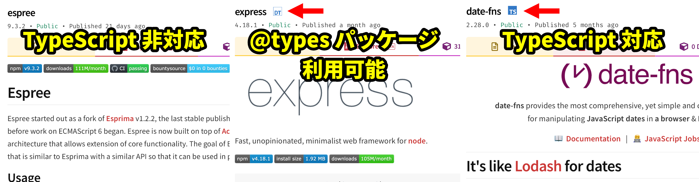

import { SiTypescript } from "react-icons/si";
import typescriptDemoVideo from "./typescript-demo.mp4";
import setupTypeScriptNodeVideo from "./setup-typescript-node.mp4";
import typesPackageVideo from "./types-package.mp4";
import viteTypescriptVideo from "./vite-typescript.mp4";

## JavaScriptとデータ型

次のような関数を考えてみましょう。

```javascript
function formatDate(date) {
  return `${date.getFullYear()}/${date.getMonth() + 1}/${date.getDate()}`;
}
```

この関数の`date`引数には、どのような値を指定すれば良いでしょうか。答えは、[`Date`オブジェクト](https://developer.mozilla.org/ja/docs/Web/JavaScript/Reference/Global_Objects/Date)を指定することです。`formatDate(new Date("2022-01-01"))`は動作しますが、`formatDate("2022-01-01")`はエラーになってしまいます。しかも、エラーが発生するかどうかは実際に実行してみるまでわかりません。

上のような単純なプログラムならこういった問題は起きにくいですが、プログラムの規模が大きくなるにつれ、「どういった値がやりとりされているのか」という情報を把握することが重要になってきます。こういった情報を、**データ型**、あるいは単に**型**と呼びます。

[TypeScript](https://www.typescriptlang.org/)を用いると、プログラム中にデータ型を記述できるようになります。TypeScriptは、Microsoft社によって開発された、JavaScriptに<Term>トランスパイル</Term>して用いられる言語です。

TypeScriptにおける型は、通常`:`の記号に続けて記述します。例えば、先程のプログラムをTypeScriptを用いて書き直すと、次のようになります。引数の部分に型指定が入っているところに注目してください。

```typescript
function formatDate(date: Date) {
  return `${date.getFullYear()}/${date.getMonth() + 1}/${date.getDate()}`;
}
```

TypeScriptを導入することにより、このプログラムを記述する際に、次のような支援が得られます。

- `date.`と入力されたタイミングで、使用可能なメソッドが全て表示されます
- 誤った型の引数 (動画内では文字列) を指定すると、エラーが表示されるようになります

<video src={typescriptDemoVideo} controls muted />

:::tip[他言語との比較]

C++やJavaなどのプログラミング言語では、型の情報は実行に何らかの影響を与えますが、TypeScriptはJavaScriptにトランスパイルされる言語であり、実行時には型の情報は一切利用されません。

:::

## TypeScriptを使ってNode.jsのプログラムを記述する

TypeScriptを用いてNode.jsのプログラムを作成するには、次の手順に従ってください。

<video src={setupTypeScriptNodeVideo} controls />

まずは、プロジェクトルートに`package.json`を作成します。`npm init`を実行すればよいのでした。

続いて、

```shell
npm install -D typescript
```

を実行し、[typescriptパッケージ](https://www.npmjs.com/package/typescript)をインストールします。`-D`オプションは「開発時のみに使用する」という意思表示になります。`package.json`に記録される方法が少しだけ変わります。

続いて、`main.ts`ファイルを作成します。TypeScriptファイルの拡張子は通常`.ts`です。今回は、

```typescript title="main.ts"
const language: string = "TypeScript";
console.log(`Hello ${language}!`);
```

としました。

TypeScriptファイルの作成が終わったら、<Term>`npx`コマンド</Term>で[TypeScriptパッケージを実行](https://www.typescriptlang.org/docs/handbook/compiler-options.html)し、TypeScriptファイルをJavaScriptファイルにトランスパイルします。パッケージ名と異なり、`tsc`となるので注意しましょう。

```shell
npx tsc main.ts
```

すると、同名のJavaScriptファイルが生成されます。このファイルを実行すれば、通常のJavaScriptとして実行できます。

なお、TypeScriptのウェブサイトで提供されている[TS Playground](https://www.typescriptlang.org/play)を用いると、ブラウザ上でTypeScriptのコードを記述し、型チェックの結果を確認できます。

## TypeScriptのデータ型

TypeScriptにおけるデータ型とは、その型の値として扱うことのできる全ての**値の集合**です。例えば、`number`型の集合には、`0`や`3.14`、`-7`など、数値の値が含まれます。

型は、変数や関数の引数など、**その場所に入る値の種類を明示したい箇所**に、`:` (コロン) に続けて記述します。

```typescript
// addはnumber型の引数a, bをとりnumber型の値を返す関数
function add(a: number, b: number): number {
  return a + b;
}

// sumはnumber型の変数
let sum: number = add(3, 4);
```

変数、関数の引数、戻り値など、**値の型が定まっている位置に異なる型の値が入る可能性がある**プログラムを検出すると、TypeScriptはエラーを報告します。例えば、次のプログラムにおいて、`"7"`や`"3"`、`"4"`は`number`型に属さないため、エラーが出力されます。

```typescript
sum = "7"; // Type 'string' is not assignable to type 'number'.

add("3", "4"); // Argument of type 'string' is not assignable to parameter of type 'number'.
```

TypeScriptでは、`number`型のほかにも、次の表に示すように、さまざまなデータ型が用意されています。

| 型名      | 説明         | 例                        |
| --------- | ------------ | ------------------------- |
| `number`  | 数値         | `0`, `3.14`, `-7`         |
| `string`  | 文字列       | `"Hello"`, `"TypeScript"` |
| `boolean` | 真偽値       | `true`, `false`           |
| `object`  | オブジェクト | `{ name: "田中" }`        |

### 確認問題

JavaScriptで記載された次の関数`repeat`に対し、TypeScriptとして適切と思われる型を追記してください。

```typescript
function repeat(text, times) {
  let result = "";
  for (let i = 0; i < times; i++) {
    result += text;
  }
  return result;
}
```

<Answer title="文字列の繰り返し">

関数`repeat`は、文字列`text`を`times`回繰り返して結合した新しい文字列を返す関数です。したがって、`text`は`string`型、`times`は`number`型、戻り値も`string`型とするのが適切です。

```typescript
function repeat(text: string, times: number): string {
  let result: string = "";
  for (let i: number = 0; i < times; i++) {
    result += text;
  }
  return result;
}
```

</Answer>

## 部分型の関係

TypeScriptの型には包含関係があり、`T`が`U`の部分集合であるとき、`T`は`U`の**部分型**であるといいます。

この部分型関係は、**全体集合を`unknown`型、空集合を`never`型**として、次の図のように整理できます。


例えば、次の例のように、数値`1`は`1`型、`number`型、`unknown`型のいずれにも属します。

```typescript
const a: unknown = 1;
const b: number = 1;
const c: 1 = 1; // 左辺の1はデータ型としての1
```

部分型の値は、より大きな型の値として扱うことができます。例えば、次の例では、`string`型の変数`value`を、`unknown`型の引数を受け取る関数`logValue`に渡しています。`string`型は`unknown`型の部分型であるため、TypeScriptはこのプログラムを正しいとみなします。

```typescript
function logValue(value: unknown) {
  console.log(value);
}

const value: string = "Hello";
logValue(value); // string型はunknown型の部分型
```

:::tip[`any`型]

TypeScriptの標準設定では、型が判明しなかった場合、`any`型が指定されたものとみなされます。`any`型の値には、どんな操作でも許容されます。`any`型の値はどんな型の変数にも代入できますし、`any`型の変数にはどんな値でも代入できます。上の集合のどの部分にも当てはまりません。

```typescript
const strangeValue: any = 1;

// TypeScriptは誤りを検出できないが、実行時にエラーになる
strangeValue.strangeMethod();
```

:::

## データ型の別名

`type`宣言を用いると、データ型に対して別名を付けられます。

```typescript
type Age = number;

// 変数ageはAge (number) 型
const age: Age = 18;
```

:::tip

型の名前には通常<Term>パスカルケース</Term>が用いられます。

:::

## オブジェクト型

オブジェクト型では、プロパティの名前や、値の型が指定できます。

```typescript
// Personはstring型のnameプロパティとnumber型のageプロパティを持つオブジェクト
type Person = {
  name: string;
  age: number;
};

let person: Person = { name: "田中", age: 18 };
```

TypeScriptでは、**プロパティが多いオブジェクト型は、プロパティが少ないオブジェクト型の部分型**とみなされます。

次の例では、プロパティの数が多い`Teacher`型のオブジェクトを、プロパティの数が少ない`Person`型の変数に代入しています。これは、`Teacher`型のオブジェクトは`Person`型のオブジェクトの全てのプロパティを持っており、`Person`型のオブジェクトに対する全ての操作を安全に実行できるためです。

```typescript
type Teacher = {
  name: string;
  age: number;
  subject: string;
};

let teacher: Teacher = { name: "鈴木", age: 18, subject: "数学" };
person = teacher;

// Property 'subject' is missing in type 'Person' but required in type 'Teacher'.
teacher = person;
```

:::note[クラス]

クラス名は、そのまま型名として利用できます。また、フィールドにも型を指定できます。

```typescript
class Person {
  name: string;
  age: number;

  constructor(name: string, age: number) {
    this.name = name;
    this.age = age;
  }
}

const person: Person = new Person("田中", 18);
```

:::

### 確認問題

`Product`型と`Book`型が次のように定義されているとします。

```typescript
type Product = {
  name: string;
  price: number;
};

type Book = {
  name: string;
  price: number;
  author: string;
};
```

次のプログラムに対し、TypeScriptとして適切と思われる型を追記してください。

```javascript
function calculateTotal(item, quantity) {
  return item.price * quantity;
}

const book = {
  name: "TypeScript入門",
  price: 2500,
  author: "山田 太郎",
};
const total = calculateTotal(book, 3);
```

<Answer title="商品の合計金額の計算">

- `calculateTotal`関数の引数`item`は`Product`型と`Book`型のいずれも文法的には正しいですが、関数の処理において`Book`型特有のプロパティを使用していないため、`Product`型を指定するのがより適切です。
- `book`は`Book`型のオブジェクトです。
- `quantity`は商品の数量を表すため`number`型とします。戻り値も合計金額を表すため`number`型とします。

```typescript
function calculateTotal(item: Product, quantity: number): number {
  return item.price * quantity;
}

const book: Book = {
  name: "TypeScript入門",
  price: 2500,
  author: "山田 太郎",
};
const total: number = calculateTotal(book, 3);
```

</Answer>

## 配列型

型`T`の配列型は、`T[]`のように記述できます。また、`T`が`U`の部分型であれば、`T[]`は`U[]`の部分型になります。

```typescript
const numbers: number[] = [1, 2, 3];

// number[]はunknown[]の部分型
const unknowns: unknown[] = numbers;
```

## 関数型

関数型では、引数や戻り値の型が指定できます。引数名は異なっていても同じ型だとみなされます。

```typescript
// BinaryNumberOperatorはnumber型の引数2つを受け取ってnumber型の値を返す関数
type BinaryNumberOperator = (x: number, y: number) => number;

function add(a: number, b: number): number {
  return a + b;
}

const operator: BinaryNumberOperator = add;
```

:::tip[関数型の部分型の関係]

関数型の部分型の関係は複雑ですが、「部分型の値はより大きな型の値として扱える」という基本的な考え方に基づいています。次の3つの関数型は、すべて`(v: string) => string`型の部分型となります。

- `() => string`: 引数が少ない関数に、引数を余分に渡しても無視されるので安全
- `(v: unknown) => string`: 関数の引数に、より小さな型の値を渡しても安全
- `(v: string) => never`: 関数の戻り値を、より大きな型の値として扱っても安全

:::

## 型演算

2つの型に対し、集合の和や積 (共通部分)を求める記号が利用できます。

| 記号 | 意味     |
| ---- | -------- |
| `&`  | 共通部分 |
| `\|` | 合併     |

共通部分型は、**両方の型に属する型**を表します。**オブジェクト型同士の場合、両方の型のプロパティを全て持つオブジェクト型**となります。

次の例における`Student & Programmer`型は、`name`、`major`、`language`の3つのプロパティを持つオブジェクト型となります。

```typescript
type Student = { name: string; major: string };
type Programmer = { name: string; language: string };
const studentProgrammer: Student & Programmer = {
  name: "田中",
  major: "数学",
  language: "TypeScript",
};
```

合併型は、**いずれかの型に属する型**を表します。

次の例では、変数`hand`には`"グー"`、`"チョキ"`、`"パー"`のいずれかの文字列を指定できます。

```typescript
const hand: "グー" | "チョキ" | "パー" = "グー";
```

変数の値が合併型のどれに属するかが、`if`文などの条件により明らかである場合、**型の絞り込み**が行われます。

次の例における`meeting`引数は、`InPersonMeeting`型か`OnlineMeeting`型のいずれかです。`type`プロパティの値に応じて、`location`プロパティか`url`プロパティが利用可能になります。

```typescript
type InPersonMeeting = { type: "in_person"; location: string };
type OnlineMeeting = { type: "online"; url: string };
type Meeting = InPersonMeeting | OnlineMeeting;

function describeMeeting(meeting: Meeting): string {
  if (meeting.type === "in_person") {
    return `会議は ${meeting.location} で行われます。`;
  } else {
    return `会議はオンラインで行われます。URL: ${meeting.url}`;
  }
}
```

### 確認問題

**問題1**: `string & number`型は何型と等しいでしょうか。

**問題2**: 次のように定義される型`T`に対して、直接使用可能なプロパティは何でしょうか。

```typescript
type T = { name: string; age: number } | { name: string; subject: string };
```

<Answer>

**問題1**: `never`型

`string`型と`number`型の共通部分は存在しません。したがって、`string & number`型は、空集合である`never`型と等しいです。

**問題2**: `name`のみ

型`T`は、`{ name: string; age: number }`型と`{ name: string; subject: string }`型の合併型です。両方の型に共通して存在するプロパティは`name`のみであるため、型`T`に対して使用可能なプロパティは`name`のみとなります。

</Answer>

## 型推論

文脈からデータ型が明らかな場合は、型定義の記述を省略できます。

```typescript
// ageはnumber型
let age = 18;

// Type 'string' is not assignable to type 'number'.
age = "19";

// 戻り値の型が推論されるため、addは(a: number, b: number) => number型
function add(a: number, b: number) {
  return a + b;
}
```

関数型を要求する部分に関数式を指定する場合、その引数の型が推論されます。

```typescript
type BinaryNumberOperator = (a: number, b: number) => number;

// aやbはnumberに推論される
const operator: BinaryNumberOperator = (a, b) => a + b;

// イベントハンドラの記述の際に便利
window.onload = (e) => {
  // eはEvent型
};
```

## ジェネリクス

引数を一つ受け取り、その値をそのまま返す関数を考えてみよう。

```typescript
function identity(x) {
  return x;
}
```

こういった関数では、引数`x`はどんな型の値も指定できます。つまり、`x`は`unknown`型とするのが適切なはずです。しかし、引数を`unknown`型としてしまうと、戻り値が`unknown`型となってしまい、戻り値に対する操作が一切不可能になってしまいます。

```typescript
function identity(x: unknown) {
  return x;
}

// Object is of type 'unknown'.
identity(1).toString();
```

TypeScriptでは、型パラメータを用いることで、この問題を解決できます。型パラメータは、通常の引数と異なり、型を指定するための特殊な引数です。JavaScriptに<Term>トランスパイル</Term>される際に削除されます。こういった言語機能は他の多くのプログラミング言語でも用意されており、[ジェネリクス](https://www.typescriptlang.org/docs/handbook/2/generics.html)と呼ばれます。

```typescript
// Tは型パラメータ
// identityはT型の引数を受け取ってT型の戻り値を返す関数
function identity<T>(x: T): T {
  return x;
}

// Tにnumberを指定したので、ここではidentityはnumber型の引数を受け取ってnumber型の戻り値を返す関数
identity<number>(1).toString();

// 文脈から型パラメータが明らかな場合は推論される
// この場合はTはnumberに推論される
identity(1).toString();
```

`type`宣言やクラスでも型パラメータを利用できます。

```typescript
type Range<T> = {
  from: T;
  to: T;
};

const dateRange: Range<Date> = {
  from: new Date("2022-01-01"),
  to: new Date("2022-12-31"),
};

type BinaryOperator<T> = (a: T, b: T) => T;

// addは(a: number, b: number) => number型
const add: BinaryOperator<number> = (a, b) => a + b;
```

### 確認問題

次の関数`apply`は、関数を適用する関数です。引数と戻り値を表す型パラメータを定義し、ジェネリクスを用いて適切な型をつけてください。なお、`parseInt`関数は、文字列を整数に変換する関数です。

```typescript
function apply(f, x) {
  return f(x);
}

const result = apply(parseInt, "1024"); // resultはnumber型
```

<Answer>

`parseInt`は、`(v: string) => number`型の関数です。したがって、`apply`関数の型パラメータ`T`は`string`、`U`は`number`に推論されます。

```typescript
function apply<T, U>(f: (x: T) => U, x: T): U {
  return f(x);
}
```

<ViewSource url={import.meta.url} path="_samples/apply" noCodeSandbox />

</Answer>

## TypeScriptとnpm

npmでインストールしたパッケージがTypeScriptに対応している場合、下の図のように、npmのパッケージのウェブサイトに <SiTypescript style={{ verticalAlign: "text-bottom" }} /> アイコンが表示されます。



`DT`アイコンがついているパッケージは、`@types/パッケージ名`という名称のパッケージをインストールすることで、TypeScriptからパッケージが利用可能になります。例えば、`@types/express`パッケージをインストールすることにより、`express`パッケージがTypeScriptから利用できるようになります。

<video src={typesPackageVideo} controls />

`@types`パッケージのインストール前後で`app`の型が変わっていることが分かります。

## フロントエンドにおけるTypeScriptの利用

Viteは、標準でTypeScriptのトランスパイラが内蔵されています。新しくプロジェクトを作成する際は、テンプレートを選択する際にTypeScriptのテンプレートを使用しましょう。

<video src={viteTypescriptVideo} controls />

:::tip[`tsconfig.json`]

この方法でプロジェクトを作成すると、`tsconfig.json`というファイルが生成されます。TypeScriptは、さまざまなJavaScriptのニーズに合わせてカスタマイズできるようになっており、その設定を記述するためのファイルが`tsconfig.json`です。

[公式ドキュメント](https://www.typescriptlang.org/tsconfig)には、全てのオプションの詳細な説明が記述されています。特に、[`strict`オプション](https://www.typescriptlang.org/tsconfig#strict)は、TypeScriptの能力を大幅に上昇させることができるので、有効にすることが推奨されています。`typescript`パッケージを直接インストールしたプロジェクトでは、`npx tsc --init`コマンドによりこのファイルを生成できます。

:::
