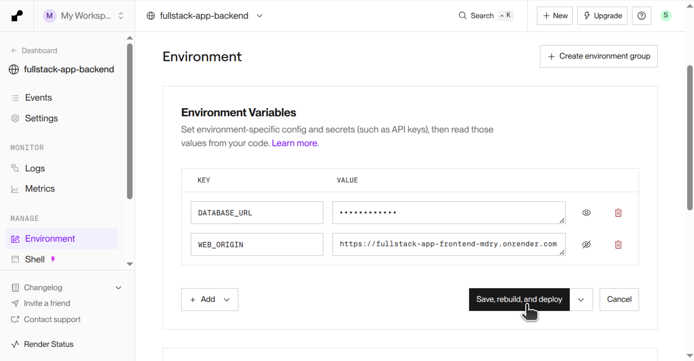

import OriginExplanation from "./origin-explanation.tsx";
import setupTypescriptVideo from "./setup-typescript.mp4";
import createDatabaseAndServerVideo from "./create-database-and-server.mp4";
import setupCorsVideo from "./setup-cors.mp4";
import addDevScriptVideo from "./add-dev-script.mp4";
import startBackendServerVideo from "./start-backend-server.mp4";
import buildFrontendVideo from "./build-frontend.mp4";
import setupBuildScriptsVideo from "./setup-build-scripts.mp4";
import deployVideo from "./deploy.mp4";

## フロントエンドとバックエンドを連携する

Viteを用いて構築されたフロントエンドと、Node.jsを用いて構築されたバックエンドを接続する方法について学びましょう。

[データベース](/docs/web-servers/database/)の節で作成した掲示板サービスの処理の流れは、次の図のようになっていました。1つのWebサーバーが、フロントエンドで動作するアプリケーションの配信と、バックエンドで動作するアプリケーションの処理の両方を担っています。


今回作成する掲示板サービスでは、フロントエンドとバックエンドでそれぞれ別のサーバーを構築します。処理の流れは、次の図のようになります。


### バックエンドを構築する

次の手順に従って、バックエンドを構築しましょう。

#### プロジェクトを格納するディレクトリを作成する

新しくプロジェクトを格納するディレクトリを作成して開きます。その中に`backend`ディレクトリを作成します。

#### TypeScriptのセットアップをする

<video src={setupTypescriptVideo} controls />

1. `backend`ディレクトリに移動し、`npm init`コマンドを実行して`package.json`ファイルを作成します。`type`と尋ねられた時には`module`を指定します。
1. `npm install -D typescript`コマンドを実行してTypeScriptをインストールし、`npx tsc --init`コマンドを実行してTypeScriptの設定を記述するための`tsconfig.json`ファイルを作成します。
1. ここでは、事前にTypeScriptをJavaScriptにトランスパイルせずにTypeScriptファイルを実行するために、次のコマンドを実行して<Term>[`tsx`パッケージ](https://tsx.is/)</Term>をインストールします。`npx tsx 実行するファイルのパス`とすることで、TypeScriptファイルを実行できます。

   ```shell
   npm install -D tsx
   ```

#### データベースとWebサーバーを作成する

[データベース](/docs/web-servers/database/)の節と同じように、データベースを作成し、Expressを用いてWebサーバーを作成します。詳細は、[データベース](/docs/web-servers/database/)の節を参照してください。

<video src={createDatabaseAndServerVideo} controls />

1. Supabaseで新しいデータベースを作成します。
1. `npm install @prisma/client @prisma/adapter-pg pg dotenv`コマンドと`npm install -D prisma @types/pg`コマンドを実行して、Prismaを利用するために必要なパッケージをインストールします。
1. `npx prisma init`コマンドを実行して、Prismaを利用するために必要なファイルを作成します。
1. `.env`ファイルを編集し、Prismaがデータベースに接続できるようにします。
1. 作成された`schema.prisma`ファイルを編集し、掲示板の投稿を保存するためのテーブルの定義を次のように記述します。

   ```javascript title="backend/prisma/schema.prisma"
   // This is your Prisma schema file,
   // learn more about it in the docs: https://pris.ly/d/prisma-schema

   // Looking for ways to speed up your queries, or scale easily with your serverless or edge functions?
   // Try Prisma Accelerate: https://pris.ly/cli/accelerate-init

   generator client {
     provider = "prisma-client"
     output   = "../generated/prisma"
   }

   datasource db {
     provider = "postgresql"
   }

   model Post {
     id      Int    @id @default(autoincrement())
     message String
   }
   ```

1. `npx prisma db push`コマンドを実行してテーブルの定義をデータベースに反映します。
1. `npx prisma generate`コマンドを実行して`PrismaClient`クラスなどを生成します。
1. 掲示板の投稿のサンプルデータをデータベースに登録します。
1. `npm install express`コマンドと`npm install -D @types/express`コマンドを実行して、Expressとその型定義をインストールします。
1. `main.ts`ファイルを作成し、次のように記述します。

   ```ts title="backend/main.ts"
   import express from "express";
   import { PrismaPg } from "@prisma/adapter-pg";
   import { PrismaClient } from "./generated/prisma/client.js";

   const app = express();

   const adapter = new PrismaPg({
     connectionString: process.env.DATABASE_URL,
   });
   const client = new PrismaClient({ adapter });

   app.use(express.json());

   app.get("/posts", async (request, response) => {
     const posts = await client.post.findMany();
     response.json(posts);
   });

   app.post("/posts", async (request, response) => {
     await client.post.create({ data: { message: request.body.message } });
     response.sendStatus(201); // Created（新しいメッセージを作成）
   });

   app.listen(3000);
   ```

#### CORSに関する設定をする

<Term>**CORS**</Term>に関する設定を行います。

:::tip[CORS（Cross-Origin Resource Sharing）]

プロトコル、ドメイン、ポートの組み合わせのことを<Term>**オリジン**</Term>と呼びます。

<p>
  <OriginExplanation />
</p>

異なる<Term>オリジン</Term>のリソースへアクセスすることはブラウザによって制限されることがあります。フロントエンドの開発用サーバーの<Term>オリジン</Term>が`http://localhost:5173`でバックエンドのWebサーバーの<Term>オリジン</Term>が`http://localhost:3000`である場合には、これらは異なる<Term>オリジン</Term>です。そのため、Fetch APIを使用してフロントエンドのアプリケーションからバックエンドのアプリケーションのリソースへアクセスすることはブラウザによって制限されます。

{/* prettier-ignore */}
<Term>**CORS（Cross-Origin Resource Sharing）**</Term>は、このような場合でも異なる<Term>オリジン</Term>のリソースへアクセスすることを可能にする仕組みです。クライアントからのリクエストに対して、サーバーがHTTPレスポンスヘッダにリソースへのアクセスを許可する<Term>オリジン</Term>を示す[`Access-Control-Allow-Origin`ヘッダ](https://developer.mozilla.org/ja/docs/Web/HTTP/Reference/Headers/Access-Control-Allow-Origin)を含めることで、ブラウザはそこで指定された<Term>オリジン</Term>からアクセスすることを許可します。

Expressを用いる場合には、[`cors`パッケージ](https://www.npmjs.com/package/cors)を使用することで、HTTPレスポンスヘッダに`Access-Control-Allow-Origin`ヘッダなどを適切に設定することができます。

:::

<video src={setupCorsVideo} controls />

1. 次のコマンドを実行して、[`cors`パッケージ](https://www.npmjs.com/package/cors)とその型定義である[`@types/cors`パッケージ](https://www.npmjs.com/package/@types/cors)をインストールします。
   ```shell
   $ npm install cors
   $ npm install -D @types/cors
   ```
1. `.env`ファイルを編集し、<Term>環境変数</Term>`WEB_ORIGIN`の値にViteの開発用サーバーの<Term>オリジン</Term>である`http://localhost:5173`を指定します。
1. `main.ts`ファイルを編集し、<Term>CORS</Term>に関する設定を行います。14行目の`app.use(cors({ origin: process.env.WEB_ORIGIN }));`により、<Term>環境変数</Term>`WEB_ORIGIN`に指定した<Term>オリジン</Term>からアクセスすることができるようにします。

   ```ts title="backend/main.ts" showLineNumbers
   import express from "express";
   // highlight-next-line
   import cors from "cors";
   import { PrismaPg } from "@prisma/adapter-pg";
   import { PrismaClient } from "./generated/prisma/client.js";

   const app = express();

   const adapter = new PrismaPg({
     connectionString: process.env.DATABASE_URL,
   });
   const client = new PrismaClient({ adapter });

   app.use(express.json());
   // highlight-next-line
   app.use(cors({ origin: process.env.WEB_ORIGIN }));

   app.get("/posts", async (request, response) => {
     const posts = await client.post.findMany();
     response.json(posts);
   });

   app.post("/posts", async (request, response) => {
     await client.post.create({ data: { message: request.body.message } });
     response.sendStatus(201); // Created（新しいメッセージを作成）
   });

   app.listen(3000);
   ```

#### 開発によく使うコマンドを登録する

<video src={addDevScriptVideo} controls />

`package.json`の`scripts`プロパティに開発によく使うコマンドを登録します。次のように記載して、`npm run dev`コマンドを実行することでWebサーバーを起動できるようにしましょう。<Term>`tsx`パッケージ</Term>では、[Node.jsと同様のオプションが利用](https://tsx.is/node-enhancement#swap-node-for-tsx)できます。

```json title="backend/package.jsonの抜粋"
{
  "scripts": {
    "dev": "tsx --env-file=.env main.ts"
  }
}
```

#### 動作を確認する

<video src={startBackendServerVideo} controls />

`npm run dev`コマンドを実行してWebサーバーを起動し、[`http://localhost:3000/posts`](http://localhost:3000/posts)にアクセスして、掲示板の投稿の一覧が取得できることを確認します。

### フロントエンドを構築する

次の手順に従って、フロントエンドを構築しましょう。

<video src={buildFrontendVideo} controls />

#### Reactのセットアップをする

プロジェクトを格納するディレクトリに移動してから、`npm create vite@latest`コマンドを実行して`frontend`という名前でReactのプロジェクトを作成します。`frontend`ディレクトリに移動してから、`npm install`コマンドを実行して必要なパッケージをインストールします。

#### バックエンドのURLを環境変数で指定する

`.env`ファイルを作成し、<Term>環境変数</Term>`VITE_API_ENDPOINT`の値にバックエンドのURLである`http://localhost:3000`を指定します。

#### アプリケーションのコードを記述する

`App.tsx`ファイルを編集し、次のように記述します。掲示板の投稿の取得や、新しい投稿の送信には、`fetch`関数を使用します。`fetch`関数の第1引数は今までは`/posts`のように指定していましたが、ここでは`${import.meta.env.VITE_API_ENDPOINT}/posts`と指定します。`import.meta.env.VITE_API_ENDPOINT`で<Term>環境変数</Term>`VITE_API_ENDPOINT`に指定されたバックエンドのURLを利用しています。

```tsx title="frontend/src/App.tsx"
import { useEffect, useState } from "react";

type Post = { id: number; message: string };

function App() {
  const [posts, setPosts] = useState<Post[]>([]);
  const [newPostContent, setNewPostContent] = useState("");

  useEffect(() => {
    async function fetchPosts() {
      const response = await fetch(
        `${import.meta.env.VITE_API_ENDPOINT}/posts`,
      );
      setPosts(await response.json());
    }
    fetchPosts();
  }, []);

  return (
    <>
      <ul>
        {posts.map((post) => (
          <li key={post.id}>{post.message}</li>
        ))}
      </ul>
      <input
        value={newPostContent}
        onChange={(e) => {
          setNewPostContent(e.target.value);
        }}
      />
      <button
        type="button"
        onClick={async () => {
          await fetch(`${import.meta.env.VITE_API_ENDPOINT}/posts`, {
            method: "POST",
            headers: { "Content-Type": "application/json" },
            body: JSON.stringify({ message: newPostContent }),
          });
        }}
      >
        送信
      </button>
    </>
  );
}

export default App;
```

:::tip[Viteでの環境変数の利用]

Viteは起動時に`.env`ファイルの内容を読み込みます。

Viteは、[`VITE_`で始まる<Term>環境変数</Term>を、アプリケーション内で`import.meta.env`オブジェクトのプロパティとして利用](https://ja.vite.dev/guide/env-and-mode.html#env-variables)できるようにします。例えば、`VITE_API_ENDPOINT`という<Term>環境変数</Term>の値は、`import.meta.env.VITE_API_ENDPOINT`と記述することで利用できます。

:::

#### 動作を確認する

`npm run dev`コマンドを実行してViteの開発用サーバーを起動し、[`http://localhost:5173/`](http://localhost:5173/)にアクセスして、正しく動作することを確認します。

## デプロイする

今までの開発環境では、バックエンドとフロントエンドのそれぞれで`npm run dev`コマンドを実行することで、バックエンドの場合には<Term>`tsx`パッケージ</Term>でTypeScriptファイルを実行してWebサーバーを起動し、フロントエンドの場合にはViteの開発用サーバーを起動していました。

しかしながら、本番環境では、これとは異なる方法を用いることが一般的です。バックエンドの場合には、TypeScriptファイルをJavaScriptファイルに<Term>トランスパイル</Term>してから、そのJavaScriptファイルを実行してWebサーバーを起動します。フロントエンドの場合には、Viteにより出力されたファイルをRenderで配信します。

| 環境     | バックエンド                                                                                                               | フロントエンド                             |
| -------- | -------------------------------------------------------------------------------------------------------------------------- | ------------------------------------------ |
| 開発環境 | <Term>`tsx`パッケージ</Term>でTypeScriptファイルを実行してWebサーバーを起動                                                | Viteの開発用サーバーを起動                 |
| 本番環境 | TypeScriptファイルをJavaScriptファイルに<Term>トランスパイル</Term>してから、JavaScriptファイルを実行してWebサーバーを起動 | Viteにより出力されたファイルをRenderで配信 |

### ビルドの設定をする

フロントエンドの場合には、`npm run build`コマンドを実行することで、Viteによるビルド結果が`dist`ディレクトリに格納されるのでした。本番環境では、この`dist`ディレクトリをRenderで配信すればよいです。

次に、バックエンドのTypeScriptファイルを<Term>トランスパイル</Term>するための設定を行いましょう。

<video src={setupBuildScriptsVideo} controls />

1. `tsconfig.json`の[`outDir`オプション](https://www.typescriptlang.org/tsconfig/#outDir)の値を`"./dist"`にして、<Term>トランスパイル</Term>結果が`dist`ディレクトリに入るようにします。また、`.gitignore`ファイルに`/dist`を追加して、`dist`ディレクトリがGitの管理下に入らないようにします。
1. `package.json`の`scripts`プロパティに次のように記載して、`npm run build`コマンドと`npm start`コマンドが使えるようにしましょう。`npm run build`コマンドでTypeScriptファイルをJavaScriptファイルに<Term>トランスパイル</Term>し、`npm start`コマンドで出力されたJavaScriptファイルを実行できるようになります。

   ```json title="backend/package.jsonの抜粋"
   {
     "scripts": {
       "dev": "tsx --env-file=.env main.ts",
       "build": "prisma generate && tsc",
       "start": "node dist/main.js"
     }
   }
   ```

### Renderにデプロイする

次の手順に従って、作成したアプリケーションをRenderに<Term>デプロイ</Term>しましょう。Renderに<Term>デプロイ</Term>するには、作成したアプリケーションをGitHubのリポジトリに保存しておく必要があります。

<video src={deployVideo} controls />

1. バックエンドを<Term>デプロイ</Term>するため、Renderにログインした直後の画面から`Web Service`を作成します。

   

1. {/*  */}<Term>デプロイ</Term>するアプリケーションのコードを含むGitHubのリポジトリを選択した後、次のように設定します。

   

1. {/*  */}<Term>環境変数</Term>`DATABASE_URL`でデータベースへの接続情報を設定します。<Term>環境変数</Term>`WEB_ORIGIN`は、ひとまず空のままにしておきます。

   

1. フロントエンドを<Term>デプロイ</Term>するため、`Static Site`を作成します。

   

1. 次のように設定します。

   

1. {/*  */}<Term>環境変数</Term>`VITE_API_ENDPOINT`に先ほど<Term>デプロイ</Term>したバックエンドのURLを設定します。

   

1. バックエンドの<Term>環境変数</Term>の設定を再度開き、<Term>環境変数</Term>`WEB_ORIGIN`に先ほど<Term>デプロイ</Term>したフロントエンドの<Term>オリジン</Term>を設定します。

   

<ViewSource url={import.meta.url} path="_samples/fullstack-app" noCodeSandbox />
