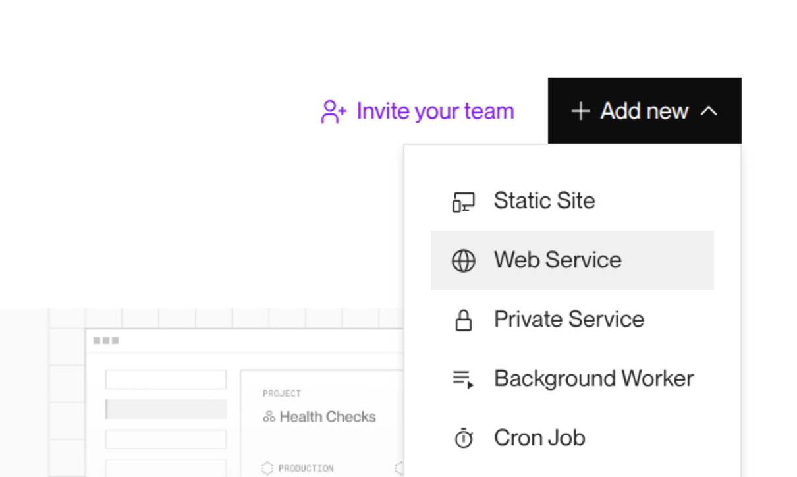
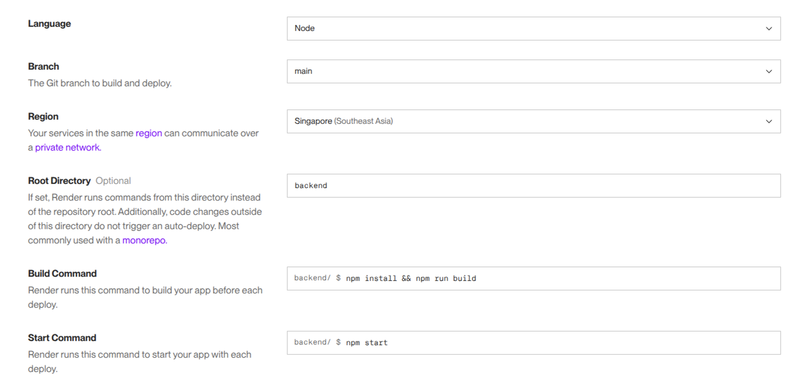
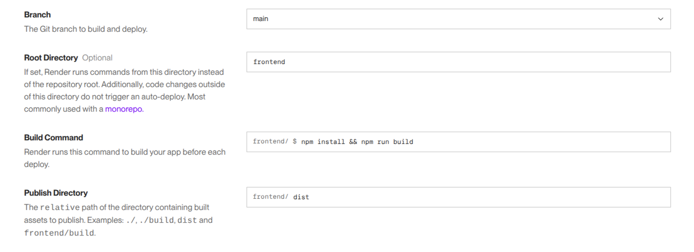
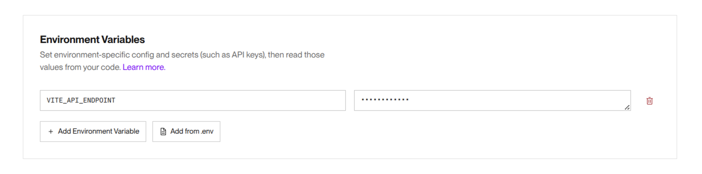

import OriginExplanation from "./origin-explanation.tsx";

## フロントエンドとバックエンドを連携する

Reactによって作成されたブラウザ上で動くアプリケーションと、Node.jsによって作成されたサーバー上で動くアプリケーションを接続する方法について学びましょう。

[データベース](/docs/web-servers/database/)の節で作成した掲示板サービスの処理の流れは、次の図のようになっていました。


今回作成する掲示板サービスでは、フロントエンドとバックエンドでそれぞれ別のWebサーバーを起動します。バックエンドはNode.jsを用いてWebサーバーを起動し、フロントエンドはViteを用いて開発用サーバーを起動します。処理の流れは、次の図のようになります。


### バックエンドを作成する

次の手順に従って、バックエンドを作成しましょう。

1. 新しいプロジェクト用のディレクトリを作成して開き、その中に`backend`ディレクトリを作成します。
1. バックエンドでTypeScriptを使用するためのセットアップを行います。

   ここに動画を埋め込む
   1. `cd backend`コマンドでカレントディレクトリを移動した後、`npm init`コマンドで`package.json`ファイルを作成し、`type`フィールドの値を`"module"`にします。
   1. `npm install -D typescript`コマンドを実行してTypeScriptをインストールし、`npx tsc --init`コマンドを実行してTypeScriptの設定を記述するための`tsconfig.json`ファイルを作成します。
   1. ここでは、TypeScriptファイルを直接実行するために、`npm install -D tsx`コマンドを実行して<Term>[tsx](https://tsx.is/)</Term>をインストールします。`tsx 実行するファイルのパス`とすることで、TypeScriptファイルを直接実行できます。

1. [データベース](/docs/web-servers/database/)の節と同じように、データベースを作成し、Expressを用いてWebサーバーを作成します。
   1. Supabaseで新しいデータベースを作成します。
   1. `npm install @prisma/client dotenv`コマンドと`npm install -D prisma`コマンドを実行して、Prismaのセットアップに必要なパッケージをインストールします。
   1. `npx prisma init`コマンドを実行してPrismaのセットアップに必要なファイルを作成します。作成された`prisma.config.ts`ファイルを編集し、`.env`ファイルの内容が読み込まれるようにします。
   1. `.env`ファイルを編集し、Prismaがデータベースに接続できるようにします。
   1. 作成された`schema.prisma`ファイルを編集し、掲示板への投稿を保存するためのテーブルとそのカラムの定義を次のように記述します。

      ```javascript title="/backend/prisma/schema.prisma"
      // This is your Prisma schema file,
      // learn more about it in the docs: https://pris.ly/d/prisma-schema

      // Looking for ways to speed up your queries, or scale easily with your serverless or edge functions?
      // Try Prisma Accelerate: https://pris.ly/cli/accelerate-init

      generator client {
        provider = "prisma-client"
        output   = "../generated/prisma"
      }

      datasource db {
        provider = "postgresql"
        url      = env("DATABASE_URL")
      }

      model Post {
        id      Int    @id @default(autoincrement())
        message String
      }
      ```

   1. `npx prisma db push`コマンドを実行して、テーブルとカラムの定義をデータベースに反映します。
   1. 掲示板への投稿のサンプルデータをデータベースに登録します。
   1. `npm install express`コマンドと`npm install -D @types/express`コマンドを実行して、Expressとその型定義をインストールします。
   1. `main.ts`ファイルを作成し、次のように記述します。

      ```ts title="/backend/main.ts"
      import express from "express";
      import { PrismaClient } from "./generated/prisma/client.js";

      const app = express();
      const client = new PrismaClient();
      app.use(express.json());

      app.get("/posts", async (request, response) => {
        const posts = await client.post.findMany();
        response.json(posts);
      });

      app.post("/send", async (request, response) => {
        await client.post.create({ data: { message: request.body.message } });
        response.send();
      });

      app.listen(3000);
      ```

1. フロントエンドとバックエンドで別のWebサーバーを起動しているため、<Term>CORS</Term>というものに関する設定を行う必要があります。

   ここに動画を埋め込む
   1. `npm install cors`コマンドと`npm install -D @types/cors`コマンドを実行して、[`cors`パッケージ](https://www.npmjs.com/package/cors)とその型定義である[`@types/cors`パッケージ](https://www.npmjs.com/package/@types/cors)をインストールします。
   1. `.env`ファイルを編集し、<Term>環境変数</Term>`WEB_ORIGIN`の値をViteの開発用サーバーの<Term>オリジン</Term>である`"http://localhost:5173"`に設定します。
   1. `main.ts`ファイルを編集し、<Term>CORS</Term>に関する設定を行います。8行目の`app.use(cors({ origin: process.env.WEB_ORIGIN }));`により、<Term>環境変数</Term>`WEB_ORIGIN`に設定した<Term>オリジン</Term>からのリクエストのみを許可するようにします。

      ```ts title="/backend/main.ts" showLineNumbers
      import express from "express";
      import cors from "cors";
      import { PrismaClient } from "./generated/prisma/client.js";

      const app = express();
      const client = new PrismaClient();
      app.use(express.json());
      app.use(cors({ origin: process.env.WEB_ORIGIN }));

      app.get("/posts", async (request, response) => {
        const posts = await client.post.findMany();
        response.json(posts);
      });

      app.post("/send", async (request, response) => {
        await client.post.create({ data: { message: request.body.message } });
        response.send();
      });

      app.listen(3000);
      ```

   :::tip[CORS（Cross-Origin Resource Sharing）]

   プロトコル、ドメイン、ポートの組み合わせのことを<Term>**オリジン**</Term>と呼びます。

   <p>
     <OriginExplanation />
   </p>

   通常、異なるオリジンのリソースへアクセスすることはブラウザによって制限されています。そのため、フロントエンドの開発用サーバーのオリジンが`http://localhost:5173`でバックエンドのWebサーバーのオリジンが`http://localhost:3000`の場合には、これらは異なるオリジンであるため、Fetch APIを使用してフロントエンドのアプリケーションからバックエンドのアプリケーションのリソースへアクセスすることは制限されています。

   {/* prettier-ignore */}
   <Term>**CORS（Cross-Origin Resource Sharing）**</Term>は、異なるオリジンのリソースへアクセスすることを可能にする仕組みです。クライアントからのリクエストに対して、サーバーがHTTPレスポンスヘッダにリソースへのアクセスを許可するオリジンを示す[`Access-Control-Allow-Origin`ヘッダ](https://developer.mozilla.org/ja/docs/Web/HTTP/Reference/Headers/Access-Control-Allow-Origin)を含めることで、そこで指定されたオリジンからのアクセスが許可されるようになります。

   Expressを用いる場合には、[`cors`パッケージ](https://www.npmjs.com/package/cors)を使用することで、HTTPレスポンスヘッダに`Access-Control-Allow-Origin`ヘッダなどを適切に設定することができます。

   :::

1. `package.json`の`scripts`プロパティに開発によく使うコマンドを登録します。次のように記載して、`npm run dev`コマンドが使えるようにしましょう。<Term>tsx</Term>でも、Node.jsと同様に`--env-file`オプションが利用できます。これにより、`npm run dev`コマンドを実行することでWebサーバーを起動できるようになります。

   ```json title="/backend/package.jsonの抜粋"
   {
     "scripts": {
       "dev": "tsx --env-file=.env main.ts"
     }
   }
   ```

1. `npm run dev`コマンドを実行してWebサーバーを起動し、[`http://localhost:3000/posts`](http://localhost:3000/posts)にアクセスして、掲示板への投稿の一覧が取得できることを確認します。

### フロントエンドを作成する

次の手順に従って、フロントエンドを作成しましょう。

ここに動画を埋め込む

1. `cd ..`コマンドでカレントディレクトリを移動してから`npm create vite@latest`コマンドを実行して`frontend`という名前でReactのプロジェクトを作成し、作成されたディレクトリ内で`npm install`コマンドを実行して必要なパッケージをインストールします。
1. `.env`ファイルを作成し、<Term>環境変数</Term>`VITE_API_ENDPOINT`の値をバックエンドのURLである`"http://localhost:3000"`に設定します。
1. `App.tsx`ファイルを編集し、次のように記述します。掲示板への投稿の取得や、新しい投稿の送信には、`fetch`関数を使用します。`fetch`関数の第1引数は今までは`/posts`のように記述していましたが、ここでは`import.meta.env.VITE_API_ENDPOINT`により<Term>環境変数</Term>`VITE_API_ENDPOINT`に設定したバックエンドのURLを参照して、`${import.meta.env.VITE_API_ENDPOINT}/posts`と記述しています。

   ```tsx title="/frontend/src/App.tsx"
   import { useEffect, useState } from "react";

   type Post = { id: number; message: string };

   function App() {
     const [posts, setPosts] = useState<Post[]>([]);
     const [newPostContent, setNewPostContent] = useState("");

     useEffect(() => {
       async function fetchPosts() {
         const response = await fetch(
           `${import.meta.env.VITE_API_ENDPOINT}/posts`,
         );
         setPosts(await response.json());
       }
       fetchPosts();
     }, []);

     return (
       <>
         <ul>
           {posts.map((post) => (
             <li key={post.id}>{post.message}</li>
           ))}
         </ul>
         <input
           value={newPostContent}
           onChange={(e) => {
             setNewPostContent(e.target.value);
           }}
         />
         <button
           type="button"
           onClick={async () => {
             await fetch(`${import.meta.env.VITE_API_ENDPOINT}/send`, {
               method: "POST",
               headers: { "Content-Type": "application/json" },
               body: JSON.stringify({ message: newPostContent }),
             });
           }}
         >
           送信
         </button>
       </>
     );
   }

   export default App;
   ```

   :::tip[Viteでの環境変数の利用]

   Viteでは[`VITE_`で始まる<Term>環境変数</Term>を`import.meta.env`オブジェクトのプロパティとして利用](https://ja.vite.dev/guide/env-and-mode.html#env-variables)できます。例えば、`VITE_API_ENDPOINT`という<Term>環境変数</Term>がある場合、`import.meta.env.VITE_API_ENDPOINT`として参照できます。

   なお、Viteは起動時に`.env`ファイルの内容を自動的に読み込みます。

   :::

1. `npm run dev`コマンドを実行してViteの開発用サーバーを起動し、[`http://localhost:5173/`](http://localhost:5173/)にアクセスして、正しく動作することを確認します。

## デプロイする

今までは、バックエンドとフロントエンドのそれぞれで`npm run dev`コマンドを実行することで、バックエンドの場合にはTypeScriptファイルを直接実行してWebサーバーを起動し、フロントエンドの場合にはViteの開発用サーバーを起動していました。しかしながら、<Term>デプロイ</Term>する際には、これとは異なる方法を用いる必要があります。バックエンドの場合には、TypeScriptファイルをJavaScriptファイルに<Term>トランスパイル</Term>してから、そのJavaScriptファイルを実行します。フロントエンドの場合には、Viteにより出力されたファイルを配信します。

| 環境     | バックエンド                                                                | フロントエンド                     |
| -------- | --------------------------------------------------------------------------- | ---------------------------------- |
| 開発環境 | TypeScriptファイルを直接実行してWebサーバーを起動                           | Viteの開発用サーバーを起動         |
| 本番環境 | TypeScriptファイルをJavaScriptファイルに<Term>トランスパイル</Term>して実行 | Viteにより出力されたファイルを配信 |

### ビルドの設定をする

フロントエンドの場合には、`npm run build`コマンドを実行することで、Viteにより<Term>トランスパイル</Term>とバンドルの結果が`dist`ディレクトリに格納されるのでした。<Term>デプロイ</Term>の際には、この`dist`ディレクトリを配信すればよいです。

次に、バックエンドのTypeScriptファイルを<Term>トランスパイル</Term>するための設定を行いましょう。

ここに動画を埋め込む

1. `tsconfig.json`の[`outDir`オプション](https://www.typescriptlang.org/tsconfig/#outDir)の値を`"./dist"`にして、<Term>トランスパイル</Term>結果が`dist`ディレクトリに入るようにします。また、`.gitignore`ファイルに`/dist`を追加して、`dist`ディレクトリがGitの管理下に入らないようにします。
1. `package.json`に次のように記載して、`npm run build`コマンドと`npm start`コマンドが使えるようにしましょう。`npm run build`コマンドでTypeScriptファイルをJavaScriptファイルに<Term>トランスパイル</Term>し、`npm start`コマンドで出力されたJavaScriptファイルを実行できるようになります。

   ```json title="/backend/package.jsonの抜粋"
   {
     "scripts": {
       "dev": "tsx --env-file=.env main.ts",
       "build": "prisma generate && tsc",
       "start": "node --env-file=.env dist/main.js"
     }
   }
   ```

   :::tip[`prisma generate`コマンド]

   [`prisma generate`コマンド](https://www.prisma.io/docs/orm/reference/prisma-cli-reference#generate)は、`schema.prisma`ファイルの内容に基づいて`Prisma Client`クラスを生成します。通常、`schema.prisma`ファイルを編集するたびにこのコマンドを再度実行して`Prisma Client`クラスを再生成する必要があります。ただし、`prisma db push`コマンドを実行する際にも`Prisma Client`クラスは生成されるため、`prisma db push`コマンドを実行した場合には`prisma generate`コマンドを実行する必要はありません。

   :::

### Renderにデプロイする

次の手順に従って、作成したアプリケーションをRenderに<Term>デプロイ</Term>しましょう。Renderにデプロイするには、作成したアプリケーションをGitHubのリポジトリに保存しておく必要があります。

ここに動画を埋め込む

1. バックエンドを<Term>デプロイ</Term>するため、Renderにログインした直後の画面から`Web Service`を作成します。

   

1. デプロイするGitHubのリポジトリを選択した後、次のように設定します。

   

1. フロントエンドを<Term>デプロイ</Term>するため、`Static Site`を作成します。

   

1. 次のように設定します。

   

{/* prettier-ignore */}
1. <Term>環境変数</Term>`VITE_API_ENDPOINT`に先ほど<Term>デプロイ</Term>したバックエンドのURLを設定します。

   

1. バックエンドの<Term>環境変数</Term>の設定を再度開き、<Term>環境変数</Term>`DATABASE_URL`を設定し、<Term>環境変数</Term>`WEB_ORIGIN`に先ほど<Term>デプロイ</Term>したフロントエンドの<Term>オリジン</Term>を設定します。

   

<ViewSource url={import.meta.url} path="_samples/fullstack-app" noCodeSandbox />
