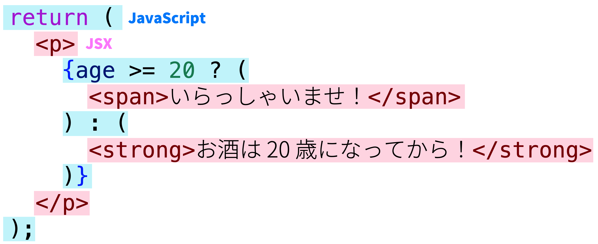

import CodeBlock from '@theme/CodeBlock';
import Term from "@site/src/components/Term";
import OpenInCodeSandbox from "@site/src/components/OpenInCodeSandbox";
import ExternalVideoPlayer from "@site/src/components/ExternalVideoPlayer";
import createReactProjectVideo from "./create-react-project.mp4";

## 宣言的な UI

これまで、JavaScript により HTML 要素を操作するために、[DOM](../../1-trial-session/11-dom/index.md) を用いることができることを学んできました。しかしながら、ナイーブな方法により DOM を使用すると、アプリケーションの規模の限界がすぐにやってきます。

簡単な ToDo アプリケーションを例に考えてみましょう。

```html
<ul id="todos"></ul>
<input id="message" />
<button id="add-todo" type="button">追加</button>
```

```js
addTodoButton.onclick = () => {
  const message = messageInput.value;
  const li = document.createElement("li");
  const span = document.createElement("span");
  span.textContent = message;
  li.appendChild(span);
  const removeTodoButton = document.createElement("button");
  removeTodoButton.type = "button";
  removeTodoButton.textContent = "削除";
  removeTodoButton.onclick = () => {
    todoContainer.removeChild(li);
  };
  li.appendChild(removeTodoButton);
  todoContainer.appendChild(li);
};
```

<OpenInCodeSandbox path="/docs/4-advanced/05-react/_samples/todo-dom" />

なんとか作り上げることができましたが、このまま要件を増やして複雑なプログラムを作ろうとすれば、要素の作成忘れ、削除忘れなどにより、すぐに破綻してしまいそうです。

このようになってしまう根本的な原因は、**現在の状態が DOM に記憶されてしまっていることにあります**。DOM には、テキストや位置、色など、数えきれない状態が格納されています。状態の数が $n$ 種類あれば、その遷移パターンは $n^2$ 個になるわけですので、状態の数が増えることが非常に危険であることは明らかです。

ところが、アプリケーションの本質的な状態というのは、一般的にそこまで多いものではありません。例えば、ToDo リストアプリケーションであれば、各 ToDo を表す `string` の配列 `string[]` がひとつだけあれば、アプリケーションの状態は全て表現できていることになるはずです。

**宣言的 UI** は、こういった性質に着目します。より具体的に説明するのであれば、アプリケーションの状態 $S$ に対し、関数 $f(S)$ により UI の状態を表現できるのであれば、開発者の関心を $S$ の変化と $f$ の定義のみに絞ることができるというわけです。

具体的なコードで確認してみましょう。先ほどの ToDo アプリケーションを、宣言的 UI のアプローチを用いて書き換えてみましょう。状態を追いやすいよう、TypeScript を用いて記述します。

まずはアプリケーションの状態と、その状態を格納する変数を宣言します。

```typescript
type State = { todos: string[] };
const state: State = { todos: [] };
```

続いて、`state` 変数をもとに UI を構築する関数 `render` を定義します。

```typescript
function render() {
  // いったん既存の要素を全て削除
  todoContainer.innerHTML = "";

  for (const todo of state.todos) {
    const li = document.createElement("li");
    // ここに li の中身を作る処理が入る
    todoContainer.appendChild(li);
  }
}
```

最後に、状態を変化させる関数を定義します。状態を変化させたら、 `render` 関数を呼び出して、変更を UI に反映させます。

```typescript
function addTodo(todo: string) {
  state.todos.push(todo);
  render();
}
function removeTodo(index: number) {
  state.todos.splice(index, 1);
  render();
}
```

<OpenInCodeSandbox path="/docs/4-advanced/05-react/_samples/todo-declarative" />

これにより、アプリケーション全体の状態が変数 `state` に集約され、開発者が意識すべき状態のパターンを大幅に減らすことに成功しました。

## React

先ほどのプログラムはうまく動作しますが、一つ問題があります。それは、`render` 関数が呼ばれるたびに全ての要素が削除され、再構築される点です。一般的に、DOM に対する操作は非常にコストが高く、可能な限り減らすことがパフォーマンス改善のために有効です。

[React](https://ja.reactjs.org/) は、この問題を**仮想 DOM**を用いて解決します。React は、DOM に似たデータ構造を内部的に JavaScript オブジェクトの形式で保持し、実際に変更された部分のみを実際の DOM に反映させることで、高いパフォーマンスを実現しています。

それでは、React を用いたプロジェクトを作成してみましょう。Vite でプロジェクトを作成しますが、テンプレートには `react-ts` を選択してください。

<video src={createReactProjectVideo} controls />

:::tip React の使用に最低限必要なパッケージ
React を新規プロジェクトではなく、既存のウェブプロジェクトで用いる場合には、[`react` パッケージ](https://www.npmjs.com/package/react)と、[`react-dom` パッケージ](https://www.npmjs.com/package/react-dom)が必要です。

また、React 本体は TypeScript に対応していないので、TypeScript プロジェクトで React を用いるためには `@types` パッケージを加えてインストールする必要があります。

```json title="package.json (抜粋)"
{
  "dependencies": {
    "react": "^18.0.0",
    "react-dom": "^18.0.0"
  },
  "devDependencies": {
    "@types/react": "^18.0.0",
    "@types/react-dom": "^18.0.0"
  }
}
```

:::

## <Term type="jsx">JSX</Term>

React を使用するプロジェクトでは、通常 <Term type="jsx" strong>JSX</Term> と呼ばれる、JavaScript の拡張構文も用いられます。拡張子は `.jsx` で、TypeScript とともに用いるためには `.tsx` となります。Vite のテンプレートからプロジェクトを作成した場合には、`main.tsx` と `App.tsx` が作成されるはずです。

`main.tsx` は HTML から直接実行されるファイルで、`id` 属性に `root` を持つ要素の中を React により管理する旨を示していますままた、このファイルから `App.tsx` で定義された関数 `App` が読み込まれています。詳細は重要ではないのでここでは扱いません。

```tsx title="main.tsx"
ReactDOM.createRoot(document.getElementById("root")!).render(
  <React.StrictMode>
    <App />
  </React.StrictMode>
);
```

:::tip Non-null assertion operator
`document.getElementById("root")` の直後に続く `!` 記号は、TypeScript の non-null assertion operator です。`document.getElementById` 関数は、要素が見つからなかった場合に `null` を返すため、戻り値は `HTMLElement | null` 型と定義されています。`null` である可能ががないことをプログラマが保証することを TypeScript に伝える記号が `!` です。なお、``tsconfig.json` の設定によってはこのエラーは表示されません。

```typescript
document.getElementById("root").textContent; // Object is possibly 'null'.
document.getElementById("root")!.textContent; // OK
```

:::

それでは、`App.tsx` を書き換えながら、React の動作を確認していきましょう。まずは、`App.tsx` を次のように修正します。

```tsx title="App.tsx"
export default function App() {
  return <div>Hello React</div>;
}
```

<OpenInCodeSandbox path="/docs/4-advanced/05-react/_samples/react-hello-world" />

このプログラムを実行すると、`div` 要素が生成され、その中に `Hello React` が表示されます。3 行目の `<div>Hello React</div>` が見慣れない文法ですね。

JSX では、`<div>` のように、**HTML の開始タグに似た記号が現れると、対応する終了タグまで囲まれた部分を、「JSX 要素」を生成する式と解釈する**ようになります。この部分のことを以後便宜的に JSX 式と呼ぶことにします。

JSX 式は、JSX 要素 (`JSX.Element` 型の値) を生成します。この値はごく一般的なオブジェクトで、変数に代入するなど、他の値と同じように扱うことが可能です。

```tsx title="App.tsx"
const message: JSX.Element = <div>Hello React</div>;

export default function App() {
  return message;
}
```

React は、`App` 関数の戻り値として `JSX.Element` が返されると、それをもとに実際の DOM を構築します。この例では、`div` 要素を作成し、その中に `Hello React` というテキストを挿入します。つまり、この `JSX.Element` が、先ほどの**仮想 DOM**なるものの実体です。

JSX 式の中に括弧 `{}` が現れると、その内部は通常の JavaScript 式として評価されるようになります。これを利用して、HTML 構造の中に JavaScript による計算結果を埋め込むことができます。

```tsx
export default function App() {
  return <div>1 + 1 = {1 + 1}</div>;
}
```

JSX 式と JavaScript の間を行き来することもできます。

```tsx
const age = 22;

export default function App() {
  return (
    <p>
      {age >= 20 ? (
        <span>いらっしゃいませ！</span>
      ) : (
        <strong>お酒は 20 歳になってから！</strong>
      )}
    </p>
  );
}
```

:::tip 条件演算子 (三項演算子)
`?` と `:` の組で表される演算子は、**条件演算子 (三項演算子)**です。条件式の評価結果が真なら 2 つめの式を、偽なら 3 つめの式を評価します。

```javascript
const a = 5;
const b = 6;
const max = a > b ? a : b; // 6
```
:::


