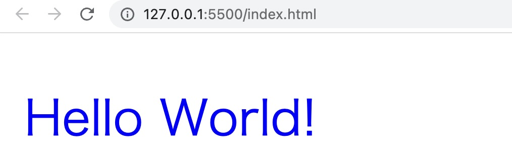

import Term from "@site/src/components/Term";
import Answer from "@site/src/components/Answer";
import ViewSource from "@site/src/components/ViewSource";
import BubbleSortVideo from "@site/docs/6-exercise/1-basis-of-web/bubble-sort-video.mp4";

この章では教材の「[初めてのウェブ開発](../../1-trial-session/01-get-started/index.md)」から「[ウェブサイトの見た目を整える](../../1-trial-session/12-css/index.md)」までの内容を扱っています。

---

## 1. HTML

HTML を用いて次のようなウェブサイトを作ってみましょう。ut.code(); のロゴは[ここ](./_samples/html/logo.svg)からダウンロードして使用してください。


### 解答例

<Answer>

```html
<!doctype html>
<html lang="ja">
  <head>
    <meta charset="UTF-8" />
    <title>ut.code(); のウェブサイト</title>
  </head>
  <body>
    <h1>ut.code();</h1>
    
    <h2>ut.code(); とは</h2>
    <p>
      ut.code(); は、2019
      年設立の東京大学のソフトウェアエンジニアリングコミュニティです。
    </p>
    <h2>主な活動</h2>
    <ul>
      <li>
        学習
        <ul>
          <li>学習カリキュラムの作成</li>
          <li>自主ゼミの開講</li>
          <li>「はじめてのプログラミング教室」の出展</li>
        </ul>
      </li>
      <li>
        交流
        <ul>
          <li>作業会の開催</li>
          <li>五月祭・駒場祭への出展</li>
          <li>合宿の開催</li>
        </ul>
      </li>
      <li>
        開発
        <ul>
          <li>プロジェクトの開発</li>
          <li>ブレインストーミングの実施</li>
          <li>定例ミーティングの開催</li>
        </ul>
      </li>
    </ul>
  </body>
</html>
```

<ViewSource url={import.meta.url} path="_samples/html" />

</Answer>

---

## 2. 名前の長さ

太郎くんは、名前を 4 文字以上 10 文字以下で入力して登録できるウェブサイトを作ろうとしています。そこで、名前の文字数を変数に入れておき、

- 文字数が 4 文字以上 10 文字以下なら `登録できます`
- 文字数が 0 文字なら `名前を入力してください`
- それ以外の文字数(1 文字〜3 文字または 11 文字以上)なら `名前は4文字以上10文字以下で入力してください`

と表示されるプログラムを以下のように作成しました。

```javascript
let nameLength = 7;
if (4 <= nameLength <= 10) {
  document.write("登録できます");
}
if (nameLength === 0) {
  document.write("名前を入力してください");
} else {
  document.write("名前は4文字以上10文字以下で入力してください");
}
```

しかし、変数の値を色々変えて試してみたところ、思った通りに表示されないことがわかりました。このプログラムを、正しく動作するように修正してください。修正すべき箇所は 2 つあります。

### 解答例

<Answer>

```javascript
let nameLength = 7;
if (4 <= nameLength && nameLength <= 10) {
  // 比較演算子を2つ並べるのではなく、論理演算子&&を用います。
  document.write("登録できます");
} else if (nameLength === 0) {
  // else if の else が抜けていました。
  document.write("名前を入力してください");
} else {
  document.write("名前は4文字以上10文字以下で入力してください");
}
```

<ViewSource url={import.meta.url} path="_samples/length-of-name" />

</Answer>

---

## 3. ブラックジャック

田中さんと佐藤さんの 2 人が、トランプゲームのブラックジャックで遊んでいます。ブラックジャックのルールは次の通りとします。

- 2 人の手札の数字の合計を比べ、より大きい方が勝ちとなる。
- ただし、どちらか 1 人の手札の数字の合計が 21 を超えていた場合、その人の負けとなる。
- 2 人の手札の数字の合計が同じだった場合や、2 人とも 21 を超えていた場合は引き分けとなる。

田中さんと佐藤さんの手札の数字の合計をそれぞれ変数に入れておき、田中さんと佐藤さんのどちらが勝つか、あるいは引き分けかを表示するプログラムを作成してください。

### 解答例

<Answer>

```javascript
let tanakaHandTotal = 19;
let satoHandTotal = 22;

// 21を超えていた場合は0(最弱)として扱う
if (tanakaHandTotal > 21) tanakaHandTotal = 0;
if (satoHandTotal > 21) satoHandTotal = 0;

if (tanakaHandTotal > satoHandTotal) {
  document.write("田中さんの勝ち");
} else if (tanakaHandTotal < satoHandTotal) {
  document.write("佐藤さんの勝ち");
} else {
  document.write("引き分け");
}
```

<ViewSource url={import.meta.url} path="_samples/blackjack" />

</Answer>

---

## 4. トラック

引っ越しトラックを考えます。

- 段ボール箱の数が 30 個以内
- 合計の重量が 2000 kg 以内

の両方の条件を満たすときに、トラックは出発できます。

「箱の数」「合計の重量」の 2 つの変数の値によって、

- 出発できる場合には「出発できます」
- 箱が多すぎる場合には「箱の数を減らしてください」
- 重量が大きすぎる場合には「重量を減らしてください」
- 箱が多すぎかつ重量も重すぎる場合には「箱の数と重量を減らしてください」

と表示されるプログラムを作ってみましょう。

また、出発できる場合には文字を<font color="green">緑色</font>で、出発できない場合には文字を<font color="red">赤色</font>で表示するようにしましょう。

:::info ヒント

`document.write()` は文字列だけでなく、HTML 要素を出力することができます。

```javascript title=script.js
document.write('<p style="color: blue">Hello World!</p>');
```



:::

### 解答例

<Answer>

```javascript title=script.js
let box = 25;
let weight = 1000;

if (box <= 30 && weight <= 2000) {
  document.write('<p style="color: green">出発できます</p>');
} else if (box > 30 && weight <= 2000) {
  document.write('<p style="color: red">箱の数を減らしてください</p>');
} else if (box <= 30 && weight > 2000) {
  document.write('<p style="color: red">重量を減らしてください</p>');
} else {
  document.write('<p style="color: red">箱の数と重量を減らしてください</p>');
}
```

<ViewSource url={import.meta.url} path="_samples/truck" />

</Answer>

---

## 5. 九九

[HTML の `table`, `tr`, `th`, `td` タグ](https://developer.mozilla.org/ja/docs/Web/HTML/Element/table) を用いて、九九の表を画面に表示させてみましょう。

:::tip

開きタグと閉じタグをどのタイミングで出力すべきかに注意しましょう。

:::

### 解答例

<Answer>

```javascript
//表のヘッダー(上の列)を描画
function writeHeaderRow() {
  let header = "";
  header += "<th> × </th>";
  for (i = 1; i <= 9; i++) {
    header += `<th> ${i} </th>`;
  }
  document.write(header);
}

//表の一行(横のヘッダー含む)を描画
function writeRow(x) {
  let row = "<tr>";
  row += getSideHeader(x);
  for (i = 1; i <= 9; i++) {
    row += `<td> ${x * i} </td>`;
  }
  row += "</tr>";
  document.write(row);
}
function getSideHeader(x) {
  return `<th> ${x} </th>`;
}

//表のbodyと横のヘッダーを描画
function writeBody() {
  for (x = 1; x <= 9; x++) {
    writeRow(x);
  }
}

function main() {
  document.write("<table>");
  writeHeaderRow();
  writeBody();
  document.write("</table>");
}

main();
```

<ViewSource url={import.meta.url} path="_samples/times-table" />

</Answer>

---

## 6. フィボナッチ数列

1,1,2,3,5...というように、前 2 つの数を足すと次の数になるような数の並びをフィボナッチ数列と言います。引数 `n` に対してフィボナッチ数列の n 番目の数を返す関数を定義してください。ただし 1 番目と 2 番目の数は 1 とします。

### 解答例

<Answer>

```javascript
function fibonacci(n) {
  if (n <= 2) {
    return 1;
  }
  return fibonacci(n - 1) + fibonacci(n - 2);
}

// このように、関数が自分自身を呼び出すときその関数を再帰関数と呼びます。
```

<ViewSource url={import.meta.url} path="_samples/fibonacci/recursion" />

### 別解

もし「配列」「繰り返し」という概念をすでに学習している場合、次のような書き方もできます。

```javascript
function fibonacci(n) {
  let sequence = [1, 1];
  for (let i = 2; i < n; i += 1) {
    sequence.push(sequence[i - 1] + sequence[i - 2]);
  }
  return sequence[n - 1];
}
```

<ViewSource url={import.meta.url} path="_samples/fibonacci/array" />

</Answer>

---

## 7. バブルソート

引数に対して「バブルソート」という整列アルゴリズムを行い、整列済み配列を返す関数`bubbleSort()`を作成しましょう。<br />
そのアルゴリズムは次の通りです。

- ソート前配列のある要素を取り、その一つ後ろの要素と比較する
  - もし一つ後ろの要素の方が小さければ、二項を入れ替える
  - そうでなければ、何もしない
- その操作を一番前の要素から一番後ろにたどり着くまで繰り返す
  - これで一番後ろの要素が一番大きいものであると確定する
- 上の操作を、全ての要素が後ろから大きい順に並ぶまで繰り返す

:::note 
テスト用に、以下のランダムに生成された配列を自由に使ってよいものとします。

` [7, 1, 10, 4, 3, 5, 9, 2, 8, 6] `

` [8, 2, 9, 14, 12, 1, 5, 13, 16, 3, 19, 17, 18, 10, 15, 7, 20, 11, 6, 4] `

` [73, 39, 94, 57, 42, 78, 20, 55, 56, 77] `

` [247, 785, 73, 879, 515, 545, 423, 617, 19, 600, 409, 547, 52, 66, 472, 670, 802, 271, 569, 316] `
:::

<video src={BubbleSortVideo} controls />

:::info
要素を入れ替えるとき、単に

```javascript
array[0] = array[1];
array[1] = array[0];
```

とするだけでは両方が`array[1]`になってしまい、うまくいきません。どうすればよいでしょうか。

:::

### 解答例

<Answer>

```javascript
function swapIndex(array, indexA, indexB) {
  const temp = array[indexA];
  array[indexA] = array[indexB];
  array[indexB] = temp;
}
function bubbleSort(array) {
  for (let i = array.length - 1; i > 0; i--) {
    for (let j = 0; j < i; j++) {
      if (array[j] > array[j + 1]) swapIndex(array, j, j + 1);
    }
  }
  return array;
}
```

<ViewSource url={import.meta.url} path="_samples/bubble-sort/normal/" />

</Answer>

:::tip <Term strong type="javascriptSideEffects">副作用</Term>と<Term strong type="javascriptPureFunction">純粋関数</Term>の話

本解答例では返り値をarrayに代入していないにも関わらず、arrayの中身が変わってしまいます。なぜでしょうか？

[**参照の節**](../browser-apps/constant/#参照)で説明したように、これは配列が評価されたときにそれ自身ではなく、配列の<Term strong type="javascriptReference">参照</Term>が得られるからです。関数を実行したときに返り値以外に関数外部に影響を与えることを<Term strong type="javascriptSideEffects">副作用</Term>と呼び、<Term strong type="javascriptSideEffects">副作用</Term>を持たない関数を<Term strong type="javascriptPureFunction">純粋関数</Term>と呼びます。思わぬ<Term strong type="javascriptSideEffects">副作用</Term>を防ぐために有効範囲の広い関数は<Term strong type="javascriptPureFunction">純粋関数</Term>であることが望ましいとされています。また関数のマクロ的役割である「操作のまとまり」として、<Term strong type="javascriptSideEffects">副作用</Term>である外部へのアクセス(画面への表示、インターネットのアクセス、ファイルの入出力など)をひとまとめにする場合は、専用の関数を作成し、それを明示した方がよいとされています。

また関数の引数以外の可変変数を参照することは<Term strong type="javascriptReferenceTransparency">参照透過性</Term>の妨げになり、デバッグが難しくなるといわれています。

上の関数を<Term strong type="javascriptPureFunction">純粋関数</Term>に書き直すと例えば、

<Answer>

```diff javascript
+ /* swapIndexは純粋関数ではないが、あくまでモジュール化のプロセスであり、
+    外部では使わないので、予期せぬ副作用は発生しにくいためこのままでもよい */
function swapIndex(array, indexA, indexB) {
  const temp = array[indexA];
  array[indexA] = array[indexB];
  array[indexB] = temp;
}
- function bubbleSort(array){
+ function bubbleSort(inputArray) {
+  let array = inputArray.slice(); // 配列の値をコピーする
  for (let i = array.length - 1; i > 0; i--) {
    for (let j = 0; j < i; j++) {
      if (array[j] > array[j + 1]) swapIndex(array, j, j+1);
    }
  }
  return array;
}
```

<ViewSource url={import.meta.url} path="_samples/bubble-sort/pure/" />
</Answer>
となります。

:::
