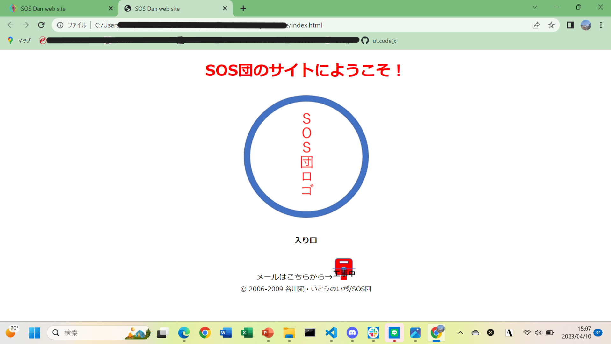

この章では教材の「初めてのウェブ開発」から「ウェブサイトの見た目を整える」までの内容を扱っています。

## HTML

# 課題

簡単な[SOS 団の Web サイト](http://haruhi.tv)を作ってみましょう。いきなり飛躍した印象を受けるかもしれませんが、ひよっこエンジニアのキョンでも、団長ハルヒに急かされてからというもの html タグを必死に並べ、なんとか SOS 団を外部に知らしめることに成功したのです...と長話はさておき、html タグを皆さんもならべてみましょう。

現在の知識でも作れるよう少し簡単にしました。こんなページを作ってみてください。

**ヒント**

- 写真を出すには`img`タグを使います。`src`属性に写真の URL を指定しましょう。

- [SOS 団の Web サイト](http://haruhi.tv)を開き、ダウンロードしたい画像にカーソルを当てて右クリックすると、写真をダウンロードすることができます。

- 何らかの理由で画像読み込みに失敗した時、何の写真を出したかったか説明するために、画像には「代替テキスト」を設定することが多いです。`img`タグでは`alt`属性で代替テキストを指定できます。余力のある人は実装してみましょう。実装したら、写真ファイルを削除して挙動を確認してみましょう。

- 文章や写真がなんとなく真ん中で一列にきれいに揃えられていますね。実は`table`タグで表を作っています。表といえど境界線がないので気づきにくかったかもしれません。`table`タグに`tr` `th` `td`タグをネストさせてきれいな表を作りましょう。全ての td タグの align 属性にある値を入れると...なんということでしょう。真ん中が縦で揃えられた表が完成します。

- [こちら](http://www.htmq.com/)で HTML タグの使い方が簡潔に示されています。

## 回答例

```html
<!DOCTYPE html>
<html lang="ja">
  <head>
    <meta charset="UTF-8" />
    <meta name="viewport" content="width=device-width, initial-scale=1.0" />
    <title>SOS dan web site</title>
  </head>
  <body>
    <table>
      <tr>
        <th align="center"><h1>SOS団のサイトへようこそ！</h1></th>
      </tr>
      <tr>
        <td align="center"></td>
      </tr>
      <tr>
        <td align="center"><h4>入り口</h4></td>
      </tr>
      <tr>
        <td align="center">
          メールはこちらから→
        </td>
      </tr>
      <tr>
        <td align="center"><h4>活動内容</h4></td>
      </tr>
    </table>
  </body>
</html>
```

jpg ファイルは html ファイルと同じ階層に入れているので、`img`タグの`src`属性は`./ファイル名`となっています。

## 条件分岐

## 問題 2-1(仮)

太郎くんは、名前を 4 文字以上 10 文字以下で入力して登録できるウェブサイトを作ろうとしています。そこで、名前の文字数を変数に入れておき、

- 文字数が 4 文字以上 10 文字以下なら `登録できます`
- 文字数が 0 文字なら `名前を入力してください`
- それ以外の文字数(1 文字〜3 文字または 11 文字以上)なら `名前は4文字以上10文字以下で入力してください`

と表示されるプログラムを以下のように作成しました。

```javascript
let lengthOfName = 7;
if (4 <= lengthOfName <= 10) {
  document.write("登録できます");
}
if (lengthOfName === 0) {
  document.write("名前を入力してください");
} else {
  document.write("名前は4文字以上10文字以下で入力してください");
}
```

しかし、変数の値を色々変えて試してみたところ、思った通りに表示されないことがわかりました。このプログラムを、正しく動作するように修正してください。修正すべき箇所は 2 つあります。

### 解答例

<ViewSource url={import.meta.url} path="_samples/length-of-name" />

## 問題 2-2(仮)

A さんと B さんの 2 人が、トランプゲームのブラックジャックで遊んでいます。ブラックジャックのルールは以下の通りとします。

- 2 人の手札の数字の合計を比べ、より大きい方が勝ちとなる。
- ただし、どちらか 1 人の手札の数字の合計が 21 を超えていた場合、その人の負けとなる。
- 2 人の手札の数字の合計が同じだった場合や、2 人とも 21 を超えていた場合は引き分けとなる。

A さんと B さんの手札の数字の合計をそれぞれ変数に入れておき、A さんと B さんのどちらが勝つか、あるいは引き分けかを表示するプログラムを作成してください。

### 解答例

<ViewSource url={import.meta.url} path="_samples/blackjack" />

## 関数

(1)引数を２つとり、そのうち大きい数を返す関数 max を定義してください。

(2)1,1,2,3,5・・・というように、前２つの数を足すと次の数になるような数の並びをフィボナッチ数列と言います。引数 n に対してフィボナッチ数列の n 番目の数を返す関数を定義してください。ただし１番目と２番目の数は１とします。

(1)解答例

```javascript
function max(a, b) {
  if (a > b) {
    return a;
  }
  return b;
}
```

(2)解答例

```javascript
function fibonacci(n) {
  if (n <= 2) {
    return 1;
  }
  return fibonacci(n - 1) + fibonacci(n - 2);
}

// このように、関数が自分自身を呼び出すときその関数を再帰関数と呼びます。
```

# 第 2 回総合問題

引っ越しトラックを考えます。

- 段ボール箱の数が 30 個以内
- 合計の重量が 2000kg 以内

の両方の条件を満たすときに、トラックは出発できます。

「箱の数」「合計の重量」の 2 つの変数の値によって、

- 出発できる場合には「出発できます」
- 箱が多すぎる場合には「箱の数を減らしてください」
- 重量が大きすぎる場合には「重量を減らしてください」
- 箱も多すぎるし、重量も重すぎる場合には「箱の数と重量を減らしてください」

と表示されるプログラムを作ってみましょう。

また、出発できる場合には文字を緑色で、出発できない場合には文字を赤色で表示するようにしましょう。

## ヒント

`document.write()` では文字列だけでなく、HTML 要素を出力することができます。

```javascript title="script.js"
document.write("<p style='color: blue'>Hello World!</p>");
```


<Answer>

```javascript title="script.js"
let box = 25;
let weight = 1000;

if (box <= 30 && weight <= 2000) {
  document.write("<p style='color: green'>出発できます</p>");
} else if (box > 30 && weight <= 2000) {
  document.write("<p style='color: red'>箱の数を減らしてください</p>");
} else if (box <= 30 && weight > 2000) {
  document.write("<p style='color: red'>重量を減らしてください</p>");
} else {
  document.write("<p style='color: red'>箱の数と重量を減らしてください</p>");
}
```

<!-- <ViewSource > -->

</Answer>
