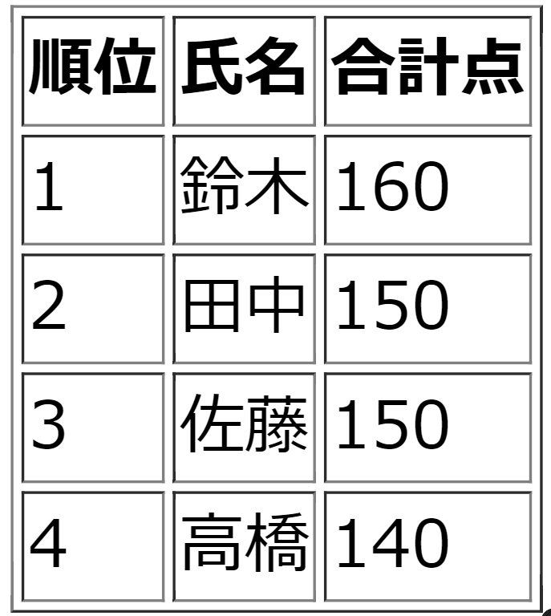

import Answer from "@site/src/components/Answer";
import ViewSource from "@site/src/components/ViewSource";

## 繰り返し

正の整数 n に対して、以下の操作を考えます。

- n が偶数の場合、n を 2 で割る。
- n が奇数の場合、n に 3 をかけて 1 を足す。

`n = 27` から始めて、`n` が `1` になるまで操作を繰り返します。それぞれの操作の後の `n` の値を順番に表示するプログラムを、while 文を用いて作成してください。

例えば、`n = 3` から始めて操作を繰り返すと、`n` の値は 3 → 10 → 5 → 16 → 8 → 4 → 2 → 1 と変化します。

:::tip `a` を `b` で割った余り

`a` を `b` で割った余りは `a % b` と表します。これを用いて `n` が偶数か奇数かを判定しましょう。

```javascript
let n = 27;
if (n % 2 === 0) {
  document.write("nは偶数です");
} else {
  document.write("nは奇数です");
}
```

:::

### 解答例

<Answer>

```html
<div id="answer"></div>
```

```javascript
let n = 27;
const answer = document.getElementById("answer");
while (n !== 1) {
  answer.textContent += n + " → ";
  if (n % 2 === 0) {
    n /= 2;
  } else {
    n *= 3;
    n += 1;
  }
}
answer.textContent += 1;
```

<ViewSource url={import.meta.url} path="_samples/collatz-problem" />

</Answer>

## クラス

次のコードは、ブラウザ上に動物の鳴き声を表示するプログラムです。

```html title=index.html
<!DOCTYPE html>
<html lang="ja">
  <head>
    <meta charset="UTF-8" />
    <title>動物</title>
  </head>
  <body>
    <script src="script.js"></script>
  </body>
</html>
```

```javascript title=script.js
class Cat {
  weight = 5;

  isKitten = true;

  meow() {
    const div = document.createElement("div");
    div.textContent = "ニャー";
    document.body.appendChild(div);
  }
}

class Dog {
  weight = 10;

  isRetriever = false;

  bark() {
    const div = document.createElement("div");
    div.textContent = "ワンワン";
    document.body.appendChild(div);
  }
}

class Chicken {
  weight = 2.8;

  isDelicious = true;

  crow() {
    const div = document.createElement("div");
    div.textContent = "コケコッコー";
    document.body.appendChild(div);
  }
}

const cat = new Cat();
const dog = new Dog();
const chicken = new Chicken();

cat.meow();
dog.bark();
chicken.crow();
```

1. 新たに `Bear`（熊）クラスを追加し、体重を 80 として、`growl` メソッドで「グルルル」と鳴くようにしてみましょう。

2. 1 のようにどんどん動物を増やしていく事もできますが、いくつかの性質や処理は共通点があり、１つの親クラスにまとめることができるように見えます。どのようなクラスを用意すればきれいにまとめることができるでしょうか？

### 解答例

<Answer>

#### 1 の解答例

```javascript title=script.js
class Cat {
  weight = 5;

  isKitten = true;

  meow() {
    const div = document.createElement("div");
    div.textContent = "ニャー";
    document.body.appendChild(div);
  }
}

class Dog {
  weight = 10;

  isRetriever = false;

  bark() {
    const div = document.createElement("div");
    div.textContent = "ワンワン";
    document.body.appendChild(div);
  }
}

class Chicken {
  weight = 2.8;

  isDelicious = true;

  crow() {
    const div = document.createElement("div");
    div.textContent = "コケコッコー";
    document.body.appendChild(div);
  }
}

class Bear {
  weight = 80;

  growl() {
    const div = document.createElement("div");
    div.textContent = "グルルル";
    document.body.appendChild(div);
  }
}

const cat = new Cat();
const dog = new Dog();
const chicken = new Chicken();
const bear = new Bear();

cat.meow();
dog.bark();
chicken.crow();
bear.growl();
```

<ViewSource url={import.meta.url} path="_samples/animals1" />

#### 2 の解答例

以下のようなクラス `Animal` を用意します。つまり、動物の体重という性質や動物が「鳴く」という処理は同じであり、変わるのは声のみなので、一括で扱ってしまいます。

```javascript
class Animal {
  weight;

  sound;

  say(sound) {
    const div = document.createElement("div");
    div.textContent = sound;
    document.body.appendChild(div);
  }
}
```

このようなクラスを作れば、次のようにコードをきれいに書くことができます。

```javascript title=script.js
class Animal {
  weight;

  sound;

  say(sound) {
    const div = document.createElement("div");
    div.textContent = sound;
    document.body.appendChild(div);
  }
}

class Cat extends Animal {
  weight = 5;

  isKitten = true;

  sound = "ニャー";
}

class Dog extends Animal {
  weight = 10;

  isRetriever = false;

  sound = "ワンワン";
}

class Chicken extends Animal {
  weight = 2.8;

  isDelicious = true;

  sound = "コケコッコー";
}

class Bear extends Animal {
  weight = 80;

  sound = "グルルル";
}

const cat = new Cat();
const dog = new Dog();
const chicken = new Chicken();
const bear = new Bear();

cat.say();
dog.say();
chicken.say();
bear.say();
```

<ViewSource url={import.meta.url} path="_samples/animals1" />

また、たとえばある正体不明の動物のインスタンスを引数として受け取ったときに鳴き声を表示する関数を作るとします。このとき、メソッドがバラバラだと次のように関数が長いコードになってしまいます。

```javascript
function showSound(Animal) {
  if (Animal instanceof cat) {
    Animal.meow();
  } else if (Animal instanceof dog) {
    Animal.bark();
  } else if (Animal instanceof chicken) {
    Animal.growl();
  }
  // 動物が増えるとさらに条件分岐が続く
}
```

これも、親クラスを作ることで短く書けます。

```javascript
function showSound(Animal) {
  Animal.say();
  // なんの動物であるかを気にする必要がない
}
```

このように、同じ処理でも動物によって処理が変わるにもかかわらず、コードは１つにまとめることができました。この「同じ処理でも引数（今回は動物）によって処理が変わる」ことを、**ポリモーフィズム**と言います。

</Answer>

## 配列

みんなのテストの点数が出ました。

```plain
佐藤...math: 80点、science:70点
鈴木...math: 90点、science:70点
高橋...math:100点、science:40点
田中...math: 85点、science:65点
```

この点数データを使って、順位表を作ってください。


ルールは以下とします。

- `math`、 `science` の合計点が高い者を上位とする。
- 上記で同率になった場合、`math` の得点が高い者を上位とする。
- 順位の判定はもちろん、配列内で繰り返し処理（点数の比較）をするプログラムを javascript で書いて行う。

```javascript
const academicPerformanceData = [sato, suzuki, takahashi, tanaka];

//const academicPerformanceData = [tanaka, suzuki, sato, takahashi];などでも構わない。

//for文でacademicPerformanceDataの要素を順位順に並べ替える処理を書く
```

最初の配列 `academicPerformanceData` がどんな並びをしていても,最終的には 1 位から順に並んだ配列が出てくるようにプログラムを作成すること。(上記の点数の場合は `[suzuki, tanaka, sato, takahashi]`)

### ヒント

```javascript
const sato = {
  name:"佐藤";
  scores: {
    math: 0,
    science: 0,
    total: 0;
  };
}
```

このように氏名・点数のデータからオブジェクトを作成すると処理がしやすいでしょう。

プログラムを書き終えたら、初めの `academicPerformanceData` の順番をいじったり、点数を書き換えたりして、望み通りの表ができるか確認しましょう。

### 解答例

<Answer>

まずは、html で表のひな形を作ります。

```html title=index.html
<!DOCTYPE html>
<html lang="ja">
  <head>
    <meta charset="UTF-8" />
    <meta http-equiv="X-UA-Compatible" content="IE=edge" />
    <meta name="viewport" content="width=device-width, initial-scale=1.0" />
    <title>Document</title>
  </head>
  <body>
    <table border="1">
      <tr>
        <th>順位</th>
        <th>氏名</th>
        <th>合計点</th>
      </tr>
      <tr>
        <td>1</td>
        <td id="prize1Name"></td>
        <td id="prize1Score"></td>
      </tr>
      <tr>
        <td>2</td>
        <td id="prize2Name"></td>
        <td id="prize2Score"></td>
      </tr>
      <tr>
        <td>3</td>
        <td id="prize3Name"></td>
        <td id="prize3Score"></td>
      </tr>
      <tr>
        <td>4</td>
        <td id="prize4Name"></td>
        <td id="prize4Score"></td>
      </tr>
    </table>
    <script src="./script.js"></script>
  </body>
</html>
```

続いて、script.js の回答例です。

```javascript title=script.js
function makePersonalData(name, mathScore, scienceScore) {
  return {
    name: name,
    scores: {
      math: mathScore,
      science: scienceScore,
      total: mathScore + scienceScore,
    },
  };
}

//データオブジェクトを生成
const sato = makePersonalData("佐藤", 80, 70);
const suzuki = makePersonalData("鈴木", 90, 70);
const takahashi = makePersonalData("高橋", 100, 40);
const tanaka = makePersonalData("田中", 85, 65);

//この配列の要素をあとで並び替える。
const academicPerformanceData = [sato, suzuki, takahashi, tanaka];

//並び替えるぞ～
//まず、合計点の順に並べよう。for文のネストが要るぞ！
//佐藤と鈴木を比べる→高橋と「佐藤＆鈴木」を比べる→田中と「佐藤＆鈴木＆高橋」を比べる

//academicPerformanceDataのa番目とb番目の要素を入れ替える関数を用意する。
function swap(a, b) {
  const before_a = academicPerformanceData[a];
  const before_b = academicPerformanceData[b];

  const after_a = before_b;
  const after_b = before_a;

  academicPerformanceData[a] = after_a;
  academicPerformanceData[b] = after_b;
}

//swapの別解
// function swap(a, b) {
//   const tmp = academicPerformanceData[a];
//   academicPerformanceData[a] = academicPerformanceData[b];
//   academicPerformanceData[b] = tmp;
// }

//いざ、並び替え！
//i++はi += 1と同じ意味です。
for (let i = 1; i < 4; i++) {
  const person_i = academicPerformanceData[i];

  for (let j = 0; j < i; j++) {
    const person_j = academicPerformanceData[j];

    if (person_j.scores.total < person_i.scores.total) {
      //１つ目のルールに従って入れ替え
      swap(j, i);
    }

    if (
      person_j.scores.total == person_i.scores.total &&
      person_j.scores.math < person_i.scores.math
    ) {
      //２つ目のルールに従って入れ替え
      swap(j, i);
    }
  }
}

//表を埋めていくDOM
for (let i = 0; i < 4; i++) {
  let name = document.getElementById(`prize${i + 1}Name`);
  let score = document.getElementById(`prize${i + 1}Score`);
  name.textContent = academicPerformanceData[i].name;
  score.textContent = academicPerformanceData[i].scores.total;
}
```

並び替えは「バブルソート」を用いています。[他の並べ方](https://products.sint.co.jp/topsic/blog/algorithm-type)もあるので興味のある方は調べてみましょう

<ViewSource url={import.meta.url} path="_samples/ranking" />

</Answer>
