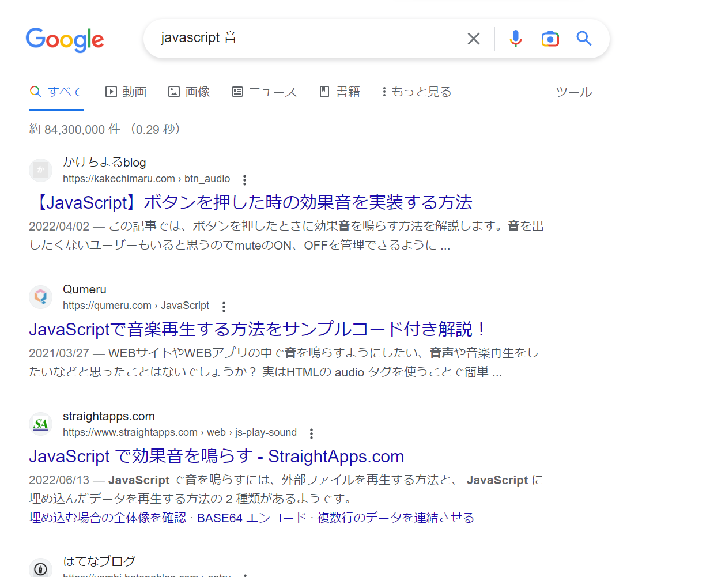

import ViewSource from "@site/src/components/ViewSource";
import Answer from "@site/src/components/Answer";
import timerVideo from "./timer.mp4";
import flashcardVideo from "./flashcard.mp4";

この章は教材の「[ブラウザで動作するアプリを構築しよう](../../2-browser-apps/index.md)」までの項目の総合問題です。

---

## 1. 英単語帳アプリ

単語帳アプリを作ってみましょう。

### ルール

- 画面に問題が表示される

- 「答えを見る」ボタンを押すと、答えが表示される

- 「次の問題へ」ボタンを押すと、次の問題が表示される(最後の問題の次は最初の問題に戻る)

<video src={flashcardVideo} controls muted autoPlay loop />

### ヒント

- まずは HTML で、問題や答えを表示するための `div` 要素と「答えを見る」「次の問題へ」ボタンを作成しましょう。

- 次に、問題と答えの組をいくつか作りましょう。問題と答えを格納する配列をそれぞれ作成します。

- 配列ができたら、ボタンの操作に応じて問題や答えが表示されるようにプログラムを作成しましょう。

  - 問題を順番に表示させるには、「現在表示されている問題のインデックス」を変数で管理し、「次の問題へ」ボタンを押すとインデックスが 1 増えるようにすると良いでしょう。ただし、最後の問題の次は最初の問題に戻ることに注意しましょう。

  - 「答えを見る」ボタンを押した時に答えが表示されるようにしましょう。「次の問題へ」ボタンを押した時には答えを非表示にする必要があることにも注意しましょう。

- ここまでで基本的な動作は完成です。最後に、CSS を用いて画面を整えてみましょう。

- 余裕のある人は、さらに機能を追加してみましょう。例えば、問題が表示される順番をランダムにしたり、選択肢を用意してクイズ形式にしたりすることが考えられます。

### 解答例

<Answer>

```html title=index.html
<div class="card">
  <div id="question"></div>
  <div id="answer"></div>
</div>
<button id="answer-button">答えを見る</button>
<button id="next-button">次の問題へ</button>
```

```js title=script.js
const questions = ["apple", "black", "cloud"];
const answers = ["りんご", "黒", "雲"];

const questionDisplay = document.getElementById("question");

const answer = document.getElementById("answer");
let index = 0;

questionDisplay.textContent = questions[0];

document.getElementById("answer-button").onclick = () => {
  answer.textContent = answers[index];
};
document.getElementById("next-button").onclick = () => {
  index += 1;
  if (index === questions.length) {
    index = 0;
  }
  questionDisplay.textContent = questions[index];
  answer.textContent = "";
};
```

<ViewSource url={import.meta.url} path="_samples/flashcard" />

</Answer>

---

## 2. タイマーアプリ

以下のような音が鳴るタイマーを作ってみましょう。

**音声が出ますのでご注意ください**

<video src={timerVideo} controls />

- セットボタンで時間がセットされます。
- スタートボタンで開始、ストップボタンで一時停止できます。
- タイマーが動いている間はスタートボタンは押せません。逆に停止しているときはストップボタンは押せません。
- 時間になると音が出ます。~~関西弁~~音源は[ここ](alarm.mp3)からダウンロードしてください。
- ストップボタンかセットボタンを押すと音が止まります。
- セットされている時間が０秒のままスタートボタンを押すとエラーが表示されます。
- 残り時間表示は時間・分・秒に分けて表示されます。
- 時間の入力欄には数字しか入力できません。
- ボタンで時間を調整することもでき、直接タイプ入力することもできます。
- 画面の大きさを変えるとそれに応じてタイマーのサイズも変わります。（つまり物の位置関係やスタイルは崩れません）

### ヒント

#### ヒント１

何やらよくわからないことがたくさん出てきました。まず多くの人が注目するのは「**音**」だと思います。音の鳴らし方なんか知らないよって？大丈夫。プログラミングでわからないことは調べれば良いのです。皆気になっていることは調べれば案外すぐに出てくるものです。試しに `JavaScript 音` なんて調べてはいかがでしょうか？

他にも特徴的な動きが何個かある思いますが、特徴的なものは調べると結構すぐ見つかります。積極的に調べていきましょう。


グーグル先生さすがっす！！

#### ヒント２

混乱する原因の一つは、機能が多いために今どの部分を作っているのか不明瞭になりやすいということです。

しかし、純粋なタイマーの機能だけに焦点を絞って考えた場合、考えることはそう多くありません。極端に言えば、**残り時間** という情報と、その残り時間を減らしていく関数さえあれば、一応タイマーにはなります。このように、まずは本質的な機能や状態に目を向けることが肝要です。

### 解答例

<Answer>

<ViewSource url={import.meta.url} path="_samples/timer" />

</Answer>
