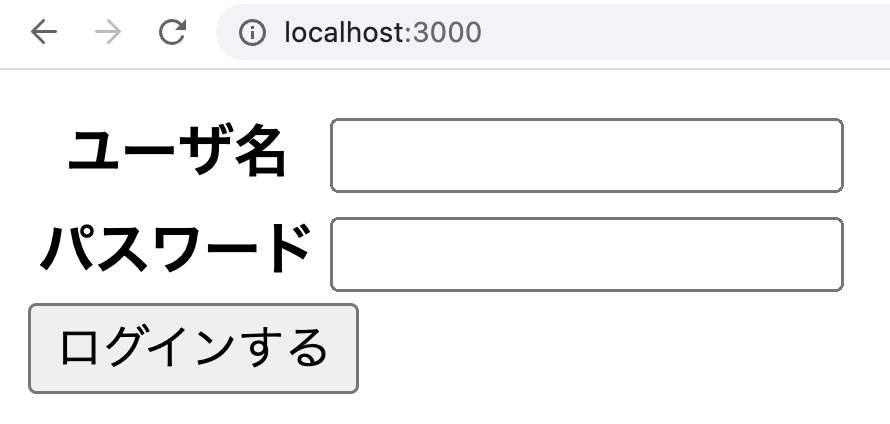

import CodeBlock from "@theme/CodeBlock";
import Term from "@site/src/components/Term";
import ViewSource from "@site/src/components/ViewSource";
import Answer from "@site/src/components/Answer";
import Details from "@theme/Details";

この章では教材の「[フォーム](/docs/web-servers/form/)」「[GET リクエストと POST リクエスト](/docs/web-servers/get-post/)」の内容を扱っています。

---

## ユーザ名とパスワードを入力してログイン

ユーザ名とパスワードを入力してログインするサイトを作ってみましょう。

- 正しいユーザ名とパスワードを入力すると、「ようこそ〇〇さん」（〇〇はユーザ名）と表示されます。
- 存在しないユーザ名、または間違ったパスワードを入力すると、「ユーザが存在しないか、パスワードが間違っています」と表示されます。

※ユーザ名とパスワードはあらかじめサーバー側で定義しておきましょう。



<Answer>

```javascript title="server.js"
const express = require("express");

const app = express();

const data = { tanaka: "1234", sato: "9999" };

app.use(express.urlencoded({ extended: true }));
app.use(express.static("static"));

app.post("/user", (request, response) => {
  if (request.body.password === data[request.body.user]) {
    response.send(`ようこそ、${request.body.user}さん！`);
  } else {
    response.send("ユーザが存在しないか、パスワードが間違っています");
  }
});

app.listen(3000);
```

```html title="index.html"
<!doctype html>
<html lang="ja">
  <head>
    <meta charset="UTF-8" />
    <title>ログイン</title>
  </head>
  <body>
    <form action="/user" method="post">
      <table>
        <tr>
          <th>ユーザ名</th>
          <td><input name="user" /></td>
        </tr>
        <tr>
          <th>パスワード</th>
          <td>
            <input name="password" type="password" />
          </td>
        </tr>
      </table>
      <button type="submit">ログインする</button>
    </form>
  </body>
</html>
```

<ViewSource url={import.meta.url} path="_samples/login-form" />

</Answer>

<Details summary={<summary>注意</summary>}>

このシステムでは、`tanaka` や `sato` などのユーザ名をキーにしているため、同名の人物が存在するとログインできなくなります。

本来はそのような場合も想定し、`{ 自動で発行したid: { name: "名前", password: ""}}` のようなモデルを使って、ユーザを登録するたびに `id` を自動で発行し、その `id` をキーにするようにするとよいでしょう。

詳細はデータベースや Cookie について理解したのちに、[Cookie の章の課題](/docs/web-servers/cookie/#%E8%AA%B2%E9%A1%8C-1)等を通して学習してください。

</Details>
