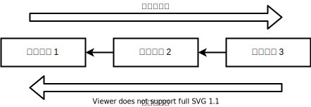
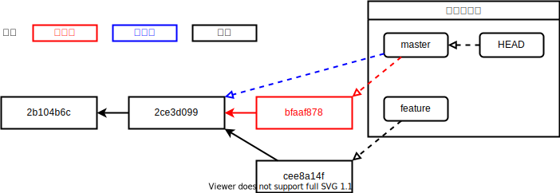
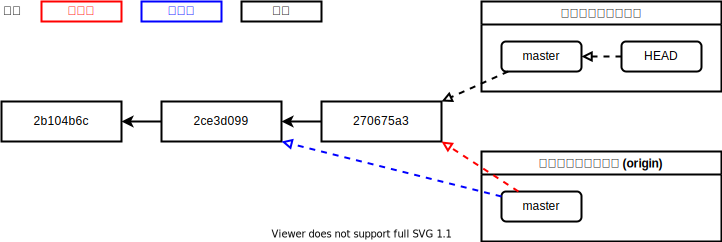
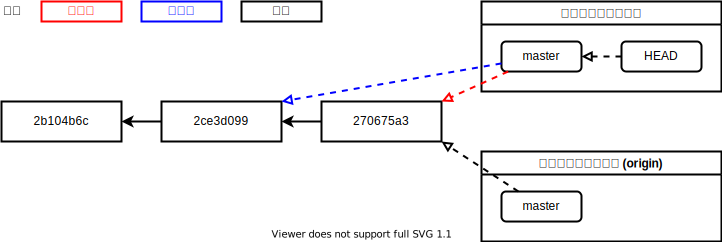
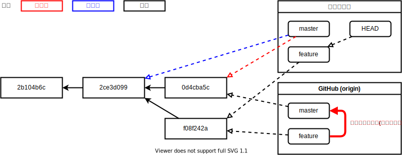
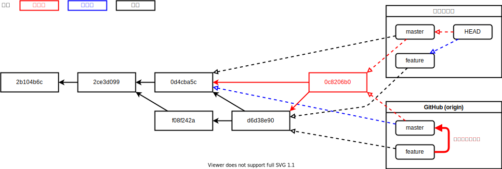

import outdent from "outdent";
import CodeBlock from '@theme/CodeBlock';
import Term from "@site/src/components/Term";
import ViewSource from "@site/src/components/ViewSource";
import ExternalVideoPlayer from "@site/src/components/ExternalVideoPlayer";
import branchedGraphVideo from "./branched-graph.mp4";
import mergeVideo from "./merge.mp4";
import editCommitMessageWithVim from "./edit-commit-message-with-vim.mp4";
import conflictVideo from "./conflict.mp4";
import remoteBranchVideo from "./remote-branch.mp4";
import pullVideo from "./pull.mp4";
import pullAndMergeVideo from "./pull-and-merge.mp4";
import pullRequestVideo from "./pull-request.mp4";
import resolvePullRequestConflictVideo from "./resolve-pull-request-conflict.mp4";

現代のチーム開発では、通常 Git が用いられます。Git の概念は複雑ですが、チーム開発で起こる様々な状況に適切に対処するためには、ある程度の理解が必要となります。この節では、Git の思想を解説したうえで、GitHub を用いてチーム開発を行う手法を示します。

## コミットが記録される仕組み

Git の節では、Git のコミットに一意の ID が割り当てられることを説明しました。実は、**コミット ID は、次の情報から計算可能です**。つまり、次の情報が完全に一致しているのであれば、どのような環境でコミットを行なっても同じコミット ID が割り当てられます。逆に、次の情報のうち一つでも異なるものがあれば、全く違うコミット ID が割り当てられます。

- すべてのファイルやディレクトリの名前
- コミットの作成者の名前やメールアドレス
- コミットが作成された日時
- コミットメッセージ
- 親コミット (ひとつ前のコミット) の ID

これらの情報の中に、**リポジトリは含まれていません**。コミットは、リポジトリとは独立して存在するものなのです。

また、注目したいのは、コミットの情報の中に親コミットの ID が含まれているところです。つまり、歴史の流れの方向と、コミットグラフの参照の方向は逆向きになります。この性質により、一度作成されたコミットはその後の変更に影響を受けません。



## ブランチと HEAD

**ブランチ**は、ソースコードへの変更の枝分かれを扱うための仕組みです。ブランチはリポジトリの中に存在し、**コミットを指し示します**。

各リポジトリには、**HEAD** と呼ばれる、**現在実際にディレクトリに表れている状態を表す**特殊なポインタがあります。作業中のブランチがある場合、HEAD はそのブランチを指し示します。`git init` コマンドによりリポジトリを新しく作成した場合、HEAD は自動的に `master` ブランチを指すように設定されます。

HEAD が `master` ブランチを指している状態で、コミットを行った際に起こる変化を表したのが次の図です。直前まで `master` ブランチが指していたコミット `2ce3d099` を親とする新しいコミット `cee8a14f` が作成され、ブランチ `master` が指し示す先は新しく作成されたコミットに変更されます。


## 別のブランチで作業する

新しいブランチを作成する場合には、`git checkout -b` コマンドを実行します。次の図は、HEAD がコミット `2ce3d099` を指している状態で、`git checkout -b feature` を実行した例です。直前まで HEAD が指していたコミットを指し示すブランチ `feature` が作成され、HEAD が指し示す先も新しいブランチに変更されます。


この状態で新しいコミット `cee8a14f` を作成すると、`feature` ブランチが指し示す先のみが新しいコミットに変更されます。


ここで `git checkout master` を実行すると、HEAD の指し示す先のみが `master` ブランチに変更され、ディレクトリ内のファイルはコミット `2ce3d099` のものに戻ります。


このまま、さらにコミット `bfaaf878` を追加します。これにより、コミットグラフの枝分かれが生じます。これが、複数人で同時に開発が行われている状態です。



ここまでの操作を実際に行った様子が次の動画で確認できます。

<video src={branchedGraphVideo} controls muted />

## 枝分かれしたブランチをマージする

`git merge` コマンドを用いると、現在のブランチに他のブランチの変更を取り込むことができます。次の例では、HEAD が `master` ブランチにある状態で、`git merge feature` を実行することで `feature` ブランチを `master` ブランチにマージしています。


このマージを実行すると、`bfaaf878` と `cee8a14f` の 2 つの親を持つ**マージコミット** `d021150b` が生成され、2 つのブランチ両方で行われた変更を含むコミットとなります。マージコミットのコミットメッセージは自分で指定することもできますが、Git 側で用意してくれる標準のメッセージ (この例では `Merge branch 'feature'`) をそのまま用いても良いでしょう。

<video src={mergeVideo} controls muted autoPlay loop />

:::tip Git 標準のエディタ

コマンドラインからコミットを作成する際、`-m` オプションを指定しなかった場合、コミットメッセージを編集するためのエディタが起動します。このエディタは自分で設定することができますが、上の例では [nano](https://www.nano-editor.org/) が起動しており、この場合は `Ctrl + X` で終了します。

環境によっては [Vim](https://www.vim.org/) が起動する場合があります。この場合は、`:q` を入力して `Enter` を押下することにより終了できます。

<video src={editCommitMessageWithVim} controls muted autoPlay loop />

:::

## コンフリクト

`git merge` コマンドが実行されると、Git はまずコミットグラフ上の共通の祖先を探します。例えば、コミットグラフが次のような状態であるとき、Git は `master` ブランチと `feature` ブランチの共通の祖先であるコミット `2ce3d099` を起点とした変更を取得します。

```html title="共通の祖先 (2ce3d099)"
<li>吾輩は猫である</li>
<li>坊っちゃん</li>
```

<div className="row">
  <div className="col">
    <CodeBlock title="master (0d4cba5c)" language="html">{outdent`
      <li>吾輩は猫である</li>
      <li>坊っちゃん</li>
      <li>三四郎</li>
    `}</CodeBlock>
  </div>
  <div className="col">
    <CodeBlock title="feature (f08f242a)" language="html">{outdent`
      <li>吾輩は猫である</li>
      <li>坊っちゃん</li>
      <li>こころ</li>
    `}</CodeBlock>
  </div>
</div>


この例の場合、共通の祖先に対して `master` は `<li>三四郎</li>` が、`feature` は `<li>こころ</li>` が**同じ場所に**追加されています。この状態で `git merge feature` を実行すると、Git は**コンフリクト**を報告し、マージを中断します。コンフリクトが発生したファイルには、Git により自動的に `<<<<<<<` や `=======`、`>>>>>>>` といったコンフリクトマーカーが挿入されます。

<!-- 頭にインデントを入れておくことで Markdown ファイルのコンフリクトと認識させない -->

<CodeBlock language="html">{outdent`

  <li>吾輩は猫である</li>
  <li>坊っちゃん</li>
  <<<<<<< HEAD
  <li>三四郎</li>
  =======
  <li>こころ</li>
  >>>>>>> feature
`.trim()}</CodeBlock>

コンフリクトを解決するには、ファイルを編集してコンフリクトマーカーを削除する必要があります。全てのコンフリクトに対応できたら、コンフリクトしたファイルをステージし、`git merge --continue` コマンドを実行してマージを続行しましょう。

ここまでの操作を実際に行うと、次の動画のようになります。

<video src={conflictVideo} controls muted />

## リモートブランチ

Git と GitHub の節では、自分の PC に置かれたリポジトリ (ローカルリポジトリ) と GitHub 上のリポジトリ (リモートリポジトリ) を接続しました。`git push origin master` コマンドを行ったときの Git の動作を確認しておきましょう。

`git push origin master` コマンドは、ローカルリポジトリの `master` ブランチが指し示すコミットを、リモートリポジトリの `master` ブランチが指し示すコミットとして設定するためのコマンドです。次の図は、ローカルリポジトリの `master` ブランチがコミット `2ce3d099` を指している状態で、空のリモートリポジトリ `origin` に対して `git push origin master` を実行した際の様子を表しています。


この状態でコミットを行うと、ローカルリポジトリの `master` ブランチが、リモートリポジトリの `master` ブランチより 1 コミット分進んでいる状態になります。


再び `git push origin master` を実行 (最初の push 時に `-u` オプションを指定した場合は `git push`) することで、作成したコミットをリモートリポジトリに反映させられます。



ここまでの操作を実際に行うと、次のようになります。

<video src={remoteBranchVideo} controls muted />

## 他の人が行った変更を取得する

自分以外がリモートリポジトリに対して変更を加えた場合、リモートリポジトリのブランチがローカルリポジトリのブランチより先のコミットを指している状態になります。`git pull` コマンドにより、ローカルリポジトリのブランチが指し示す先を、リモートリポジトリのブランチが指すコミットと一致させることができます。次の例では、`git pull origin master` により、ローカルリポジトリの `master` をリモートブランチ `master` の最新のコミットと一致させています。



<video src={pullVideo} controls muted />

## プルの際にマージが必要な場合

自分が最後に `git pull` をした後に他の人がリモートリポジトリにプッシュした状態で、自分が新しいコミットを作成すると、次の図のような状態になります。


この状態で `git pull` を行うと、自動的にマージコミットが作成されます。


再び `git push origin master` を実行することにより、変更を正しくリモートブランチに反映できます。


ここまでの操作を実際に行うと、次の動画のようになります。

<video src={pullAndMergeVideo} controls muted />

## プルリクエスト

GitHub などのサービスを用いて共同開発を行う場合、通常は `master` ブランチへのマージを Web 画面上で行い、**Git のコマンドで `master` ブランチを操作することはありません**。これにより、プログラムの変更が無秩序に行われることを防ぐことができます。GitHub では、**プルリクエスト**と呼ばれる機能により実現できます。

次の図のようなコミットグラフがある状態を考えてみましょう。`master` ブランチから `feature` ブランチを切り出し、作成したコミットをリモートリポジトリにプッシュした状態です。`feature` ブランチから `master` ブランチに対してプルリクエストを作成することで、`feature` ブランチで行った変更を他のユーザーに確認してもらうことができます。


プルリクエストをマージすると、ローカルリポジトリで `git merge` コマンドを実行した場合と同様にマージコミットが作成されます。


ローカルリポジトリで再び `master` ブランチをチェックアウトし、`git pull origin master` で `master` ブランチを GitHub 上の最新のコミットに合わせれば、開発を再開できます。


ここまでの操作を実際に行うと、次の通りになります。

<video src={pullRequestVideo} controls muted />

## プルリクエストでコンフリクトが発生した場合

プルリクエストでコンフリクトが発生した場合、ローカルではマージコミット作成前に修正をしていましたが、プルリクエストを用いた開発においては、`master` ブランチは直接操作できないため、代わりにプルリクエストを出した側のブランチを操作して `master` ブランチにマージ可能になるよう修正します。

次のコミットグラフを考えてみましょう。`master` ブランチが `2ce3d099` だった際に `feature` ブランチを切り出し、コミット `f08f242a` を作成しましたが、他のチームメンバーの開発の結果 GitHub 上の `master` ブランチが `0d4cba5c` に進み、`feature` ブランチから `master` ブランチへのプルリクエストがコンフリクトしている状態です。


この状態を解消するために、**ローカルで最新の `master` ブランチを `feature` ブランチにマージします**。まずは `master` ブランチをチェックアウトし、最新の `master` への変更を `git pull origin master` によりローカルリポジトリに取り込んだうえで、再び `feature` ブランチに戻ります。



ここで `git merge master` を実行し、コンフリクトを解決して `master` ブランチとのマージコミット `d6d38e90` を作成してプッシュします。これにより、`feature` ブランチは `master` ブランチにマージ可能となり、コンフリクトが解消されます。


通常通りプルリクエストをマージすれば完了です。同じように作成されたマージコミットをローカルに取り込むことができます。



ここまでの操作を実際に行った様子が次の動画になります。

<video src={resolvePullRequestConflictVideo} controls muted />

## 課題

1. 同一の GitHub リポジトリに対し、同じ行を変更するプルリクエストを 2 人で作成しましょう。
2. 片方をマージすると、もう片方のプルリクエストがコンフリクト状態になることを確認しましょう。
3. コンフリクトを解決しましょう。
4. マージされたプルリクエストで行われた変更をプルしましょう。
