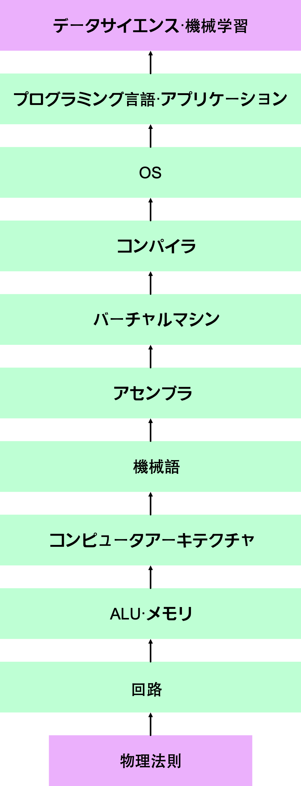

コンピュータサイエンスは、人類の築いてきた工学の最先端であり最も多くの人が関わった構築物であると言っても過言でないでしょう。人間は抽象化と階層化を繰り返すことで、コンピュータを作ってきました。ここでは、コンピュータの階層を見ていきましょう。

## コンピュータの階層

物理法則、論理ゲート、回路、ALU/メモリ、コンピュータアーキテクチャ、機械語、アセンブラ、バーチャルマシン、コンパイラ、OS、プログラミング言語、アプリケーション、データサイエンス/機械学習の層で構成されています。

コンピュータサイエンスの中核を占める最適化は離散最適化です。
データ構造とアルゴリズム(離散最適化)を用いたホワイトボックスな抽象化と階層化がコンピュータサイエンスの真髄です。
コンピュータを作る上でデータ構造とアルゴリズムは欠かせません。

ITは主に離散最適化の分野であり、科学やCS以外の工学は主に連続最適化の分野でした。

伝統的な教育課程は主に連続最適化の分野に焦点が当てられていました。物理学や機械工学、データサイエンス•機械学習は主に連続最適化です。

一方で、最近話題になっている分野であるデータサイエンス/AIでは、連続最適化が行われています。
データサイエンス/AIは数学に近い分野です。
深層学習では、連続最適化(一階の微分情報)を用いて学習されたニューラルネットワークによるブラックボックスな抽象化と階層化が行われています。
自動言語処理や画像認識などの分野で大きな成果が出ています。
実は、深層学習の発展には動的計画法というデータ構造とアルゴリズムが大きく貢献しています。

ITは主に離散最適化の分野であり、科学やCS以外の工学は主に連続最適化の分野でした。

伝統的な教育課程は主に連続最適化の分野に焦点が当てられていました。物理学や機械工学、データサイエンス•機械学習は主に連続最適化です。

教育課程で焦点が当てられている物理法則は、主に連続最適化の分野と言えます。

連続最適化は昔からあり、離散最適化はCSの発展により注目された新しい分野というイメージがあります。

離散最適化を使った人工的な抽象化•階層化によって、緑色のレイヤーが発展していきました。

近年の発展により、コンピュータサイエンスの最上部のレイヤーにピンクの部分(連続最適化)が現れました。ピンクの部分は既に教育課程に組み込まれていたので、データサイエンス•機械学習は従来の教育で対応できると思います。科学技術計算は性質的に最上部のピンクのレイヤーです。コンピュータを数学の計算の手段として使うという性質を持っています。

データサイエンス•機械学習と物理法則の学習方法は類似しています。物理法則主体の教育課程が採用されている日本において、この二つのレイヤーは強みです。一方で、中間の緑色のレイヤーは様子が変わります。緑色のレイヤーはデータ構造とアルゴリズムを駆使した離散最適化ですから、従来の物理法則主体の教育課程とは方向性が違うと言えます。

近年の傾向としては、深層学習の発展によりピンク色(連続最適化)の領域が広がっています。シミュレーション技術や仮想化技術の発展によって緑色(離散最適化)の領域も同様に広がっています。

コンピュータサイエンスの根幹にあるのは、小中高の教育課程であまり取り上げられてこなかった緑色の部分(離散最適化)であると言えます。コンピュータサイエンスの基礎である離散最適化は、連続最適化と理論上の議論の類似性(凸性、マトロイド)はあるものの、やはり分野として違いがあります。離散最適化の応用であるデータ構造とアルゴリズムは、ソフトウェアの開発に不可欠な分野です。連続最適化である深層学習の発展が計算グラフ、動的計画法、ベクタ計算等の離散最適化によって支えられているように、CSで離散最適化は至る所で登場します。1つの層を扱う場合、前後の層の知識は時に必要になります。

コンピュータサイエンスにおいて離散最適化は大きなウェイトを占めていますが、小中高の教育課程において離散最適化の占める割合は、やはり少ないと思います。コンピュータサイエンスの歴史が教育課程の歴史よりも浅いからといえるでしょう。小中高の教育課程において、従来の連続最適化に加えて離散最適化もバランス良く取り入れていくことが大事なのでは無いでしょうか。

離散最適化は微分不可能な場合の最適化であり、連続最適化は微分情報を使った最適化です。

自然言語処理の発展により離散的記号は連続値ベクトルで表現できることが分かりました。離散と連続で分野を分類することが今後も適切か分からないですが、離散か連続かで分類することである程度情報が整理しやすくなります。
<!-- コンピュータを用いたデータサイエンス/AIの実装にはデータ構造とアルゴリズムは欠かせません。 -->

<!-- バックエンドサーバーとML(機械学習)サーバーをQueueで疎結合させることでバッチ処理を実装することができる。 -->

(注釈)連続最適化とは、目的関数を最小化する連続値パラメータを見つけることです。
離散最適化とは、目的関数を最小化する離散値パラメータの組み合わせを見つけることです。Quoraの記事と同一の人物が本記事を作成しています。

<!-- データサイエンス/AIをコンピュータを用いて社会に価値を還元していくには、データ構造とアルゴリズムが必要です。

現在の学校における教育では連続最適化が主なテーマとなっています。
今後は、情報分野の中核を占める離散最適化をバランス良く取り入れていくことが求められています。

大学内では、研究としてデータサイエンスやAIが盛んに行われています。
一方で、webアプリケーション(frontend, backend)の東大の講義はありません。

GAFAが覇権を握っているのはwebアプリケーション分野の業界です。
成熟した企業が蓄積したデータを用いてデータサイエンス/AIをし、さらに付加価値を提供しています。
GAFAに対抗するためには、データサイエンス/AIだけではなく、基盤となるwebアプリケーション分野(データ構造とアルゴリズム)に力を入れる必要があります。

私たちut.code();は、webアプリケーションに注力しています。
0から1の価値を生み出して社会に価値を提供するためには、webアプリケーション分野(データ構造とアルゴリズム)が必要不可欠だと考えています。

webアプリケーションとデータサイエンス/AIの融合が東大で求められています。

社会に価値を還元していくことを目指してut.code();はwebアプリケーションの後進育成に注力しています。 -->

<!--
 -->
