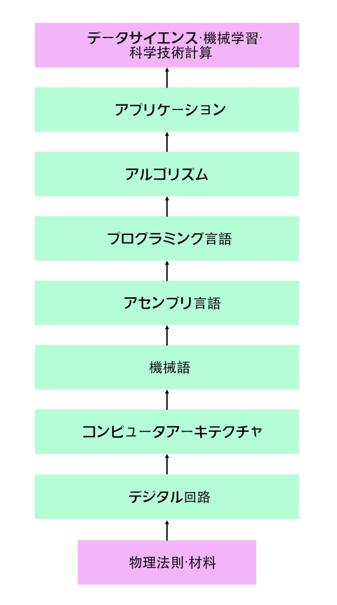

情報系はコンピュータサイエンスとデータサイエンスに別れます。

コンピュータサイエンスは人工的な離散最適化を行うサイエンスであり、データサイエンスは連続最適化を行うサイエンスであると言えるでしょう。

目的関数のパラメータが離散的な場合を離散最適、連続的な場合を連続最適といいます。
離散最適は問題の木構造や凸構造を利用し、データ構造とアルゴリズムを用いて解きます。
連続最適は、目的関数をパラメータで微分し、パラメータの更新方向を決めます。古典物理学とデータサイエンスは同じ連続最適の手法を用いているため、近いと言えるでしょう。

データサイエンスのコンピュータ・サイエンスによる拡張が深層学習になります。深層学習とは複雑な目的関数の連続最適化であり、「複雑な」
の部分はコンピュータ・サイエンスの恩恵に預かっています。データ構造とアルゴリズム、動的計画法、GPUによるベクタ計算などの技術が深層学習を可能にさせました。学習データの収集や深層学習モデルの学習、深層学習フレームワーク自体の作成は、コンピュータ・サイエンスによって可能になっています。深層学習の最適化手法自体に新しさがあるのではなく、目的関数の複雑化に新しさがありました。その意味で、コンピュータ・サイエンスを学んだほうが長期的には役に立つのではないでしょうか。

データサイエンス、統計、数学、物理などの関数はコンピュータ・サイエンスによってフレームワークに昇華され、ウェブエンジニアがバックエンドのデータ加工として利用することができます。

東大の学部でコンピュータ・サイエンスを学べる学科は、主に理学部情報科学科と工学部電子情報工学科（電気電子工学科）です。コンピュータアーキテクチャを学べるのはこの２学科に限られています。
東大の学部でデータサイエンスを学べる学科は、主に計数工学科です。現在の流れとして、伝統的な学科もデータサイエンスを取り入れています。例えば機械工学科、精密工学科、マテリアル工学科、航空宇宙工学科、システム創成工学科といった学科でも、研究室によってはデータサイエンスの研究ができるケースは多いでしょう。古典物理は連続最適化であり、データサイエンスも連続最適化であり、それらは類似しています。

コンピュータサイエンスは、最も多くの人が関わった工学的構築物であると言っても過言でないでしょう。人間は抽象化と階層化を繰り返すことで、コンピュータを作ってきました。ここでは、コンピュータの階層を見ていきましょう。

## コンピュータの階層

物理法則、論理ゲート、回路、ALU/メモリ、コンピュータアーキテクチャ、機械語、アセンブラ、バーチャルマシン、コンパイラ、OS、プログラミング言語、アプリケーション、データサイエンス/機械学習の層で構成されています。

。
データ構造とアルゴリズム(離散最適化)を用いたホワイトボックスな抽象化と階層化がコンピュータサイエンスの真髄です。
コンピュータを作る上でデータ構造とアルゴリズムは欠かせません。

一方で、最近話題になっている分野であるデータサイエンス/AIでは、連続最適化が行われています。
データサイエンス/AIは数学に近い分野です。
深層学習では、連続最適化(一階の微分情報)を用いて学習されたニューラルネットワークによるブラックボックスな抽象化と階層化が行われています。
自動言語処理や画像認識などの分野で大きな成果が出ています。
実は、深層学習の発展には動的計画法というデータ構造とアルゴリズムが大きく貢献しています。

（注 この記事とquoraの記事は同一人物が書いています)

<!-- データサイエンス/AIをコンピュータを用いて社会に価値を還元していくには、データ構造とアルゴリズムが必要です。

現在の学校における教育では連続最適化が主なテーマとなっています。
今後は、情報分野の中核を占める離散最適化をバランス良く取り入れていくことが求められています。

大学内では、研究としてデータサイエンスやAIが盛んに行われています。
一方で、webアプリケーション(frontend, backend)の東大の講義はありません。

GAFAが覇権を握っているのはwebアプリケーション分野の業界です。
成熟した企業が蓄積したデータを用いてデータサイエンス/AIをし、さらに付加価値を提供しています。
GAFAに対抗するためには、データサイエンス/AIだけではなく、基盤となるwebアプリケーション分野(データ構造とアルゴリズム)に力を入れる必要があります。

私たちut.code();は、webアプリケーションに注力しています。
0から1の価値を生み出して社会に価値を提供するためには、webアプリケーション分野(データ構造とアルゴリズム)が必要不可欠だと考えています。

webアプリケーションとデータサイエンス/AIの融合が東大で求められています。

社会に価値を還元していくことを目指してut.code();はwebアプリケーションの後進育成に注力しています。 -->

<!--
 -->
