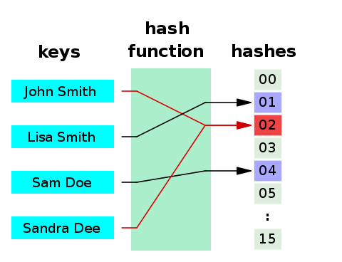

1. Git は、プログラムのソースコードなどの変更履歴を記録・追跡するための分散型バージョン管理システムです。

2. Git の中身の話をする前に、Git を構成する重要な技術の一つである[hash 関数](https://www.wikiwand.com/ja/%E3%83%8F%E3%83%83%E3%82%B7%E3%83%A5%E9%96%A2%E6%95%B0)についての説明をします。hash 関数は任意のデータを固定長の文字列に変換する非可逆な要約関数です。データが 1 文字でも違うと hash 関数は全く異なる値を出力します。hash 関数の出力の値を比べることで、データが編集されていないかを確かめることができます。(注 異なる入力に対して hash 関数の出力が等しくなる場合(衝突)が稀にあります。)
   

3. Git は、[有向非巡回グラフ(DAG)](https://www.wikiwand.com/ja/%E6%9C%89%E5%90%91%E9%9D%9E%E5%B7%A1%E5%9B%9E%E3%82%B0%E3%83%A9%E3%83%95)というグラフ構造を取っています。巡回がある場合、定義が無限ループに陥ってしまうため、Git は必ず非巡回のグラフとなっています。
   
   次に、Git のグラフの中身を見てみましょう。

4. Git は commit object の集合です。commit は、1 つの tree object へのリンク(参照)を持ちます。tree object は 1 つ以上の、tree object や[blob object](https://techacademy.jp/magazine/28210)へのリンク(参照)を持ちます。blob は binary large object の略で、ファイルのバイナリデータです。index.html や script.js などのファイルをバイナリデータにしたものが blob です。具体的な commit の構造を見てみましょう。
   98ca9..や 92ec2..はデータの hash 値です。hash 値は先頭からの一致を用いて比較されます。ここでは先頭の 5 桁が示されています。98ca9..という値は、該当する commit object を hash 関数に入力した時に計算された hash 値です。commit object には、commit の情報が含まれており、それらは hash 関数に入力することで、98ca9..という hash 値が計算されています。
   

5. commit を重ねると、編集の履歴がグラフとして表されます。tree object は snapshot として表されています。98ca9..は最初の commit です。34ac2..は parent の 98ca9..の hash 値を持っています。f30ab..は parent として 34ac2..の hash 値を持っています。98ca9.., 34ac2.., f30ab..の順番で hash が計算されます。parent の commit object を hash 関数の入力にしたときの出力値と、child が保有している parent の hash 値が一致するか確かめることで、正当な継承かどうか確かめることができます。
   

6. branch は、commit object への pointer(参照)です。branch は、commit object の hash 値を持っています。作業する内容に応じて branch を用います。
   
   HEAD は現在の位置を指します。HEAD は指している branch の名前を保有します。
   

7. 新たに tesing の branch での変更内容を commit します。そのためには、まず HEAD を testing に移動します。
   
   HEAD が testing を指している状態で commit をします。新たな commit object が記録されました。testing の branch が指している hash 値は f30ab..から c2b9e..へと更新されました。HEAD の指している branch 名は testing のままで変化していません。c2b9e..は親 commit object の hash 値である f30ab..を保有しています。
   
   再び master に作業場を移します。
   
   master を commit します
   
   新たな commit object が登録されました。
   次に、枝分かれした branch を統合する merge, rebase について説明します。

8. master と experiment の 2 つに branch が分かれており、それぞれ commit が 1 つ進んでいる状態を考えます。
   
   merge する場合は、C3 と C4 の内容をもとに C5 を作成します。C5 の commit object は、C3 と C4 の 2 つの hash 値を記録しています。
   
   merge の代わりに rebase する場合は以下の通りとなります。新たに C3'が作られます。この commit object は、C4 の hash 値を記録しています。
   

Git でコミットを積み重ねることで、レポジトリを作成することができました。レポジトリを管理するサービスとして、GitHub があります。GitHub に関する説明に進んでいきます。

The images in this slide deck are from Pro Git under a Creative Common license (Attribution, Noncommercial, Share alike).
