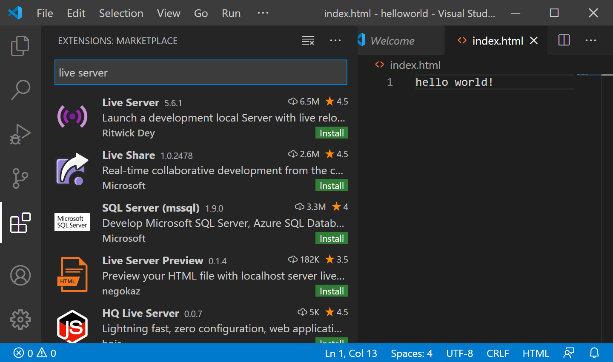

VSCodeは、**拡張機能**（Extensions）を通して自分好みの機能を追加することができます。`Live Server`拡張機能を使用すると、作成したHTMLファイルを簡単にブラウザで表示できます。開発用にはChromeが便利なので、インストールされていない場合はインストールしておきましょう。



Live Server拡張機能をインストールすると、コマンドパレットから`Live Server: Open with Live Server`が使用できるようになります。これを実行しましょう。


ブラウザが起動し、先ほど作成したWebページが表示されました。標準状態では、ブラウザのアドレスバーは

```
http://127.0.0.1:5500/index.html
```

を示しているはずです。


おめでとうございます！はじめてのウェブサイトが作成できました！
