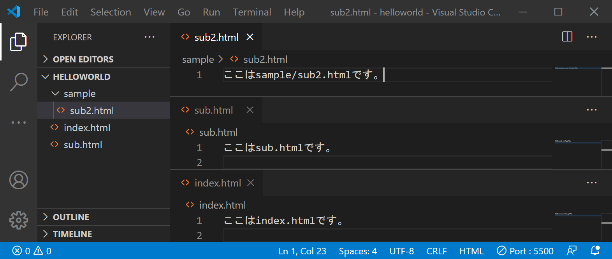

図のように、`index.html`以外の HTML ファイルがあったり、`sample`ディレクトリの中に`sub2.html`が存在したりするなど、複雑な構造になった場合はどうしたらよいのでしょうか。



そこまで難しくはありません。最初のファイルが`http://127.0.0.1:5500/index.html`でアクセスできる場合、

- `http://127.0.0.1:5500/sub.html`
- `http://127.0.0.1:5500/sample/sub2.html`

のような感じです。ディレクトリ構造がスラッシュを区切り文字として表現されているというイメージですね。

なお、`index.html`は少し特別な意味を持ち、実は URL 上では省略可能な場合が多いです。例えば、`http://127.0.0.1:5500/index.html`は、`http://127.0.0.1:5500/`のように書き換え可能だったりします。便利ですね。

`a`タグを利用すると、あるページから別のページへの**ハイパーリンク**を作成することができます。

```html title="index.html"
<a href="sub.html">リンク</a>
```

としてみて、どのように表示されるか確認してみてください。
