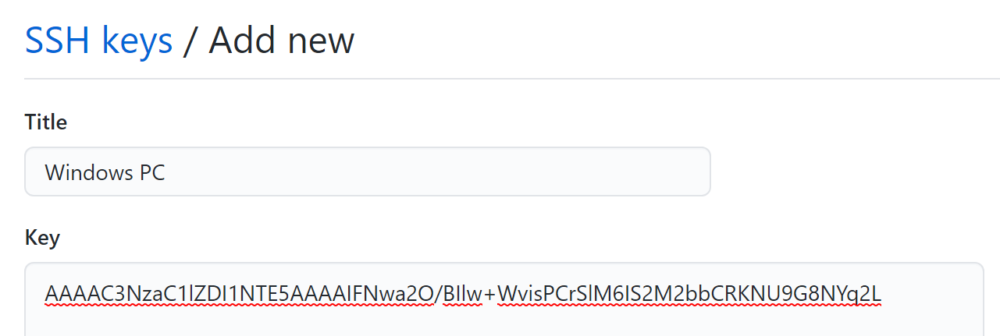

import Tabs from "@theme/Tabs";
import TabItem from "@theme/TabItem";

Git が管理するソースコードのまとまりを**リポジトリ**といいます。**GitHub**を用いると、クラウド上に Git リポジトリを保存しておくことができ、チーム開発を円滑に進めることができます。

GitHub に登録しましょう。


## 公開鍵と秘密鍵の作成

GitHub に Git を用いて接続する際、自らを正規のユーザーであると証明するため、公開鍵と秘密鍵のペアを作成します。ターミナル（Windows であれば`PowerShell`、macOS であれば`Terminal.app`）で以下のコマンドを実行します。

:::note
公開鍵暗号に関する詳細な説明は省略しますが、教養学部の情報の教科書にも載っていますし、詳しい数理的背景を知っている必要もありません。重要なのは、公開鍵暗号を用いることで何ができるのか、という点です。
:::

```
$ ssh-keygen -t ed25519
Generating public/private ed25519 key pair.
Enter file in which to save the key (/Users/[ユーザー名]/.ssh/id_ed25519):
Created directory '/Users/[ユーザー名]/.ssh'.
Enter passphrase (empty for no passphrase):
Enter same passphrase again:
Your identification has been saved in /Users/[ユーザー名]/.ssh/id_ed25519.
Your public key has been saved in /Users/[ユーザー名]/.ssh/id_ed25519.pub.
The key fingerprint is:
SHA256:xjZbER36s2DNfwNCpk963KAvSa3+EPiOHILpLKqH1kE [ユーザー名]@[コンピューター名]
The key's randomart image is:
+--[ED25519 256]--+
|                 |
|                 |
|                 |
|                 |
|                 |
|                 |
|                 |
|                 |
|                 |
+----[SHA256]-----+
```

このとき、`/Users/[ユーザー名]/.ssh/id_ed25519`が秘密鍵の保存場所、`/Users/[ユーザー名]/.ssh/id_ed25519.pub`が公開鍵の保存場所です。Windows の場合は`C:\Users\`から始まる文字列となっていることでしょう。

:::info
以後、「$」から始まる行は入力するコマンドを表すものとします。上記の場合であれば、`ssh-keygen -t ed25519`がコマンド入力です。このコマンドは何度か対話的な入力を求めてきますが、今回は何も入力せず Enter キーを押して構いません。
:::

公開鍵が格納されたファイルの中身を表示させます。`cat`コマンドを利用すると、ファイルの中身を簡単に表示させることができます。

```
$ cat /Users/[ユーザー名]/.ssh/id_ed25519.pub
ssh-ed25519 AAAAC3NzaC1lZDI1NTE5AAAAIFNwa2O/BIlw+WvisPCrSlM6IS2M2bbCRKNU9G8NYq2L [ユーザー名]@[コンピューター名]
```

`ssh-ed25519 AA...2L`の部分をコピーしましょう。これが公開鍵です。

## 公開鍵を GitHub に登録する


以上の図のように設定画面に移動し、[`SSH and GPG keys`](https://github.com/settings/keys)を選択します。`New SSH key`から先ほどコピーした公開鍵を入力します。



公開鍵の登録は基本的に 1 端末につき 1 つです。鍵を作成した端末を区別できる適当な名前を「Title」に指定しておきましょう。

## Git の初期設定

設定画面の[Emails](https://github.com/settings/emails)から、ダミーのメールアドレスを取得することができます。Git を使用するにはメールアドレスが必要ですが、正直に正しいメールアドレスを入力してしまうとそれが GitHub 上にアップロードされたとき、全世界中に自分のメールアドレスが公開されることになってしまうからです。


ターミナルから Git の初期設定を行います。

```
$ git config --global user.email [ダミーのメールアドレス]
$ git config --global user.name [GitHubのユーザー名]
```

Git が GitHub を利用できるようになりました。
