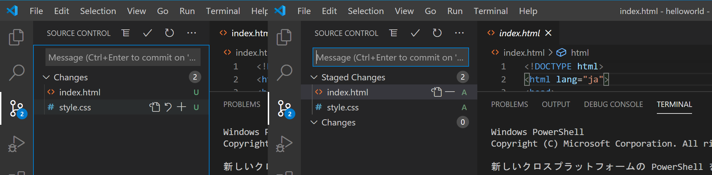
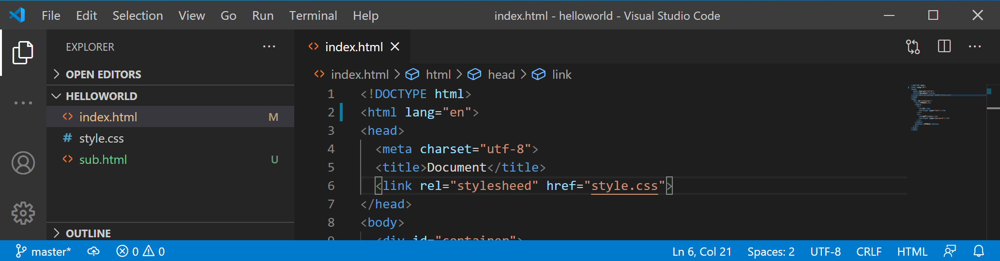

Gitのリポジトリは、**コミット**と呼ばれるソースコードへの変更の塊の集合です。以前作成したログインフォームを、Gitの管理下に置いてみましょう。


VSCodeは、ターミナルの機能を内蔵しています（統合ターミナル）。ソースコードを見ながら利用するのに便利なので、積極的に利用していきましょう。それでは、プロジェクトのディレクトリをVSCodeで開いた状態で、統合ターミナルで以下のコマンドを入力してください。

```
$ git init
Initialized empty Git repository in /Users/username/path/to/helloworld/.git/
```

ファイルリスト中のファイルの色が変わり、`U`の文字が表示されたでしょうか。


`git init`は、ディレクトリをGitの支配下に置くことを宣言するためのコマンドです。このコマンドを実行することにより、プロジェクトディレクトリはまだコミットが存在しない空のリポジトリになりました。

`U`は`Untracked`の頭文字で、そのファイルが最後のコミット（といってもまだ作ったばかりのリポジトリなので空ですが）より後に新しく作成され、まだGitによって管理されていないことを表します。

```
$ git add -A
```

左側のパネルを`SOURCE CONTROL`にすると、すべてのファイルリストではなく、変更されたファイルのみのリストを表示させることができます。上のコマンドを実行すると、今まで`U`だった部分が`A (Added)`に変更されました。



`git add`コマンドは、変更を**ステージング**するためのコマンドです。ステージングとはコミットの直前の状態で、Gitに対して該当ファイルをコミットする意思があることを伝えるためのものです。今回は`-A`オプションによりすべてのファイルをステージングしましたが、特定のファイルのみとすることもできます。

VSCodeは、GUIを利用したGitの操作に標準で対応しています。変更一覧に表示されるプラスボタンがステージング、マイナスボタンがその解除に当たります。

最後に、ステージングされたファイルをコミットしてみましょう。

```
$ git commit -m "init"
```

コミットが作成され、ファイルリストは白色に戻りました。なお、gitではコミットを作成するとき、そのコミットによって行った変更を説明するための**コミットメッセージ**を付けることになっています。それを指定するためのオプションが`-m`です。


なお、これ以降は、最後のコミットと比較し、新しく追加されたファイルには`U`が、編集されたファイルには`M (Modified)`が付与されます。ある程度変更がまとまったら、ステージング（`git add`）、コミット（`git commit`）を繰り返してプログラムを書き進めていきましょう。

