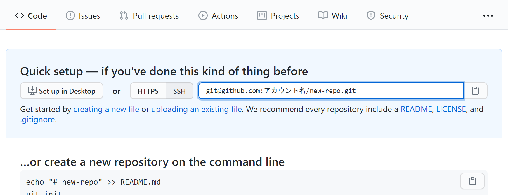

前回の作業で、手元のコンピューター上のGitリポジトリ（ローカルリポジトリ）に新しいコミットを追加することに成功しました。次は、このリポジトリをGitHub上のリポジトリ（リモートリポジトリ）に同期させてみましょう。


GitHubでは、Webインターフェースを使用してGitリポジトリの操作をすることができます。`Repository name`に適当な名前を入力して、`Create repository`を押しましょう。



`git@github.com:アカウント名/リポジトリ名.git`の部分は、GitHub上に新しく作ったリポジトリの場所を表すURLです。

ターミナルに戻り、以下のコマンドを実行します。

```
$ git remote add origin git@github.com:アカウント名/リポジトリ名.git
```

このコマンドを実行することで、ローカルリポジトリに対し、URLで指定したリポジトリを`origin`という名前で関連付けさせます。

:::note
`origin`という名前は慣習的に決まっているものです。別の名前で登録することもできますが、あまり一般的ではありません。
:::

`origin`に対し、ローカルリポジトリの変更を**プッシュ**しましょう。

```
$ git push -u origin master
```

:::info
この操作の際、初回は以下のような警告が出る場合があります。
```
The authenticity of host 'github.com (13.114.40.48)' can't be established.
RSA key fingerprint is SHA256:nThbg6kXUpJWGl7E1IGOCspRomTxdCARLviKw6E5SY8.
Are you sure you want to continue connecting (yes/no/[fingerprint])?
```
これは、接続先となっているGitHubが、なりすましではなく本物のGitHubであると信頼してもよいかを尋ねるメッセージです。家庭用のインターネット回線、UTokyo WiFi等、十分に信頼できるネットワークに接続している場合は問題ありませんので、`yes`を入力して続行させてください。
:::

:::tip
`-u`オプションは、初回の`push`時にその宛先を記憶し、次回以降自動的にその場所を指定するためのオプションです。2回目以降は

```
$ git push
```

だけで構いません。`master`は、**ブランチ**と呼ばれるソースコードの編集の分岐の名前を表すものですが、この回ではまだ詳しく扱わないこととします。
:::

GitHubをリロードしてみてください。変更が反映されているのを確認できるはずです。


