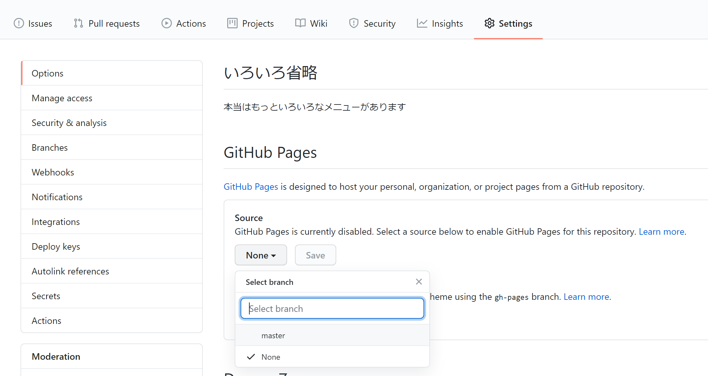

GitHub の機能である**GitHub Pages**を用いると、GitHub 状のリポジトリをそのままウェブサイトとして公開することができます。



`Settings`内の`Options`の`GitHub Pages`セクションで、`Source`を`master`に設定しましょう。すると、

```
Your site is ready to be published at https://[アカウント名].github.io/[リポジトリ名]/.
```

のように URL が発行され、作成したウェブサイトが全世界に公開されるようになります。

おめでとうございます。はじめての Web サイトを公開することができました:tada:
