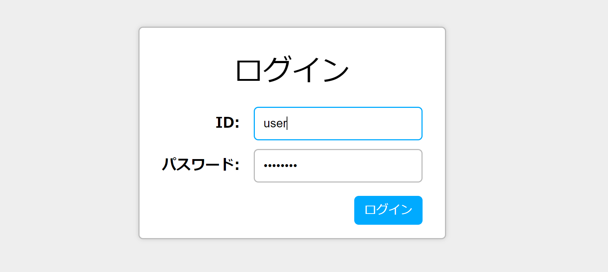

VSCodeで別のディレクトリを開き、Gitリポジトリを初期化しましょう。`style.css`のみを使用して、次に示されたHTMLを装飾してください。

```html title="index.html"
<!DOCTYPE html>
<html lang="ja">
<head>
  <meta charset="utf-8">
  <title>課題</title>
  <link rel="stylesheet" href="style.css">
</head>
<body>
  <div id="container">
    <h1>ログイン</h1>
    <table>
      <tr>
        <th>ID:</th>
        <td><input type="text"></td>
      </tr>
      <tr>
        <th>パスワード:</th>
        <td><input type="password"></td>
      </tr>
    </table>
    <button>ログイン</button>
  </div>
</body>
</html>
```

完成イメージは以下の通りでいかがでしょうか。このサンプルを忠実に模写する必要は特にありません。様々なCSSプロパティを用いて、CSSの強力さを実感してください。



実際に動作するサンプルは[こちら](https://ut-code.github.io/utcode-learn-answers/02/)から確認できます。

## おそらくつまづくであろうポイント
サンプルでは、ログインフォームが画面の中央に配置されています。一昔前であれば実装するのが大変なデザインだったのですが、現在では`Flexbox`と呼ばれる技術を使うことにより簡単に実装できるようになりました。

`body`要素に`display: flex`を指定し、`justify-content`や`align-items`を上手く使うことで対応できます。この際、上下方向に中央にするためには、`html`要素と`body`要素に`height: 100%;`を指定しなければなりません。これは、標準状態だと両要素は中身に応じて伸縮してしまうためです。

## 疑似クラス
疑似クラスを用いると、要素が特定の状態になったときにスタイルを適用することができます。代表的なものが`:hover`です。

```css
input:hover {
  color: red;
}
```

とすれば、`input`要素にカーソルが乗っている時だけ文字色を赤色にすることができます。

## 参考: サンプルで使われているCSSプロパティの一覧

暇だったら調べてみてください。

* `display`
* `flex-direction`
* `justify-content`
* `align-items`
* `align-self`
* `margin`
* `padding`
* `height`
* `border`
* `border-radius`
* `border-collapse`
* `outline`
* `box-shadow`
* `background-color`
* `text-align`
* `color`
* `font-family`
* `font-weight`
* `content`

## もっとCSSを学びたい人へ

実際に動作しているWebサイトの模写ができるか腕試しをしてみましょう。驚くような実装に出会えるかもしれません。
