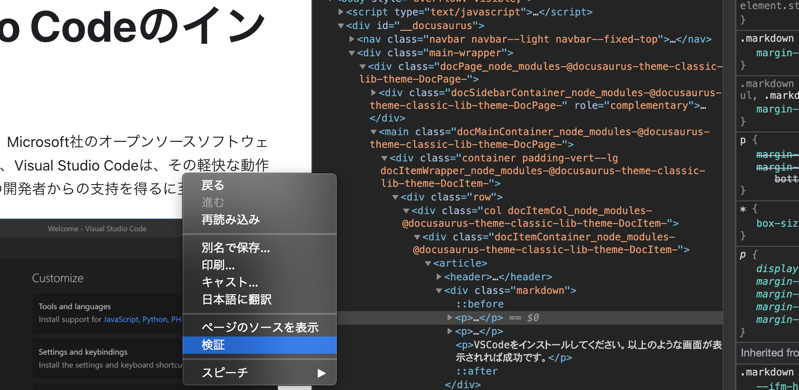

ブラウザに標準で搭載されている**開発者ツール**を使用すると、表示されているウェブサイトの構造を簡単に分析できます。

Chrome の場合図のように「その他のツール」「デベロッパー ツール」の順で選択するか、`Ctrl (Cmd) + Shift (Option) + I`、`F12`といったショートカットキーを利用します。

また、Web ページ上で右クリックすれば、そこにある HTML 要素を直接開発者ツール上で開くこともできます。Chrome だけでなく Safari や Firefox などのブラウザにも同じような機能が搭載されています。
