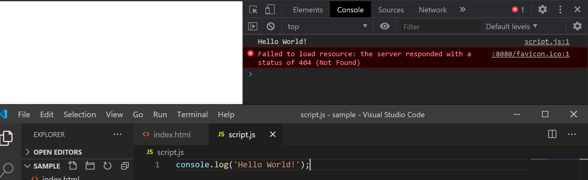
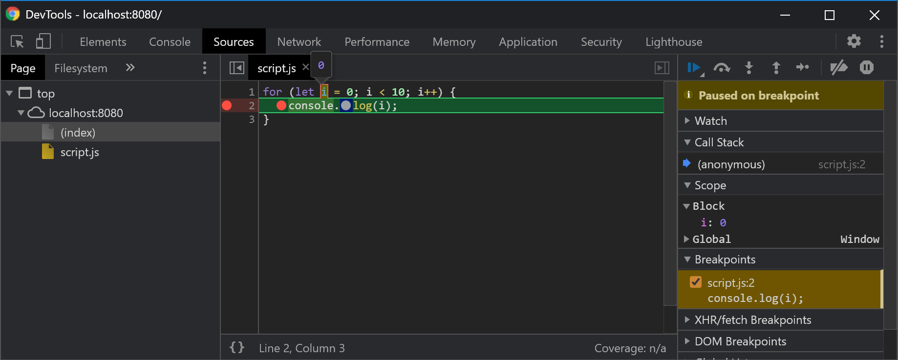

プログラムが誤っているとき、当然ながらプログラムは動作しません。この誤りを**バグ**と呼びます。バグを消すための操作を**デバッグ**と呼びます。デバッグには、以前学習した開発者ツールを利用することができます。

## console.log

ブラウザ上で動作する JavaScript のプログラムで`console.log`が呼ばれると、開発者ツールの**コンソール**にその値が表示されます。

```js
console.log("Hello World!");
```

開発者ツールを確認してみましょう。



## デバッガ

**デバッガ**は、デバッグを支援するためのソフトウェアです。ブラウザの開発者ツールには、JavaScript 向けの非常に強力なデバッガが搭載されています。

以下のコードを実行してみましょう。

```js title="script.js"
for (let i = 0; i < 10; i++) {
  console.log(i);
}
```

Chrome の開発者ツールでは、`Sources`タブで記述されている HTML や CSS、JavaScript ファイルの内容を表示できます。先ほど記述した`script.js`の 2 行目の、**行番号の左側**をクリックしてみましょう。丸い記号が表示されるはずです。


これは、**ブレークポイント**と呼ばれる、プログラムの実行を一時的に中断するための機能です。ブレークポイントが実際に動作することを確認するため、ページをリロードしてみましょう。



プログラムの実行が一時中断されました。この状態で、変数名にカーソルを合わせると、その時点での変数の値が表示されます。また、画像中では右側に表示されているパネルには、定義されている変数の一覧も表示されていることがわかります。

再生ボタンを押すと、プログラムの実行が再開されます。上記の例の場合は、次のループでもう一度 2 行目が実行されるため、そこでまたプログラムが中断されます。10 回のループの間に、変数の値がどのように変化しているかを観察してみてください。

:::tip
再生ボタンの右隣にある 3 つのアイコンは、順に**ステップオーバー**、**ステップイン**、**ステップアウト**です。

ステップオーバーを利用すると、プログラムの実行が次の文に移動します。ステップインの動作はステップオーバーの動作と似ていますが、実行中の文に関数が含まれる場合、その内部に移動します。ステップアウトは、現在処理している関数の処理を抜けたところまで実行します。
:::
