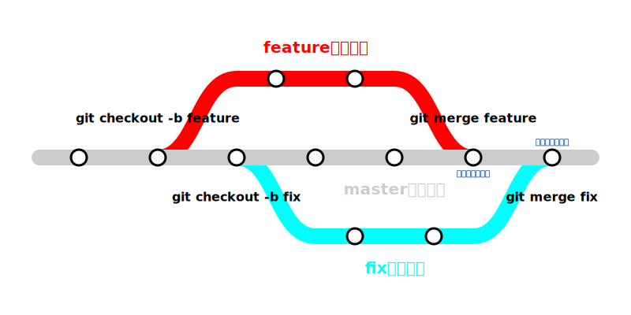
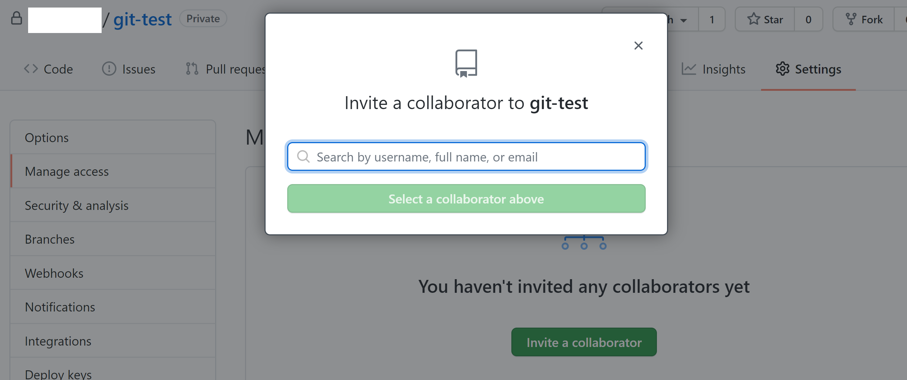
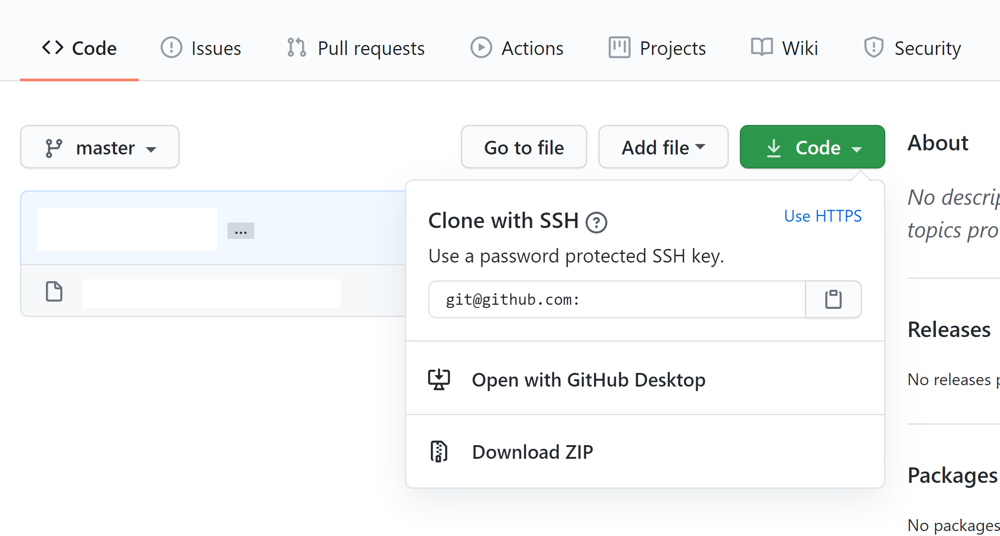

GitHub には、**プルリクエスト**という、変更を提案するための機能があります。この機能を正しく利用することで、複数人による開発を円滑に進めることができます。

## ブランチ

以前少し触れたとおり Git における**ブランチ**とは、ソースコードの分岐です。複数人で開発をする場合は、同じソースコードに複数人が同時に触れることのないよう、編集を枝分かれさせます。



作業しているブランチを切り替えるためには、`git checkout`コマンドを使用します。ただし、ブランチがまだ存在せず、新しく作成することが必要な場合は`-b`オプションを付けます。

複数のブランチをひとつのブランチに統合する作業を**マージ**といいます。分岐したブランチでいくつかのコミットをしたら、もとのブランチをチェックアウトした状態で`git merge`コマンドを実行しましょう。**マージコミット**が作成され、分岐先のブランチの変更を取り込むことができます。

## プルリクエストを利用してマージする

Git のリポジトリを作成すると、通常`master`ブランチが作成されます。`master`ブランチは、すべての起点となる重要なブランチです。このため、`master`ブランチへのマージ作業は慎重に行うべきでしょう。GitHub のプルリクエスト機能を使用すれば、マージ前に様々な確認作業を行うことができます。

まずは、**トピックブランチ**（あるひとつの変更を加えるためのブランチ）を作成します。どのような変更を行うかを把握しやすいネーミングを心がけましょう。

```
$ git checkout -b add-something
```

続いて、トピックブランチ上で適当な編集を行い、コミットします。

```
$ git add -A
$ git commit -m "somethingを追加した"
```

リモートリポジトリにプッシュしましょう。

```
$ git push -u origin add-something
```

:::tip
`git checkout`コマンドで作成したブランチは、まだローカルリポジトリにしか存在していないため、プッシュする際に`-u`オプションを指定して、リモートリポジトリを指定する必要があります。2 回目以降のプッシュでは`git push`のみで構いません。
:::

続いて、GitHub の`Pull requests`タブから、`New pull request`もしくは`New`をクリックします。


`base`をマージ先のブランチ、`compare`を先ほど作成したブランチに設定し、プルリクエストのタイトルとメッセージを記入します。

:::tip
先ほどの画面で`Compare & pull request`のボタンが表示されていた場合は自動的に`base`と`compare`が設定されます。
:::


`Create pull request`を選択すると、プルリクエストが作成されます。


`Merge pull request`を押して確認すれば、変更が`base`に指定したブランチに反映されます。

```
$ git checkout master
$ git pull
```

`master`ブランチをプルして、変更が正しく反映されていることを確認しましょう。

## ほかの人のリポジトリの開発に参加する

### 権限の付与

`Settings`の`Manage access`から、`Invite a collaborator`を押すことで、ほかの人をリポジトリに招待することができます。



### 開発の開始

権限が付与されると、メールでその旨が通知されます。リポジトリの`Code`ボタンからリポジトリの URL を取得し

```
$ git clone [リポジトリのURL]
```

としてリモートリポジトリをクローンしましょう。



:::tip
`git clone`を用いてリポジトリをクローンした場合には、はじめからリモートリポジトリが結びついているため、

```
$ git remote add origin [リポジトリのURL]
```

を実行する必要はありません。
:::

## 課題

ut.code(); Learn（このウェブサイト）は、[GitHub にて管理](https://github.com/ut-code/utcode-learn)されています。編集権限を受け取り、何かしらの編集をして、プルリクエストを作成してみましょう。
