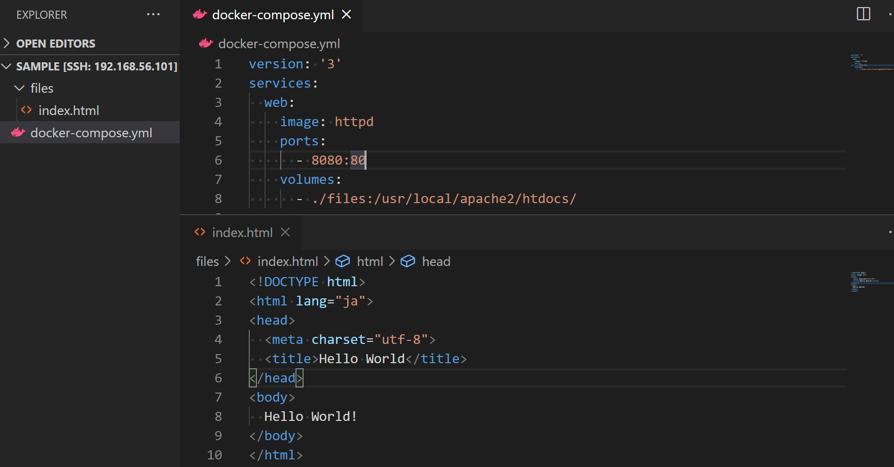
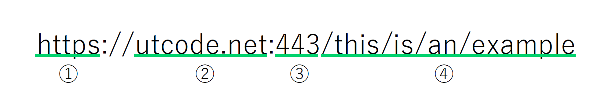
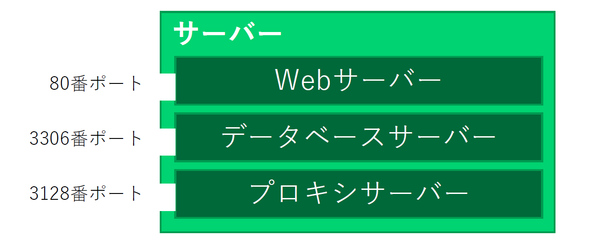

## Docker を用いて Web サーバーを構築する

新しいディレクトリを作成し、VS Code で開きましょう。`docker-compose.yml`という名前のファイルを作成し、以下の内容を記述します。

```yml
version: "3"
services:
  web:
    image: httpd
    ports:
      - 8080:80
    volumes:
      - ./files:/usr/local/apache2/htdocs
```

続いて`files`ディレクトリを作成して、適当な`index.html`をその中に作成してください。



プロジェクトディレクトリで以下のコマンドを実行します。

```
$ docker-compose up
```

[http://localhost:8080/](http://localhost:8080/) にアクセスして、先ほど作成した HTML ファイルの内容が表示されることを確認してください。

:::tip
`docker-compose up`コマンドで起動したサーバーは、`Ctrl + C`のショートカットで終了させることができます。
:::

## URL の構造

私たちがウェブサイトにアクセスする場合には、**URL**を用いるのが普通です。URL には様々な情報が含まれています。



### ② ドメイン

クライアントがサーバーにリクエストを送信する際、まず最初に使用されるのがドメインです。ドメンは、インターネット上でサーバーの場所を区別するための文字列です。

:::note
② の場所に入る文字列を、正確には**FQDN**と呼びます。FQDN は、`www.utcode.net`のような文字列で、`www`を**ホスト名**、`utcode.net`をドメインと呼びます。

しかしながら、FQDN、ホスト、ドメインが同じ意味で用いられる場合も多いので注意が必要です。
:::

:::tip
多くの端末では、`localhost`とすることで自分自身にアクセスすることができます。
:::

### ③ ポート

クライアントからリクエストを受けるコンピューターをサーバーと呼びますが、そのリクエストを実際に受け取って処理を行うソフトウェアもまた、サーバーと呼びます。

このため、一台の物理的なサーバーで稼働しているソフトウェアとしてのサーバーが一種類とは限りません。どのソフトウェアの通信なのかを区別するため、外部からの接続を待ち受けするソフトウェアは、`0 ～ 2^16 – 1 (65535)`の整数で表される**ポート**番号を指定する必要があります。



サーバーの種類によって使われるポート番号は大体決まっています。例えば、Web サーバーの場合は、80 番または 443 番が使用されるのが普通です。後述するプロトコルが HTTP の場合は 80 番、HTTPS の場合は 443 番のとき、URL におけるポート番号は省略可能になります。一般的な URL にポート番号が存在していないのはこのためです。

### ① プロトコル

複数のコンピューターが正しく通信を行うためには、事前に通信の方法を定めておく必要があります。通信を行うための取り決めを、**プロトコル**と呼びます。ウェブサイトを提供するためのプロトコルは**HTTP**または**HTTPS**です。

### ④ パス

通信先のサーバーにおける、リクエストするリソースの場所を表す文字列です。具体的な解釈の方法はプロトコルで決まっているわけではなく、サーバーソフトウェアの実装次第です。

## Docker と Docker Compose の使い方

以前インストールした Docker は、**仮想化**のためのソフトウェアです。サーバーは通常物理的な筐体ですが、仮想化を用いることで、あるコンピューターの中にあたかも別のコンピューターが存在するかのようにふるまわせることができます。

**Docker Compose**は、複雑なコマンド体系を持つ Docker を扱いやすくするためのソフトウェアです。`docker-compose.yml`という名前のファイルにサーバーの構成を記述し、`docker-compose up`とするだけで、様々なサーバーを起動させることができます。

先ほどの`docker-compose.yml`を見直してみましょう。このファイルは、**YAML**と呼ばれる可読性の高いフォーマットで記述します。

```yml
version: "3" # docker-compose.ymlの仕様のバージョン
services:
  web:
    image: httpd
    ports:
      - 8080:80
    volumes:
      - ./files:/usr/local/apache2/htdocs
```

:::tip
VS Code の拡張機能 [Docker](https://marketplace.visualstudio.com/items?itemName=ms-azuretools.vscode-docker) をインストールしておくと便利です。
:::

YAML は、JavaScript オブジェクトに変換することが可能な形式です。このファイルの内容を JavaScript の式で記述すると、下記のような形式になります。

```js
({
  version: "3",
  services: {
    web: {
      image: "httpd",
      ports: ["8080:80"],
      volumes: ["./files:/usr/local/apache2/htdocs"],
    },
  },
});
```

`services`の各プロパティが、一台のサーバーを表します。Docker Compose は、このプロパティ一つごとに、仮想的な Linux 端末（**コンテナ**）ひとつを生成します。上記の例の場合は`web`ひとつだけです。

`service.サービス名.image`には、コンテナのベースとなるイメージ名を指定します。このイメージは、通常[Docker Hub](https://hub.docker.com/)上にアップロードされているもので、公式・非公式ともにさまざまな種類が用意されています。

`service.サービス名.ports`は、`ローカル側ポート:コンテナ側ポート`形式の文字列配列を指定します。この指定をすることで、`localhost`の指定ポートへの通信を、コンテナ側の指定ポートへ転送することができます。

`service.サービス名.volumes`は、`ローカル側パス:コンテナ側パス`形式の文字列配列で、ローカル側のファイルシステムを、コンテナ側のファイルシステムと同期させることができるようになります。

## Web サーバー

`httpd`イメージは、Docker が公式に提供している、**Apache**を含むイメージです。Apache は、世界で一般的に使用される Web サーバーの一種です。

Web サーバーは通常、**ドキュメントルート**と呼ばれるディレクトリを設定し、そのディレクトリ内にあるファイルを公開します。URL に含まれるパスは、そのドキュメントルートからの相対パスです。

Docker の`httpd`イメージでは、ドキュメントルートが`/usr/local/apache2/htdocs`、ポート番号が 80 に設定されています。これが、Docker Compose の設定によりそれぞれ`./files`、8080 番ポートに転送されているため、`http://localhost:8080/`の URL で`./files/index.html`にアクセスすることができたのです。
