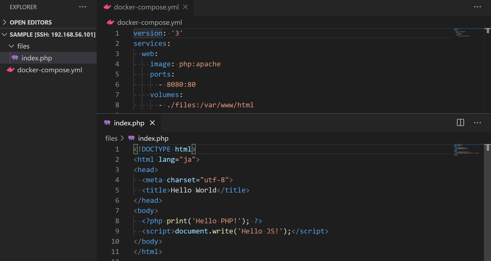
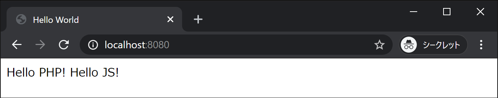

PHP は、リクエストを受け取った Web サーバーが、レスポンスを返す前に動作するプログラミング言語です。

## PHP が動作する Web サイト

```yml title="docker-compose.yml"
version: "3"
services:
  web:
    image: php:apache
    ports:
      - 8080:80
    volumes:
      - ./files:/var/www/html
```

```php title="files/index.php"
<!DOCTYPE html>
<html lang="ja">
<head>
  <meta charset="utf-8">
  <title>Hello World</title>
</head>
<body>
  <?php print('Hello PHP!'); ?>
  <script>document.write('Hello JS!');</script>
</body>
</html>
```

プロジェクトディレクトリは以下のようになるはずです。



詳細は後にするとして、とりあえず実行結果にアクセスすると、表示は大方予想通りになります。



しかしながら、ページ自体のソースを表示させてみるといかがでしょうか。


`Hello PHP!`の部分は出力内容しか残っていないことが分かります。これが、サーバーサイドで動作するプログラムの特徴です。プログラムは、実行結果がクライアントに送信される前に実行されるため、ブラウザからはサーバーサイドのプログラムのソースコードを表示させることができません。

## 動作原理

Docker イメージの`php:apache`は、PHP が動作するよう設定された Apache のイメージです。ポート番号は 80、ドキュメントルートは`/var/www/html`に設定されています。

この Apache は、拡張子が`.php`のファイルに対してリクエストを受けたとき、PHP を起動させます。PHP は、ファイルの中から`<?php`から`?>`で囲まれた部分を PHP のプログラムとして実行します（囲まれていない部分は通常の出力と解釈されます）。この実行結果を Apache が受け取り、クライアント側に返却するようになっています。
