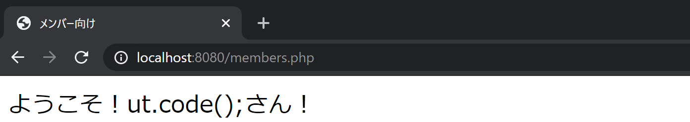

## POST メソッドを使用する

前回の例を少々改変してみましょう。

```html title="index.html"
<form method="post" action="members.php">
  <p>名前: <input type="text" name="user-name" /></p>
  <p><input type="submit" value="送信" /></p>
</form>
```

```php title="members.php"
ようこそ！<?php print($_POST['user-name']); ?>さん！
```

実行結果は前回と変わりません。



しかしながら、今回はクエリパラメータらしき文字列が URL の中に存在していません。一体どのようにしてデータの受け渡しを行っているのでしょうか。

## telnet クライアントを用いて HTTP リクエストを人力で送信する

macOS や Ubuntu に標準で搭載されている`telnet`コマンドを使用すると、HTTP より下位の（ハードウェアに近い）プロトコルである**TCP**を用いて、通常ブラウザが自動的に送信する HTTP リクエストを人力で送信することができます。以下は、`localhost`の 8080 番ポートに対して HTTP リクエストを送る例です。

```
$ telnet localhost 8080
Trying 127.0.0.1...
Connected to localhost.
Escape character is '^]'.
GET / HTTP/1.1
Host: localhost

HTTP/1.1 200 OK
Date: Wed, 02 Sep 2020 01:56:02 GMT
Server: Apache/2.4.38 (Debian)
Last-Modified: Wed, 02 Sep 2020 01:47:49 GMT
ETag: "11b-5ae4ad2af4662"
Accept-Ranges: bytes
Content-Length: 283
Vary: Accept-Encoding
Content-Type: text/html

<!DOCTYPE html>
<html lang="ja">
<head>
  <meta charset="utf-8">
  <title>Hello World</title>
</head>
<body>
  <form method="post" action="members.php">
    <p>名前: <input type="text" name="user-name"></p>
    <p><input type="submit" value="送信"></p>
  </form>
</body>
</html>
```

まず、リクエストは

```
GET / HTTP/1.1
Host: localhost
```

の部分です。

1 行目の`GET`を`リクエストメソッド`と呼びます。通常、ブラウザから適当なページを開くと、このリクエストメソッドを用いて通信が行われます。

スペースに続く文字列`/`がパスです。URL のパス部分が、クエリ文字列を含めてそのまま渡されます。続く`HTTP/1.1`は、HTTP プロトコルのバージョンです。

2 行目以降は**リクエストヘッダ**で、リクエストに対して付加的な情報を与えることができます。形式は`ヘッダ名: 値`の形で、1 行につき 1 ヘッダで記述されます。主に使用されるリクエストヘッダに、`Host`リクエストヘッダがあります。

`Host`リクエストヘッダには、アクセスしようとするサーバーのホスト（FQDN）を指定します。昨今では、物理的なサーバーの台数を減らして多くの Web サービスを稼働させるため、複数のドメインが同じサーバーに割り当てられている場合があります。その際、サーバー側ではどのドメインへのリクエストか判断できないため、この`Host`ヘッダを確認することにより、適切な応答をすることができるようになります。

レスポンスは、以下の部分です。

```
HTTP/1.1 200 OK
Date: Wed, 02 Sep 2020 01:56:02 GMT
Server: Apache/2.4.38 (Debian)
Last-Modified: Wed, 02 Sep 2020 01:47:49 GMT
ETag: "11b-5ae4ad2af4662"
Accept-Ranges: bytes
Content-Length: 283
Vary: Accept-Encoding
Content-Type: text/html

<!DOCTYPE html>
<html lang="ja">
<head>
  <meta charset="utf-8">
  <title>Hello World</title>
</head>
<body>
  <form method="post" action="members.php">
    <p>名前: <input type="text" name="user-name"></p>
    <p><input type="submit" value="送信"></p>
  </form>
</body>
</html>
```

1 行目の`200`という整数は、**ステータスコード**と呼ばれ、HTTP リクエストの成否を端的に示すための値です。ステータスコード`200`は、リクエストが成功したことを示します。

2 行目以降は**レスポンスヘッダ**で、リクエストヘッダと対になる概念です。レスポンスヘッダから空行を一行あけて続く部分が、**レスポンスボディ**となります。

## POST リクエストを telnet で送信する

以下は、`/members.php`に対して POST リクエストを送る例です。

```
$ telnet localhost 8080
Trying 127.0.0.1...
Connected to localhost.
Escape character is '^]'.
POST /members.php HTTP/1.1
Host: localhost
Content-Type: application/x-www-form-urlencoded
Content-Length: 16

user-name=utcode
HTTP/1.1 200 OK
Date: Wed, 02 Sep 2020 02:12:14 GMT
Server: Apache/2.4.38 (Debian)
X-Powered-By: PHP/7.4.9
Vary: Accept-Encoding
Content-Length: 165
Content-Type: text/html; charset=UTF-8

<!DOCTYPE html>
<html lang="ja">
<head>
  <meta charset="utf-8">
  <title>メンバー向け</title>
</head>
<body>
  ようこそ！utcodeさん！
</body>
</html>
```

リクエストは

```
POST /members.php HTTP/1.1
Host: localhost
Content-Type: application/x-www-form-urlencoded
Content-Length: 16

user-name=utcode
```

の部分です。先ほどとは異なり、リクエストメソッドが POST になり、`Content-Type`と`Content-Length`リクエストヘッダが加わっています。

そして注目すべきなのは、リクエストヘッダから 1 行開けて、`user-name=utcode`という形式の**リクエストボディ**が存在する点です。これはクエリパラメータと同じ形式ですね。クエリパラメータが存在しなくてもデータが送信できる理由は、このリクエストボディが存在しているからなのです。

なお、`Content-Type`リクエストヘッダは、リクエストボディの形式を指定するものです。`application/x-www-form-urlencoded`は、クエリパラメータと同じ形式を表しています。

## 課題

商品検索システムを作ってみましょう。入力画面でプロダクト ID を入力すると、値段が表示されるようにしてください。データは

```php
$data = [
  ['product_id' => 'A101', 'price' => 100],
  ['product_id' => 'A102', 'price' => 300],
  ['product_id' => 'B321', 'price' => 230],
  ['product_id' => 'B334', 'price' => 360],
];
```

を使用してください。

### ヒント

`$data`は`product_id`キーと`price`キーを持つ連想配列の一次元配列になっています。`foreach`ループを回して、`product_id`が入力値と一致したらその時の`price`を出力しましょう。
