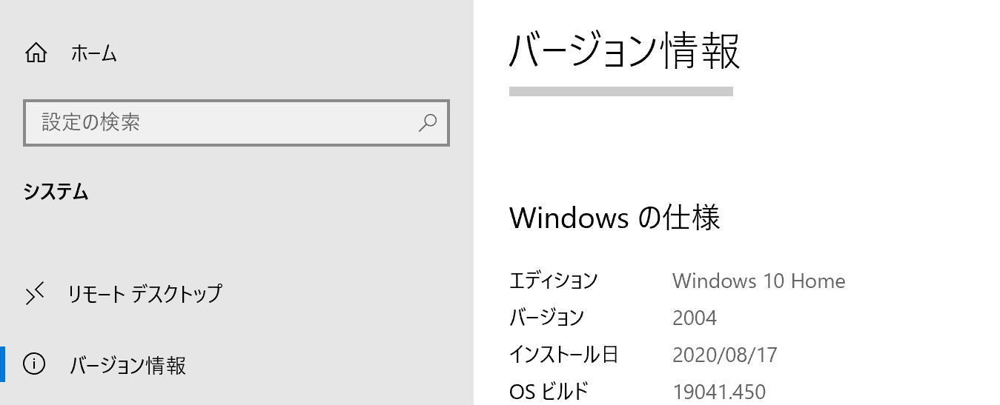
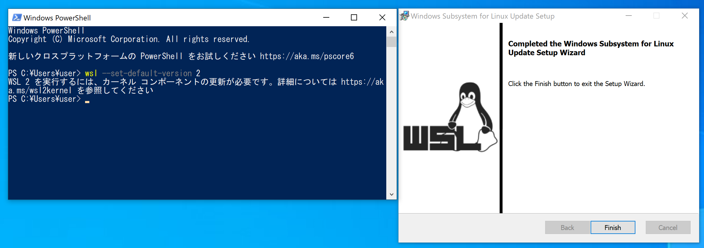
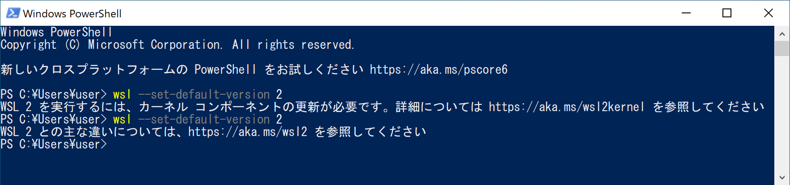
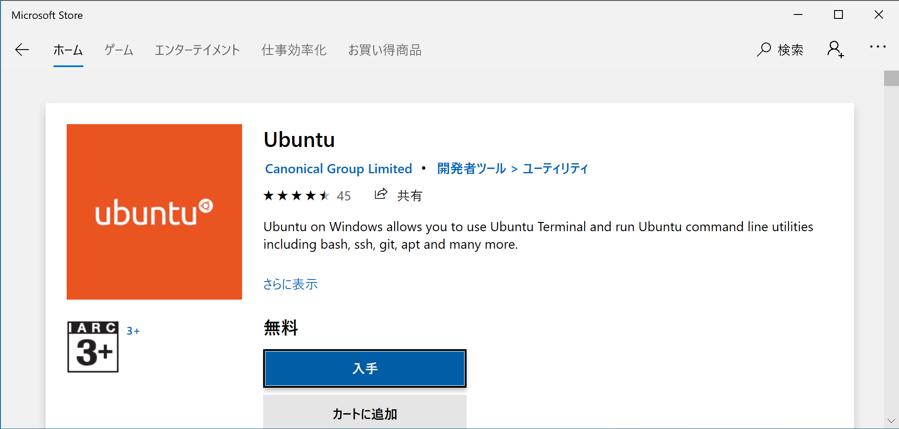

:::info
競技プログラミング等で既にWSL1を使用している場合は、[こちら](https://docs.microsoft.com/ja-jp/windows/wsl/install-win10#set-your-distribution-version-to-wsl-1-or-wsl-2)を参考に、

* 開発に使用するディストリビューションのWSLバージョンを2にする
* WSLのデフォルトバージョンを2にする

を行ってください。
:::

:::caution
この記事では、非常に新しい技術について扱っています。内容が実際と異なる場合があるので、必ず[Microsoftの記事](https://docs.microsoft.com/ja-jp/windows/wsl/install-win10)を併せて確認してください。
:::

新しいバージョンのWindowsには、WSL（Windows Subsystem for Linux）と呼ばれる、Windows内でLinuxを動作させるための仕組みが用意されています。最近、WSLのバージョン2が登場し、完全なLinuxを使用できるようになりました。これ以後の全てのWindows上での開発は、WSL2上で行うことを前提とします。

## WSLの有効化とWSL2の設定

WSL2は、Windows 10のバージョン2004以降で正式に利用できます。設定画面からWindowsのバージョンを確認し、これより前の状態であった場合はWindows Updateをするとよいでしょう。



PowerShellまたはコマンドプロンプトを管理者権限で起動します。


以下のコマンドを用いてWSLと仮想マシン プラットフォームを有効にします。有効化が終わったら、端末を再起動してください。

```
dism.exe /online /enable-feature /featurename:Microsoft-Windows-Subsystem-Linux /all /norestart
dism.exe /online /enable-feature /featurename:VirtualMachinePlatform /all /norestart
```


再起動が完了したら、WSL2を有効にします。以下のコマンドを実行してください。こちらは管理者権限は必要ありません。

```
wsl --set-default-version 2
```

「WSL 2 を実行するには、カーネル コンポーネントの更新が必要です。詳細については https://aka.ms/wsl2kernel を参照してください」と表示された場合は、[WSL 2 Linux カーネルの更新](https://aka.ms/wsl2kernel)を参考にしてください。



「WSL 2 との主な違いについては、https://aka.ms/wsl2 を参照してください」のように表示されたら完了です。



## Ubuntuのセットアップ

Microsoft StoreからUbuntuをインストールします。Ubuntuは、Linuxのディストリビューション（Linuxの上に様々なソフトウェアを加えたもの）の、最もポピュラーなもののひとつです。



Ubuntuを起動すると、Ubuntuで使用するユーザー名とパスワードの入力が求められます。必ず英数字で入力してください。


おめでとうございます。WSLが使用可能になりました。

## VSCodeをWSLで使用する

`Visual Studio Code Remote - WSL`拡張機能を用いると、VSCodeをWSL上で動作させることができ、あたかもLinux上で開発をしているかのような体験を得ることができます。


拡張機能のインストールが完了したら、コマンドパレットから`Remote-WSL: New Window`を選択します。


正しくウィンドウが開けたら成功です。

## Gitの設定をする

WSLはWindowsから独立しているため、Windows環境でインストールしたGitはWSL上では使用できません。しかしながら、幸いなことにUbuntuではGitが標準でインストールされています。以前の記事を参考に、SSH鍵の生成と、メールアドレス・ユーザー名の設定を行いましょう。

```
$ ssh-keygen -t ed25519
$ git config --global user.email [ダミーのメールアドレス]
$ git config --global user.name [GitHubのユーザー名]
```

SSH公開鍵を表示するためには、

```
$ cat ~/.ssh/id_ed25519.pub
```

を実行してください。公開鍵をGitHubに登録したら、リポジトリのクローンやコミットができるかどうか確認してみましょう。

## WindowsのエクスプローラーでWSL上のファイルにアクセスする

WSL上では、通常のWindowsとは完全に独立したファイルシステムが構築されています。このため、Windows側からファイルを操作するためには、特殊な方法が必要です。

`Win + R`キーを押して`ファイル名を指定して実行`ダイアログボックスを開き、`\\wsl$`と入力します。


エクスプローラー上でインストールしたディストリビューション（この記事の手順に従った場合は`Ubuntu`）のフォルダとして表示されます。この中身がファイルシステムのルートです。
