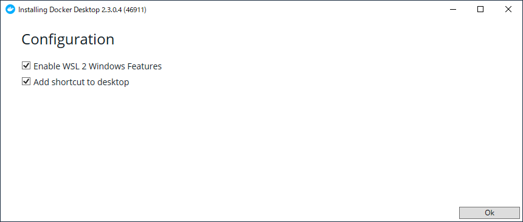
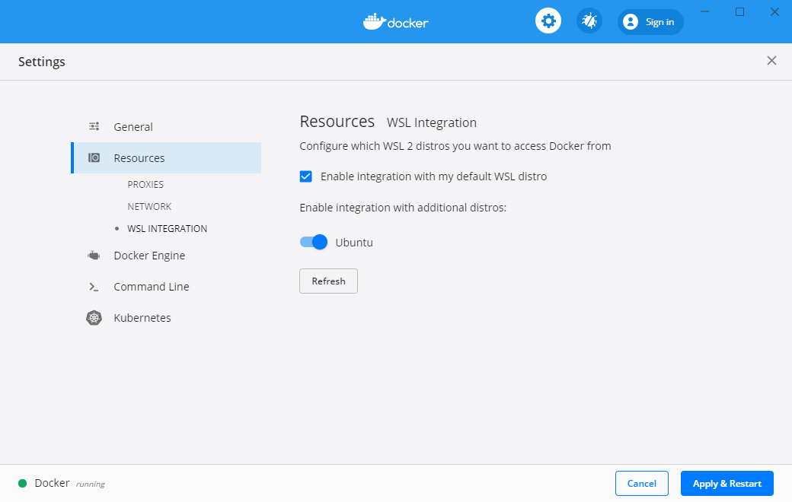
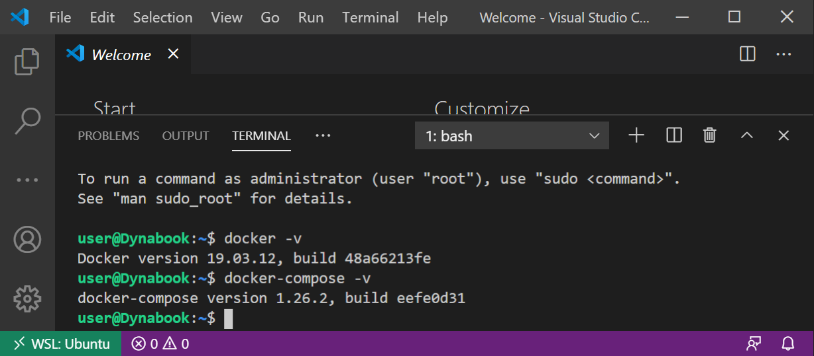
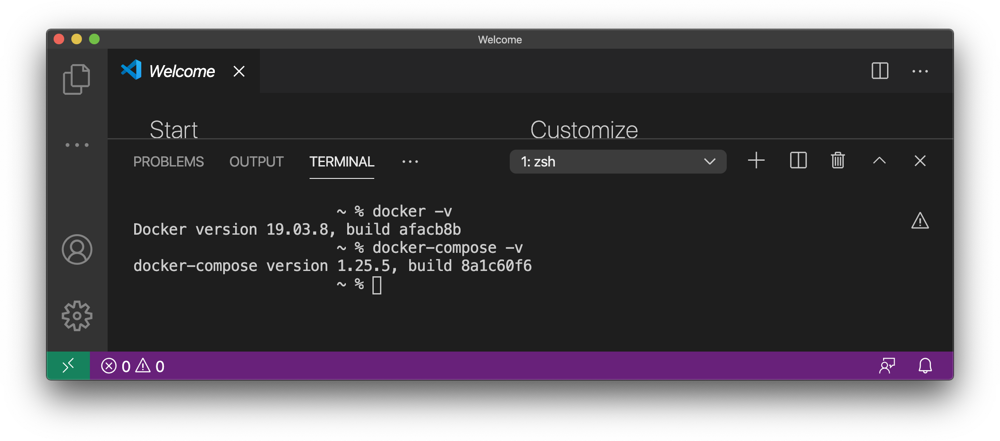

**Docker**を用いると、仮想的なLinuxマシンを軽量に構築することができます。

## WSLを用いてインストールする (Windowsのみ)

[こちら](https://www.docker.com/products/docker-desktop)からDocker Desktopをダウンロード・インストールします。インストール中に`Enable WSL 2 Windows Features`が表示されるので、チェックが入っていることを確認しましょう。



:::caution
このオプションが表示されない場合、WSL2が正しく有効化できていない可能性が高いです。
:::

Docker Desktopの設定画面（タスクトレイのアイコンから起動できます）から、WSLのディストリビューション上（手順通りであれば`Ubuntu`です）でDockerが使用できるように設定します。



VSCodeでWSLに接続して統合ターミナルを起動し、Dockerが問題なく使用できることを確認しましょう。



```
$ docker -v
$ docker-compose -v
```

バージョン番号が表示されていれば成功です。

## macOSにインストールする

macOSでの手順は非常に簡単です。[Docker Desktop](https://www.docker.com/products/docker-desktop)を何も考えずにインストールするだけです。簡単ですね。VSCodeの統合ターミナルで同様に確認してください。


