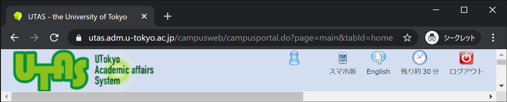

## クライアントがデータを送信する仕組み

PHPを用いることで、サーバー上でプログラムを動作させることができました。それでは、サーバー上で動作するプログラムに対し、ユーザーの入力内容を伝え、それによって動作を変更するにはどうしたら良いのでしょうか。

もっとも単純な方法は、URLに**クエリ文字列**と呼ばれる追加情報を付加することです。東京大学の学務システムUTASを例にとってみましょう。ブラウザでUTASにログインし、トップページを表示させると、そのURLは

`https://utas.adm.u-tokyo.ac.jp/campusweb/campusportal.do?page=main&tabId=home`
になっています。`https://utas.adm.u-tokyo.ac.jp/campusweb/campusportal.do`まではよく見る形式で`?page=main&tabId=home`の部分がクエリ文字列です。



クエリ文字列は、`パラメータ名=値`の組み合わせを`&`でつなぎ合わせた形となっており、`?`から始まります。

プロパティ名や値に特殊な文字（主にアルファベット以外の文字を指します）が含まれる場合は注意が必要です。例えば、日本語の文字はURLとして使用することができないため、そのままではクエリ文字列の中に含めることができません。これらの文字を使用する場合、URLとして使用可能な形式に変換してやる必要があります。

例えば、日本語の`あ`はUTF-8において`E38182`（6桁の16進数）で表されます。この時、`あ`をURLで使用可能な形式に変換する（**URLエンコード**）場合、`%E3%81%82`となります。

:::tip
コンピューター上では、文字列をデータとして扱うために、すべての文字に対し一意のコードを割り当てています。これが`文字コード`です。Webの世界では、`UTF-8`が標準です。

よく言われる文字化けは、製作者側の意図と異なる文字コードでデータを開こうとする場合に起こる現象です。
:::

## クエリ文字列を用いてPHPにユーザー入力を渡す

HTMLにおいて、`method`属性を`get`に指定した`form`タグを使用して`input`要素を囲むと、`input`要素に入力された値をクエリ文字列を使用してサーバー側に送信することができます。

このとき、各`input`要素の`name`属性に指定された値が、クエリ文字列におけるパラメータ名として使用されます。データの送信先のURLは`form`タグの`action`属性によって指定できます。早速例を見てみましょう。

```html title="index.html"
<form method="get" action="members.php">
  <p>名前: <input type="text" name="user-name"></p>
  <p><input type="submit" value="送信"></p>
</form>
```

```php title="members.php"
ようこそ！<?php print($_GET['user-name']); ?>さん！
```


フォームの送信先の画面のアドレスバーに注目しましょう。`index.html`で入力された値が、URLのクエリパラメータとして引き渡されているのが分かります（なお、昨今のブラウザはURLエンコードされた文字列をデコードしてアドレスバーに表示する機能を持っているため、アドレスバーにエンコード済みの文字列が表示されていません）。

PHPでは、クエリパラメータによって渡されたデータは、`$_GET`グローバル変数に連想配列の形式で自動的に格納されます。この変数はプログラム中のどこからでもアクセスすることが可能となっています。

## 課題

前回の課題における、素数の最大値をGETパラメータを用いて設定できるようにしましょう。[`intval`関数](https://www.php.net/manual/ja/function.intval.php)を用いると、文字列を数値に変換できます。
