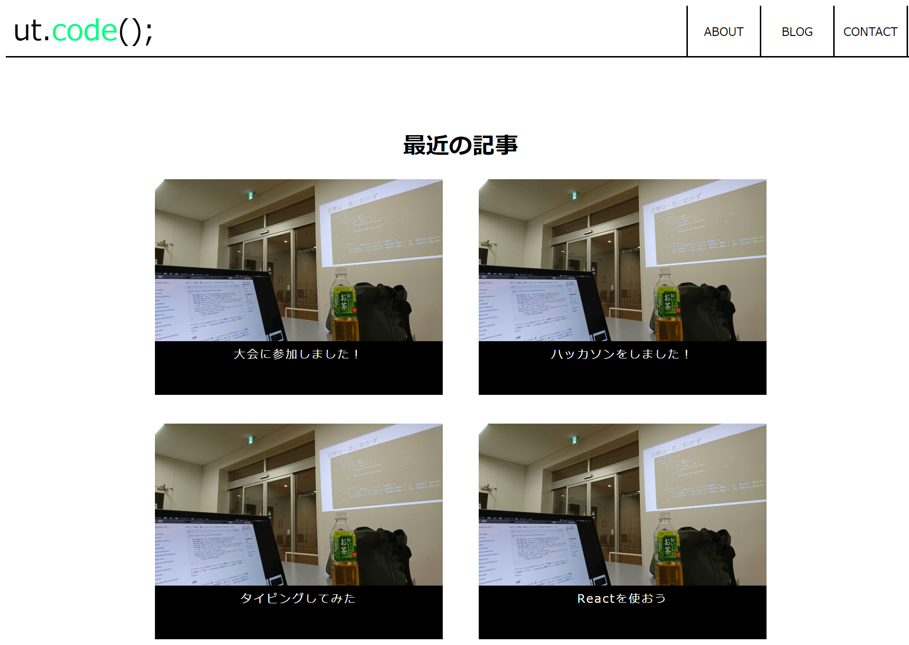
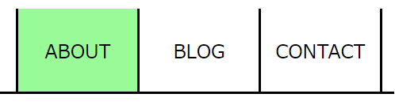

## 第５回　フレックスボックスとグリッドの問題

次のようなウェブサイトを作成してみましょう。

以下要件です。

- 記事・ロゴ・ナビゲーションボタン（ABOUTなど）はクリックできるようにしてください。ただしbuttonタグは使わないでください。記事は写真も文字も黒い枠もすべてクリックできるようにしてください。
- ナビゲーションボタンにカーソルを合わせると以下のように色が徐々に(0.1sで)変わるようにしてください。

- 記事の画像は以下からダウンロードしてください。
[download](article.jpg)
